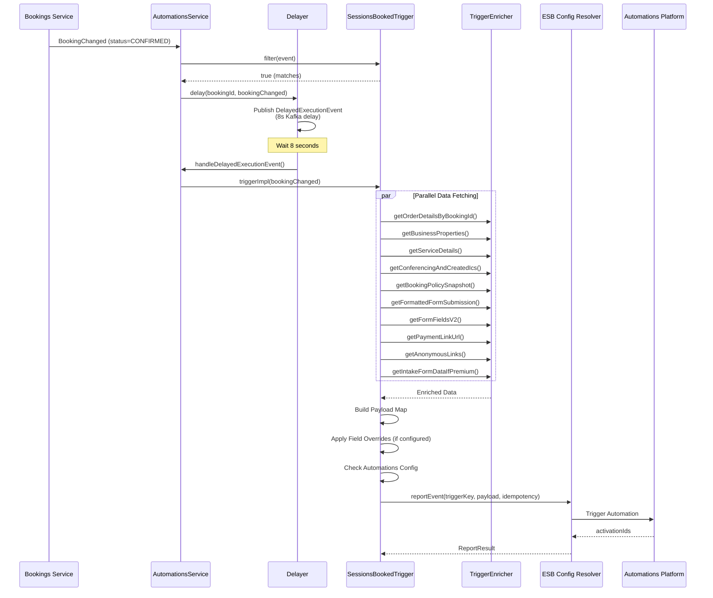
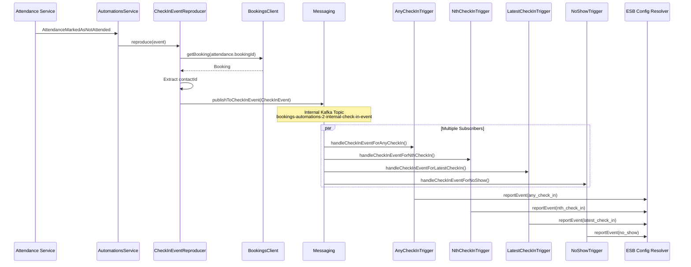
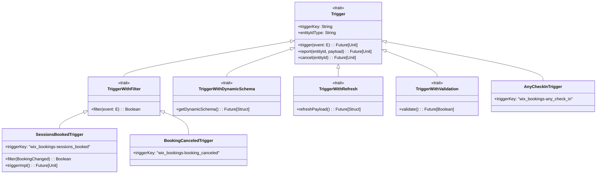
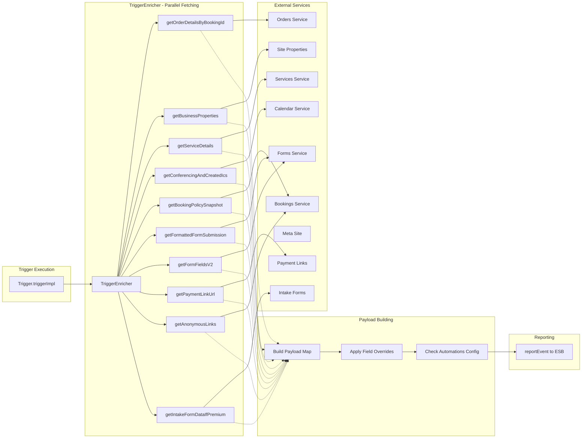
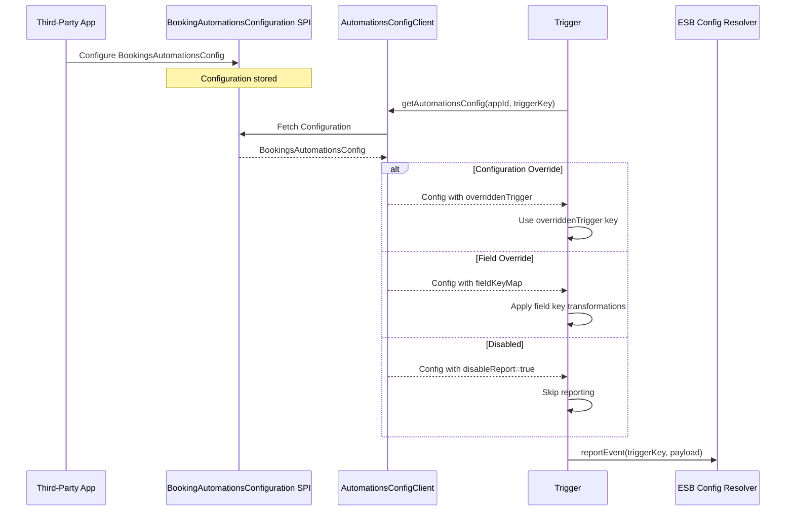
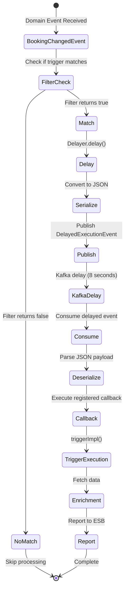
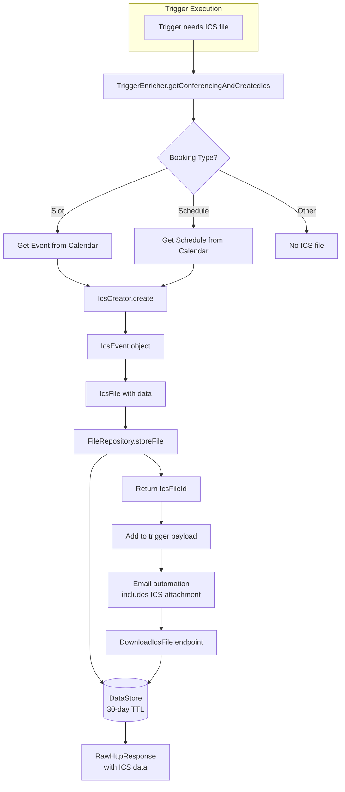
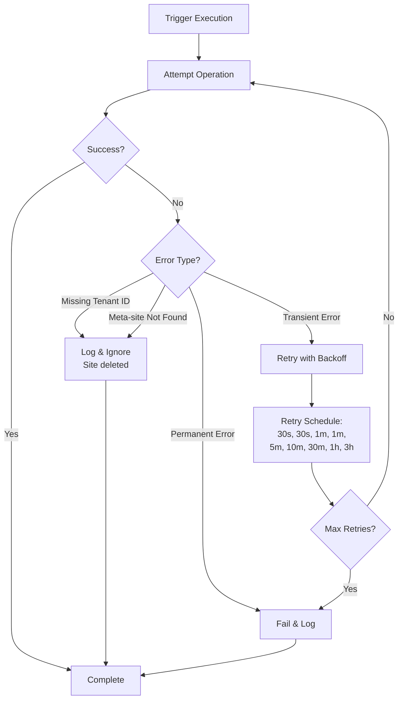
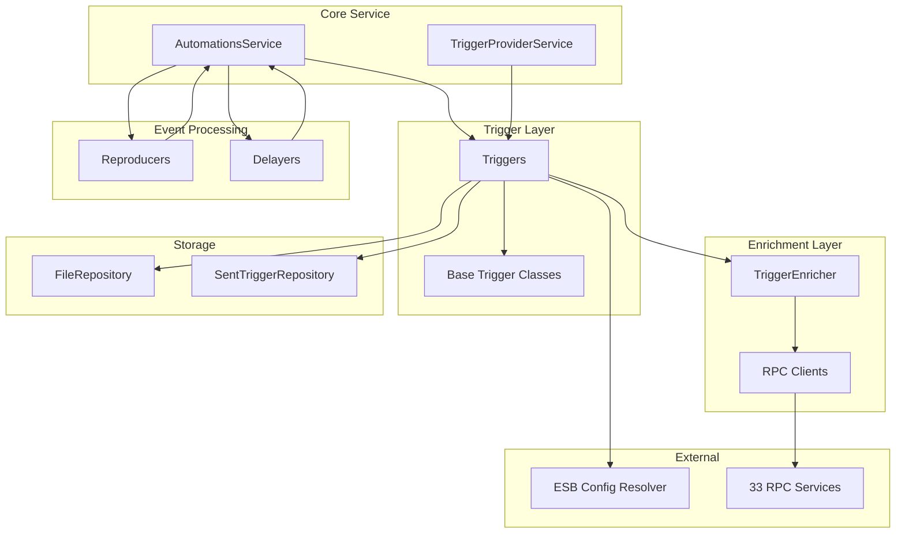

# Bookings Automations Service v2 - Visual Diagrams

## Service Architecture Overview

```mermaid
graph TB
    subgraph "External Domain Events"
        BE[Bookings Service v2<br/>Domain Events]
        CE[Calendar Service v3<br/>Domain Events]
        AE[Attendance Service v2<br/>Domain Events]
        FE[Booking Fees<br/>Domain Events]
        PE[Pricing Plans<br/>Credit Notifications]
    end

    subgraph "Bookings Automations Service v2"
        AS[AutomationsService<br/>Main Handler]
        TP[TriggerProviderService<br/>SPI Service]
        
        subgraph "Trigger System"
            T1[SessionsBookedTrigger]
            T2[BookingCanceledTrigger]
            T3[SessionUpdatedTrigger]
            T4[CheckInTriggers]
            T5[SessionStart/EndTriggers]
            T6[Other Triggers...]
        end
        
        TE[TriggerEnricher<br/>Data Fetching]
        
        subgraph "Reproducers"
            R1[CheckInEventReproducer]
            R2[SessionParticipationReproducer]
            D[Delayers]
        end
        
        subgraph "Repositories"
            FR[FileRepository<br/>ICS Files]
            SR[SentTriggerRepository]
        end
    end
    
    subgraph "External RPC Services"
        BS[Bookings Service]
        CS[Calendar Service]
        SS[Services Service]
        OS[Orders & Payments]
        FS[Forms Service]
        SP[Site Properties]
        MS[Meta Site]
    end
    
    subgraph "Wix Automations Platform"
        ESB[ESB Config Resolver]
        AP[Automations Platform]
    end

    BE --> AS
    CE --> AS
    AE --> AS
    FE --> AS
    PE --> AS
    
    AS --> R1
    AS --> R2
    AS --> D
    AS --> T1
    AS --> T2
    AS --> T3
    AS --> T4
    AS --> T5
    AS --> T6
    
    T1 --> TE
    T2 --> TE
    T3 --> TE
    T4 --> TE
    T5 --> TE
    T6 --> TE
    
    TE --> BS
    TE --> CS
    TE --> SS
    TE --> OS
    TE --> FS
    TE --> SP
    TE --> MS
    
    T1 --> ESB
    T2 --> ESB
    T3 --> ESB
    T4 --> ESB
    T5 --> ESB
    T6 --> ESB
    
    ESB --> AP
    
    TP --> T1
    TP --> T2
    TP --> T3
    
    TE --> FR
    T1 --> SR
```

## Booking Confirmation Flow

## Check-In Event Flow

## Trigger System Architecture

## Data Enrichment Flow

## SPI Integration Flow

## Delayed Execution Mechanism

## ICS File Generation Flow

## Error Handling & Retry Strategy

## Component Dependencies

