# Test Architecture Guide

## Table of Contents
1. [Overview](#overview)
2. [Architecture Diagram](#architecture-diagram)
3. [Core Concepts](#core-concepts)
4. [Context Hierarchy](#context-hierarchy)
5. [Fake Services](#fake-services)
6. [File Structure](#file-structure)
7. [Naming Conventions](#naming-conventions)
8. [Best Practices](#best-practices)
9. [Implementation Guide](#implementation-guide)

---

## Overview

This test suite uses a **layered architecture** with:
- **Base Test Class**: Provides test framework setup and common infrastructure
- **Context Traits (Ctx)**: Provide test-specific setup, mocks, and data
- **Fake Services**: In-memory implementations for external dependencies
- **Context Inheritance**: Hierarchical contexts that build upon each other

This approach minimizes code duplication, improves maintainability, and makes tests easy to read and understand.

---

## Architecture Diagram

```mermaid
graph TB
    subgraph "Test Framework Layer"
        BT[ResourceAvailabilityBaseTest<br/>extends SpecWithJUnit]
        BT --> |provides| Infra[Test Infrastructure<br/>Matchers, Mockito, etc.]
    end

    subgraph "Context Layer - Base"
        BaseCtx[Ctx trait<br/>extends Scope]
        BaseCtx --> |provides| Setup[Common Setup<br/>- contextBuilder<br/>- blockingService<br/>- fakeResourcesService<br/>- default mocks]
        BaseCtx --> |provides| Utils[Helper Methods<br/>- givenResource<br/>- givenResources<br/>- aResource<br/>- aV3Event]
    end

    subgraph "Context Layer - Specialized"
        ListCtx[ListAggregatedResourceAvailabilityCtx<br/>extends Ctx]
        SingleBusinessCtx[SingleResourceWithBusinessScheduleCtx<br/>extends ListAggregatedResourceAvailabilityCtx]
        SingleCustomCtx[SingleResourceWithCustomScheduleCtx<br/>extends ListAggregatedResourceAvailabilityCtx]
        MultiBusinessCtx[MultiResourcesWithBusinessScheduleCtx<br/>extends ListAggregatedResourceAvailabilityCtx]
        MultiCustomCtx[MultiResourcesWithCustomScheduleCtx<br/>extends ListAggregatedResourceAvailabilityCtx]
        Calendar3Ctx[Calendar3Context<br/>extends Ctx]
        ValidationCtx[CheckResourceAvailabilityValidationContext<br/>extends Ctx]
        FakeEventsCtx[ContextWithFakeEvents<br/>extends Ctx]
    end

    subgraph "Context Layer - Test-Specific"
        TestCtx1[Calendar3WithQueryEventsContext<br/>extends Calendar3Context]
        TestCtx2[ExternalCalendarTestCtx<br/>extends ListAggregatedResourceAvailabilityPaginationCtx]
        TestCtx3[CheckResourceAvailabilityContext<br/>extends CheckResourceAvailabilityValidationContext]
    end

    subgraph "Fake Services Layer"
        FakeRes[FakeResourcesService<br/>In-memory Resource storage<br/>with filtering]
        FakeEvt[FakeEventsService<br/>In-memory Event storage<br/>with filtering & timezone handling]
    end

    subgraph "Test Classes"
        Test1[Calendar3BlockingEventsIntegrationTest<br/>extends ResourceAvailabilityBaseTest]
        Test2[ListAggregatedResourceAvailabilityTest<br/>extends ResourceAvailabilityBaseTest]
        Test3[ResourcesIntegrationTest<br/>extends ResourceAvailabilityBaseTest]
        Test4[ValidateCheckResourceAvailabilityTest<br/>extends ResourceAvailabilityBaseTest]
    end

    BaseCtx --> |uses| FakeRes
    BaseCtx --> |uses| FakeEvt
    ListCtx --> |extends| BaseCtx
    SingleBusinessCtx --> |extends| ListCtx
    SingleCustomCtx --> |extends| ListCtx
    MultiBusinessCtx --> |extends| ListCtx
    MultiCustomCtx --> |extends| ListCtx
    Calendar3Ctx --> |extends| BaseCtx
    ValidationCtx --> |extends| BaseCtx
    FakeEventsCtx --> |extends| BaseCtx
    TestCtx1 --> |extends| Calendar3Ctx
    TestCtx2 --> |extends| ListCtx
    TestCtx3 --> |extends| ValidationCtx

    Test1 --> |uses| TestCtx1
    Test2 --> |uses| SingleBusinessCtx
    Test2 --> |uses| SingleCustomCtx
    Test2 --> |uses| MultiBusinessCtx
    Test2 --> |uses| MultiCustomCtx
    Test3 --> |uses| Calendar3Ctx
    Test4 --> |uses| ValidationCtx

    style BT fill:#e1f5ff
    style BaseCtx fill:#fff4e1
    style ListCtx fill:#ffe1f5
    style Calendar3Ctx fill:#ffe1f5
    style ValidationCtx fill:#ffe1f5
    style FakeRes fill:#e1ffe1
    style FakeEvt fill:#e1ffe1
```



---

## Core Concepts

### Base Test vs Context (Ctx)

#### **Base Test Class** (`ResourceAvailabilityBaseTest`)
- **Purpose**: Provides test framework infrastructure
- **Responsibilities**:
  - Extends test framework (`SpecWithJUnit`)
  - Provides matchers and test utilities
  - Defines context traits (but doesn't instantiate them)
  - Sets up sequential test execution if needed
- **When to use**: Always extend this for new test classes
- **Example**:
```scala
class MyTest extends ResourceAvailabilityBaseTest {
  "My feature" should {
    "do something" in new MyContext {
      // test code
    }
  }
}
```

#### **Context Trait (Ctx)**
- **Purpose**: Provides test-specific setup and state
- **Responsibilities**:
  - Sets up mocks and fake services
  - Provides test data builders
  - Configures service dependencies
  - Defines helper methods for test setup
- **When to use**: Create a context for each test scenario
- **Key Difference**: Contexts are **instantiated per test** (`new MyContext`), providing isolation
- **Example**:
```scala
trait MyContext extends Ctx {
  val resourceId = UUID.randomUUID().toString
  val resource = aResource(resourceId, ...)
  givenResources(Seq(resource))
}
```

### Why Both?

1. **Separation of Concerns**:
   - Base Test = Framework setup (static)
   - Context = Test data setup (per-test, isolated)

2. **Isolation**: Each test gets a fresh context instance, preventing test interference

3. **Reusability**: Contexts can be shared across tests, base test provides common infrastructure

4. **Flexibility**: Tests can mix and match contexts, override context methods

---

## Context Hierarchy

### Base Context (`Ctx`)
The foundation context that all others extend:

```scala
trait Ctx extends Scope {
  // Core services
  val fakeResourcesService = new FakeResourcesService()
  val contextBuilder = ...
  val blockingService = ...
  
  // Default mocks
  contextBuilder.rpc.servicesService.queryServices(...) returns ...
  contextBuilder.rpc.externalCalendarService.listEvents(...) returns ...
  
  // Helper methods
  def givenResource(resource: Resource): Resource
  def givenResources(resources: Seq[Resource]): Unit
  def aResource(...): Resource
  def aV3Event(...): EventV3
}
```

### Specialized Contexts

#### 1. **Feature-Specific Contexts**
Extend `Ctx` to add feature-specific setup:

```scala
trait ListAggregatedResourceAvailabilityCtx extends Ctx {
  val startDate = LocalDateTime.now().plusDays(1)
  val endDate = startDate.plusDays(1)
  val truncatedStartDate = startDate.truncatedTo(DAYS)
  val businessScheduleId = UUID.randomUUID().toString
}
```

#### 2. **Scenario-Specific Contexts**
Extend feature contexts for specific scenarios:

```scala
trait SingleResourceWithBusinessScheduleCtx extends ListAggregatedResourceAvailabilityCtx {
  val resourceId = UUID.randomUUID().toString
  val resourceScheduleId = UUID.randomUUID().toString
  val resource = aResource(resourceId, Some(businessScheduleId), ...)
  givenResources(Seq(resource))
}
```

#### 3. **Test-Specific Contexts**
Private contexts within test classes for very specific setups:

```scala
class MyTest extends ResourceAvailabilityBaseTest {
  private trait MySpecificContext extends Calendar3Context {
    // Test-specific setup
    givenEventsWithFilter(queryBlockingEventsFilter, Seq(blockTimeEvent))
  }
}
```

### Context Inheritance Rules

1. **Single Inheritance**: Each context extends exactly one parent context
2. **Progressive Specialization**: Each level adds more specific setup
3. **Override Methods**: Use `override` to customize parent behavior:
   ```scala
   trait MyContext extends Ctx {
     override def overrideContextBuilder(builder: ...) = {
       // Customize builder
       super.overrideContextBuilder(builder.copy(...))
     }
   }
   ```

---

## Fake Services

### Purpose
Fake services provide **in-memory implementations** of external dependencies with:
- Realistic behavior (filtering, searching)
- No external dependencies
- Fast execution
- Deterministic results

### FakeResourcesService

**Location**: `FakeResourcesService.scala`

**Features**:
- In-memory resource storage
- Query filtering using `InMemoryObjectSearcher`
- Supports complex filter queries

**Usage**:
```scala
trait MyContext extends Ctx {
  val resource = aResource("id", ...)
  givenResource(resource)  // Adds to fake service
}
```

**Implementation Pattern**:
```scala
class FakeResourcesService {
  private var resources: Seq[Resource] = Vector.empty
  val mock = Mockito.mock[ResourcesServicePlatformizedClientMethods]
  
  mock.queryResources(any)(any) answers { args =>
    val request = args.head.asInstanceOf[QueryResourcesRequest]
    val filter = request.getQuery.filter
    val filteredResources = ObjectSearcher.search(resources, filterClause, ...)
    Future.successful(QueryResourcesResponse().withResources(filteredResources))
  }
  
  def givenResource(resource: Resource): Resource = {
    resources = resources.filterNot(_.getId == resource.getId) :+ resource
    resource
  }
}
```

### FakeEventsService

**Location**: `FakeEventsService.scala`

**Features**:
- In-memory event storage
- Timezone-aware date handling
- Filtering by schedule, type, transparency, location, resources
- Automatic UTC date enrichment

**Usage**:
```scala
trait MyContext extends ContextWithFakeEvents {
  val event = aV3Event(...)
  eventsService.givenEvent(event)
}
```

**Key Methods**:
- `givenEvent(event: Event)`: Add event to storage
- `givenBusinessTimeZone(timezone: String)`: Set timezone for queries
- Automatic filtering by date range and query filters

---

## File Structure

```
bookings-backend/resource-availability/test/
├── com/wixpress/resources/availability/v1/
│   ├── ResourceAvailabilityBaseTest.scala      # Base test + base contexts
│   ├── FakeResourcesService.scala              # Fake resources service
│   ├── FakeEventsService.scala                 # Fake events service
│   │
│   ├── ListAggregatedResourceAvailabilityTest.scala
│   ├── Calendar3BlockingEventsIntegrationTest.scala
│   ├── ResourcesIntegrationTest.scala
│   ├── ValidateCheckResourceAvailabilityTest.scala
│   ├── ExternalCalendarTest.scala
│   └── ... (other test files)
```

### File Naming Conventions

1. **Base Test**: `*BaseTest.scala` (e.g., `ResourceAvailabilityBaseTest.scala`)
2. **Fake Services**: `Fake*Service.scala` (e.g., `FakeResourcesService.scala`)
3. **Test Classes**: `*Test.scala` or `*IntegrationTest.scala`
4. **Context Traits**: Defined within base test or test files (not separate files)

---

## Naming Conventions

### Context Traits
- **Base**: `Ctx` (short, simple)
- **Feature**: `*Ctx` (e.g., `ListAggregatedResourceAvailabilityCtx`)
- **Scenario**: `*With*Ctx` (e.g., `SingleResourceWithBusinessScheduleCtx`)
- **Test-specific**: `*Context` or `*TestCtx` (e.g., `Calendar3WithQueryEventsContext`)

### Helper Methods
- **Builders**: `a*` (e.g., `aResource`, `aV3Event`)
- **Setup**: `given*` (e.g., `givenResource`, `givenEvents`)
- **Overrides**: `override*` (e.g., `overrideContextBuilder`)

### Variables
- **IDs**: `*Id` (e.g., `resourceId`, `scheduleId`)
- **Collections**: Plural (e.g., `resources`, `events`)
- **Services**: `*Service` (e.g., `eventsService`, `resourcesService`)

---

## Best Practices

### 1. Context Design

✅ **DO**:
- Create contexts for reusable test setups
- Use progressive specialization (base → feature → scenario)
- Keep contexts focused on one concern
- Use descriptive names

❌ **DON'T**:
- Create contexts with too many responsibilities
- Duplicate setup code across contexts
- Use contexts for one-off test data

### 2. Test Organization

✅ **DO**:
```scala
class MyTest extends ResourceAvailabilityBaseTest {
  "Feature name" should {
    "scenario description" in new AppropriateContext {
      // Arrange
      givenResource(...)
      
      // Act
      val result = blockingService.method(...)
      
      // Assert
      result must beExpectedResult
    }
  }
}
```

❌ **DON'T**:
- Mix multiple concerns in one test
- Use base `Ctx` directly (use specialized contexts)
- Create test-specific contexts for common scenarios

### 3. Fake Service Usage

✅ **DO**:
- Use fake services for external dependencies
- Add helper methods in contexts to interact with fakes
- Keep fake service logic simple and focused

❌ **DON'T**:
- Mix real services with fake services
- Add complex business logic to fake services
- Create fake services for internal dependencies

### 4. Code Reuse

✅ **DO**:
- Extract common setup to base contexts
- Create helper methods for repeated patterns
- Share contexts across related tests

❌ **DON'T**:
- Copy-paste test setup code
- Create duplicate helper methods
- Over-engineer contexts for simple cases

### 5. Test Isolation

✅ **DO**:
- Use `new Context` for each test (provides isolation)
- Reset state in context initialization
- Use immutable test data where possible

❌ **DON'T**:
- Share mutable state between tests
- Use class-level variables for test data
- Rely on test execution order

---

## Implementation Guide

### Step 1: Create a New Test Class

```scala
package com.wixpress.resources.availability.v1

class MyFeatureTest extends ResourceAvailabilityBaseTest {
  "MyFeature" should {
    "test scenario" in new MyContext {
      // Test implementation
    }
  }
}
```

### Step 2: Create Context (if needed)

**Option A: Use existing context**
```scala
"test scenario" in new SingleResourceWithBusinessScheduleCtx {
  // Use existing context
}
```

**Option B: Extend existing context**
```scala
private trait MyContext extends Calendar3Context {
  // Add specific setup
  val customData = ...
  givenEvents(...)
}
```

**Option C: Create new context**
```scala
trait MyFeatureContext extends Ctx {
  // Base setup
  val featureSpecificData = ...
  
  // Helper methods
  def setupFeature(): Unit = {
    // Setup code
  }
}
```

### Step 3: Use Helper Methods

```scala
trait MyContext extends Ctx {
  // Build test data
  val resource = aResource(
    resourceId = "id",
    workScheduleId = Some("schedule-id"),
    eventScheduleId = "event-schedule-id"
  )
  
  // Setup test state
  givenResources(Seq(resource))
  givenWorkingHoursEvents(Seq(...))
  givenBlockingEvents(Seq(...))
}
```

### Step 4: Write Test

```scala
"test scenario" in new MyContext {
  // Arrange: Use context setup + additional setup if needed
  val additionalEvent = aV3Event(...)
  givenBlockingEvents(Seq(additionalEvent))
  
  // Act: Call service method
  val result = blockingService.listAggregatedResourceAvailability(request)
  
  // Assert: Verify result
  result must beListAggregatedResourceAvailabilityResponse(
    aggregatedAvailableTimes = haveSize(1)
  )
}
```

### Step 5: Create Fake Service (if needed)

```scala
class FakeMyService {
  private var data: Seq[MyType] = Vector.empty
  val mock = Mockito.mock[MyServicePlatformizedClientMethods]
  
  mock.queryMyData(any)(any) answers { args =>
    val request = args.head.asInstanceOf[QueryMyDataRequest]
    val filter = request.getQuery.filter
    val filtered = ObjectSearcher.search(data, filterClause, ...)
    Future.successful(QueryMyDataResponse().withData(filtered))
  }
  
  def givenData(item: MyType): MyType = {
    data = data.filterNot(_.getId == item.getId) :+ item
    item
  }
}
```

### Step 6: Integrate Fake Service in Base Context

```scala
trait Ctx extends Scope {
  val fakeMyService = new FakeMyService()
  val myService = fakeMyService.mock
  
  val contextBuilder = overrideContextBuilder(
    ResourceAvailabilityServiceTestContextBuilder(
      ...
      rpc = ResourceAvailabilityServiceTestContextBuilder.mockRpc.copy(
        myService = myService
      )
    )
  )
  
  def givenMyData(item: MyType): MyType =
    fakeMyService.givenData(item)
}
```

---

## Common Patterns

### Pattern 1: Override Context Builder

```scala
trait MyContext extends Ctx {
  lazy val customService = new FakeCustomService()
  
  override def overrideContextBuilder(builder: ResourceAvailabilityServiceTestContextBuilder) =
    builder.copy(
      rpc = builder.rpc.copy(
        customService = customService.mock
      )
    )
}
```

### Pattern 2: Conditional Setup

```scala
trait MyContext extends Ctx {
  val enableFeature: Boolean = true
  
  if (enableFeature) {
    contextBuilder.petri.conductSpec(...) returns Some("true")
  }
}
```

### Pattern 3: Shared Test Data

```scala
trait MyContext extends Ctx {
  val sharedResourceId = "shared-id"
  val sharedScheduleId = "shared-schedule-id"
  
  // Use in multiple tests
}
```

### Pattern 4: Test-Specific Private Context

```scala
class MyTest extends ResourceAvailabilityBaseTest {
  "Feature" should {
    "specific scenario" in new SpecificContext {
      // Uses SpecificContext
    }
  }
  
  private trait SpecificContext extends BaseContext {
    // Very specific setup for this test only
  }
}
```

---

## Summary

### Key Takeaways

1. **Base Test** = Framework infrastructure (static)
2. **Context (Ctx)** = Test setup and state (per-test, isolated)
3. **Fake Services** = In-memory implementations for external dependencies
4. **Context Hierarchy** = Progressive specialization (base → feature → scenario)
5. **Isolation** = Each test gets fresh context instance

### Benefits

- ✅ **Minimal Code Duplication**: Shared contexts and helpers
- ✅ **Easy to Read**: Clear test structure and naming
- ✅ **Maintainable**: Changes in one place affect all tests
- ✅ **Isolated**: Each test is independent
- ✅ **Fast**: Fake services are in-memory, no external calls

### When to Create New Contexts

- Multiple tests share the same setup
- Setup is complex and reusable
- You want to group related test scenarios

### When to Use Existing Contexts

- Simple test that fits existing scenario
- One-off test that doesn't need reuse
- Test-specific setup that won't be shared

---

## Examples from Codebase

### Example 1: Simple Test with Existing Context

```scala
class ValidateCheckResourceAvailabilityTest extends ResourceAvailabilityBaseTest {
  "Validate Check Resource Availability" should {
    "validate request" in new CheckResourceAvailabilityValidationContext {
      val request = validRequest.update(...)
      blockingService.checkResourceAvailability(request) must beValidationError(...)
    }
  }
}
```

### Example 2: Test with Multiple Contexts

```scala
class ListAggregatedResourceAvailabilityTest extends ResourceAvailabilityBaseTest {
  "ListAggregatedResourceAvailability" should {
    "single resource" >> {
      "business schedule" in new SingleResourceWithBusinessScheduleCtx {
        // Test code
      }
      "custom schedule" in new SingleResourceWithCustomScheduleCtx {
        // Test code
      }
    }
    "multi resources" >> {
      "business schedule" in new MultiResourcesWithBusinessScheduleCtx {
        // Test code
      }
    }
  }
}
```

### Example 3: Test with Private Context

```scala
class Calendar3BlockingEventsIntegrationTest extends ResourceAvailabilityBaseTest {
  "ListAggregatedResourceAvailability" should {
    "call queryEvents" in new Calendar3WithQueryEventsContext {
      blockingService.listAggregatedResourceAvailability(request)
      there was one(events3).queryEvents(...)
    }
  }
  
  private trait Calendar3WithQueryEventsContext extends Calendar3Context {
    givenEventsWithFilter(queryBlockingEventsFilter, Seq(blockTimeEvent, classEvent))
  }
}
```

---

This guide provides a comprehensive foundation for writing tests following the established patterns in the codebase. Follow these patterns to ensure consistency, maintainability, and minimal code duplication.

