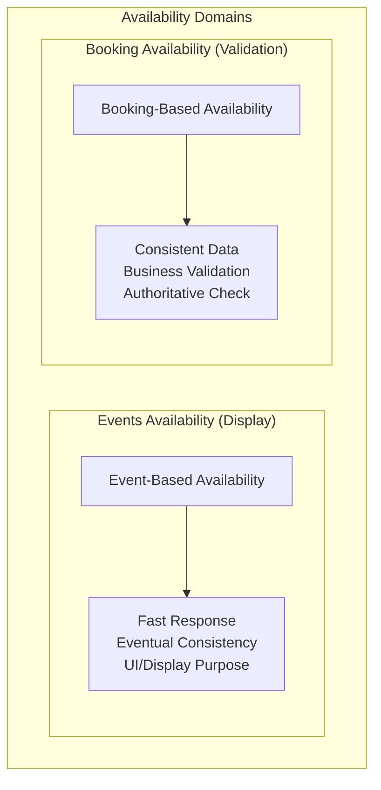
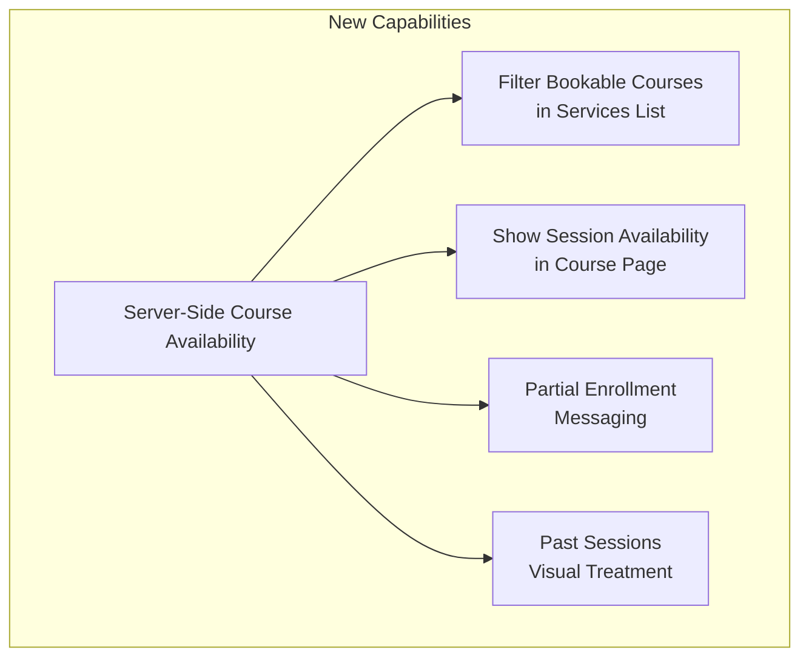
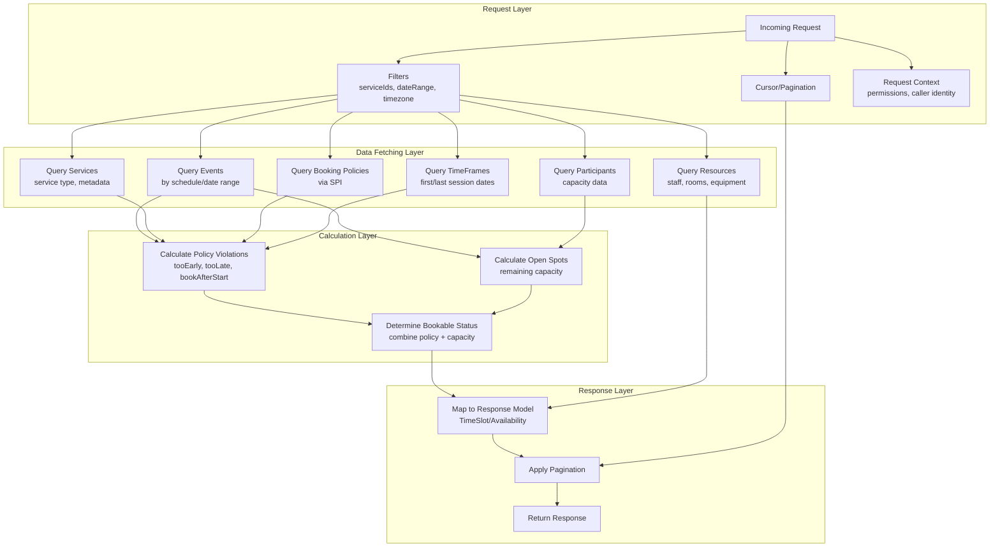
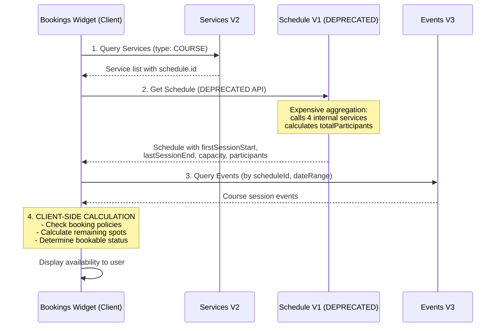
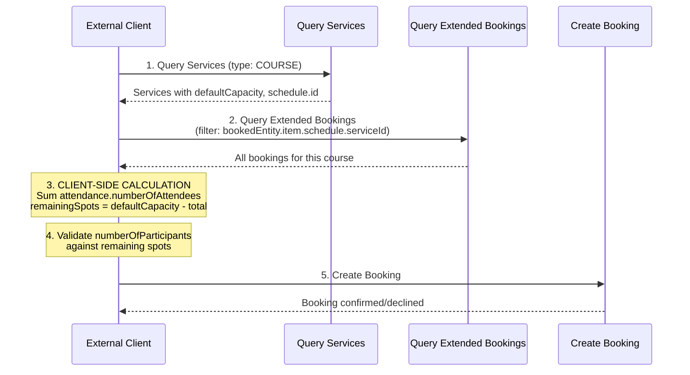
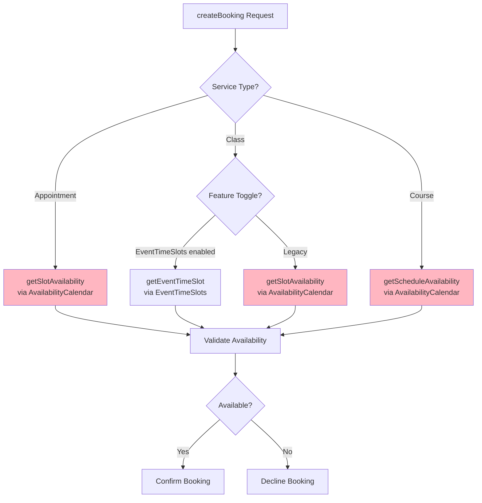
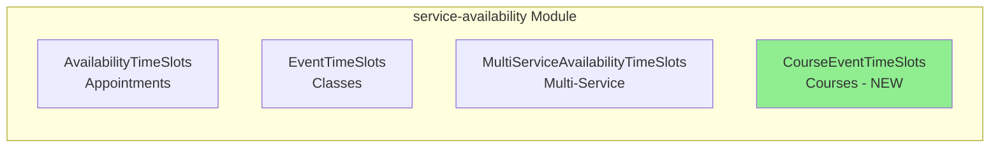
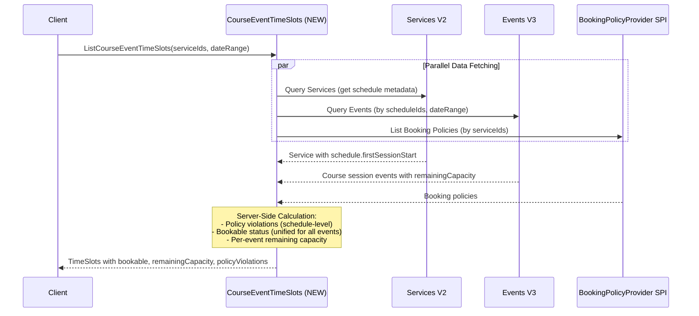
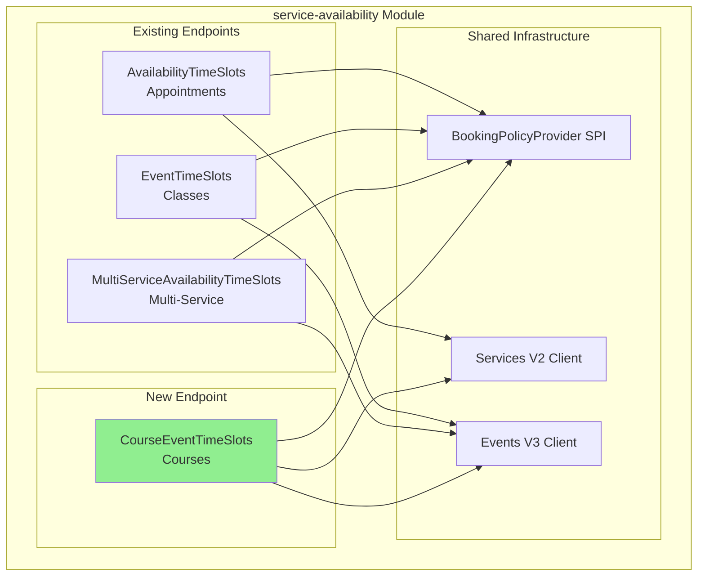
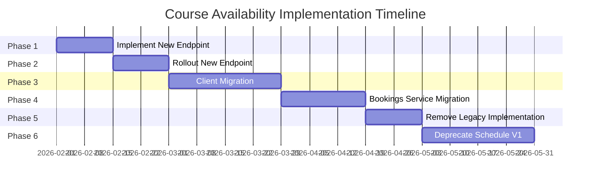

# Course Availability Design - Service Availability V2

**Project Name**: Course Availability Support in Service Availability  
**Owner**: Bookings Platform Team  
**Date**: January 17, 2026  
**Status**: Draft for Review  
**Version**: 2.0

---

## Table of Contents

1. [Context: Availability Domains](#1-context-availability-domains)
2. [Problems We Are Solving](#2-problems-we-are-solving)
3. [General Availability Data Flow](#3-general-availability-data-flow)
4. [Current Course Availability Implementation](#4-current-course-availability-implementation)
5. [Proposed Solution: New Course Availability Endpoint](#5-proposed-solution-new-course-availability-endpoint)
6. [Data Sources Analysis](#6-data-sources-analysis)
7. [Design Decision: New Endpoint vs Extending ListEventTimeSlots](#7-design-decision-new-endpoint-vs-extending-listeventtimeslots)
8. [Implementation & Rollout Plan](#8-implementation--rollout-plan)
9. [Open Questions](#9-open-questions)

---

## 1. Context: Availability Domains

### Two Domains of Availability

Availability in Wix Bookings is conceptually divided into **two distinct domains**, each serving different purposes with different consistency and performance requirements:



### Comparison: Events Availability vs Booking Availability

| Aspect | Events Availability | Booking Availability |
|--------|---------------------|---------------------|
| **Purpose** | UI display, calendar views, slot listing | Core business flow validation, booking creation |
| **Consistency** | Eventually consistent (1-5 second lag acceptable) | Must be consistent (authoritative source of truth) |
| **Performance Priority** | High - must be fast for user experience | Can tolerate higher latency for accuracy |
| **Typical Latency** | Target: Fast response for UI rendering | Can be slower in exchange for consistency |
| **Data Source** | Event.remainingCapacity (pre-calculated) | Query Bookings/Participations directly |
| **Risk of Stale Data** | Acceptable - user will retry if booking fails | Not acceptable - could lead to overbooking |
| **Use Cases** | Bookings Widget, Calendar Views, Mobile Apps | createBooking validation, confirmBooking |

### Current Implementation Landscape

| Service | Domain | Service Types Supported | Status |
|---------|--------|------------------------|--------|
| `AvailabilityTimeSlots` | Events Availability | Appointments | ✅ Active |
| `EventTimeSlots` (ListEventTimeSlots) | Events Availability | Classes | ✅ Active |
| `MultiServiceAvailabilityTimeSlots` | Events Availability | Multi-Service | ✅ Active |
| **Course Availability** | Events Availability | Courses | ❌ **Missing** |
| `AvailabilityCalendar.getScheduleAvailability` | Booking Availability | Courses | ⚠️ **Deprecated** |
| `AvailabilityCalendar.getSlotAvailability` | Booking Availability | Classes/Appointments | ⚠️ **Deprecated** |

### Why This Separation Matters

**Events Availability (Display Domain)**:
- Users browse availability before deciding to book
- Stale data results in a minor inconvenience (failed booking attempt → retry)
- Performance directly impacts user experience and page load times
- High query volume (many users browsing, few actually booking)

**Booking Availability (Validation Domain)**:
- Called during actual booking creation
- Stale data could result in overbooking or incorrect rejection
- Lower volume but higher importance per request
- Must validate against real-time capacity

---

## 2. Problems We Are Solving

This design document addresses three categories of problems:

### 2.1 Client Support Experience & Performance

| Problem | Description | Impact |
|---------|-------------|--------|
| **Server logic on client side** | Clients must calculate availability themselves (sum participants, check policies) | Inconsistent implementations, error-prone |
| **Blocks server updates** | Adding new features (e.g., course waitlist, new booking policy) cannot be rolled out without client updates | Feature velocity bottleneck |
| **Client version inconsistency** | Different client versions may have different availability calculations | Business logic fragmentation |
| **Multiple API calls required** | Clients need 3+ API calls for course availability | Higher latency, more complexity |
| **Deprecated API usage** | Clients forced to use deprecated Schedule V1 and AvailabilityCalendar | Technical debt, migration blocker |

### 2.2 Deprecated API Migration

The following deprecated APIs must be fully replaced:

| Deprecated API | Replacement | Migration Status |
|----------------|-------------|------------------|
| `Schedule V1` (schedules proxy) | Schedule V3 + Services V2 | 🔄 In Progress |
| `AvailabilityCalendar.getScheduleAvailability` | **NEW: Course Availability Endpoint** | ❌ No replacement exists |
| `AvailabilityCalendar.getSlotAvailability` | `EventTimeSlots.listEventTimeSlots` | 🔄 In Progress (via feature toggle) |

**Services Still Using Deprecated AvailabilityCalendar**:

| Service | RPC Used | Purpose | Migration Required |
|---------|----------|---------|-------------------|
| Bookings Service | `getScheduleAvailability` | Course availability during createBooking | ✅ Yes |
| Bookings Service | `getSlotAvailability` | Class availability during createBooking | 🔄 In Progress |
| Bookings Gateway | `getSlotAvailability` | Availability validation | 🔄 In Progress |
| Waiting List Service | `getSlotAvailability` | Check spots on booking cancellation | ✅ Yes |

### 2.3 Platform Consistency

| Issue | Description |
|-------|-------------|
| **Different patterns for similar services** | Classes use `ListEventTimeSlots`, Courses use manual client calculation |
| **Missing modern API for courses** | `service-availability` module supports appointments, classes, multi-service - but NOT courses |
| **Documentation recommends deprecated flow** | Official Wix docs direct users to deprecated APIs |

### 2.4 New UI/UX Capabilities Enabled

The new course availability endpoint enables several UI/UX improvements that are currently impossible or require complex client-side logic:



| Capability | Description | User Value |
|------------|-------------|------------|
| **Filter Bookable Courses** | On the services-list page, filter and show only courses that are currently bookable (not full, within booking window) | Users don't waste time clicking into unavailable courses |
| **Session Availability Indicators** | On the course service-page, mark which individual sessions are still available vs. already occurred | Clear visual indication of what the user will attend |
| **Partial Enrollment Messaging** | When booking a course with `bookAfterStartPolicy = true`, display message like *"Your registration will include 22/25 sessions in this course"* | Transparent communication about what user is purchasing |
| **Past Sessions Visual Treatment** | Gray out or visually differentiate sessions that have already occurred | Clear UX that past sessions won't be attended |
| **Per-Session Capacity Display** | Show remaining spots for each session (if they differ) | Better capacity planning for users |

**Example UI Mockup - Partial Enrollment Message**:

```
┌─────────────────────────────────────────────────────────┐
│  🎓 Advanced Photography Course                         │
│                                                         │
│  ⚠️ This course has already started                     │
│                                                         │
│  Your registration will include 22 of 25 sessions.     │
│  3 sessions have already occurred and are grayed out.  │
│                                                         │
│  [ View Sessions ]  [ Book Now - $199 ]                │
└─────────────────────────────────────────────────────────┘
```

### 2.5 Business Context: bookAfterStartPolicy Usage

Understanding the real-world usage of the `bookAfterStartPolicy` is critical for prioritizing this feature:

**DORA Data Analysis**:

| Metric | Value |
|--------|-------|
| **Courses with bookAfterStartPolicy enabled** | 69,764 |
| **Total active courses with bookings** | 205,612 |
| **Percentage with policy enabled** | **33.93%** |

> **Definition**: Active courses = not deleted, with at least one confirmed booking in the last 365 days, and `bookAfterStartPolicy.enabled = true`

**Key Insights**:

| Insight | Implication |
|---------|-------------|
| **~1 in 3 courses allow late enrollment** | Significant demand for partial enrollment functionality |
| **~2 in 3 courses use standard policy** | Most courses prefer customers to enroll before start |
| **33% is substantial** | This is not an edge case - nearly 70K courses rely on this policy |
| **Business value of late enrollment** | Ongoing programs, certification courses, and rolling-admission courses benefit from late-entry |

**Why This Matters for Implementation**:

1. **Must support `bookAfterStartPolicy`**: Cannot ship course availability without this - affects 33% of courses
2. **Requires SPI extension**: Current `BookingPolicyProvider` SPI doesn't include this field
3. **UI implications**: Need to handle partial enrollment messaging for 70K+ courses
4. **Backward compatibility**: Courses without this policy should work exactly as before

---

## 3. General Availability Data Flow

### Availability Calculation Components

All availability endpoints follow a common pattern with these components:



### Data Flow Steps

| Step | Description | Input | Output |
|------|-------------|-------|--------|
| **1. Query Data** | Fetch all required data from various sources | Request filters | Raw data from Events, Services, Policies, Participants, TimeFrames, Resources |
| **2. Calculate Policy Violations** | Determine if booking policies are violated | Event/Schedule times, Booking Policies | `tooEarlyToBook`, `tooLateToBook`, `bookOnlineDisabled` |
| **3. Calculate Open Spots** | Determine remaining capacity | Event participants or Bookings count | `remainingCapacity`, `openSpots` |
| **4. Determine Bookable Status** | Combine policy and capacity checks | Policy violations, Open spots | `bookable` boolean |
| **5. Map & Return** | Format response with pagination | Calculated availability | TimeSlots/Availability response |

---

## 4. Current Course Availability Implementation

### 4.1 Internal Client Flow (Wix Bookings Widget)

The internal Bookings Widget currently calculates course availability using the following flow:



**Issues with Current Internal Client Flow**:

| Issue | Description | Impact |
|-------|-------------|--------|
| **Server logic on client** | Widget calculates booking policies and remaining spots | Logic duplication, inconsistency risk |
| **Blocks server updates** | New policy (e.g., `bookAfterStartPolicy`) requires widget update | Feature velocity bottleneck |
| **Version inconsistency** | Different widget versions may calculate differently | Business logic fragmentation |
| **Multiple API calls** | 3 sequential API calls required | Higher latency (sequential, not parallel) |
| **Uses deprecated Schedule V1** | Schedule V1 marked for deprecation | Migration blocker |
| **Expensive aggregation** | Schedule V1 internally calls 4 services, aggregates participants | Performance bottleneck |

### 4.2 External Client Flow (Third-Party Integrations)

According to the [Wix Bookings End-to-End Booking Flows documentation](https://dev.wix.com/docs/api-reference/business-solutions/bookings/end-to-end-booking-flows#book-a-course), external clients must follow this flow:



**From Official Documentation**:
> "Calculate the total number of participants already booked by adding up the `attendance.numberOfAttendees` from all extended bookings. Then, subtract this total from the service's `defaultCapacity` to determine the number of remaining spots."

**Issues with Current External Client Flow**:

| Issue | Description | Impact |
|-------|-------------|--------|
| **No availability API** | Must query bookings and calculate manually | High complexity for integrators |
| **No policy enforcement** | `tooEarlyToBook`, `tooLateToBook`, `bookAfterStartPolicy` not provided | Client must implement or skip |
| **Race conditions** | Between query and booking, spots may be taken | Potential overbooking attempts |
| **No session details** | Only aggregate capacity, no per-session info | Poor UX for displaying sessions |
| **Documentation outdated** | Recommends deprecated APIs, no modern alternative | Developer confusion |

> ⚠️ **ACTION ITEM**: Update official documentation to reflect new course availability endpoint once implemented.

### 4.3 Bookings Service Availability Validation

When `createBooking` is called, the Bookings service validates availability differently per service type:



**Current State**:
- Classes: Can use `EventTimeSlots` via feature toggle (migration in progress)
- Courses: No alternative - must use deprecated `AvailabilityCalendar.getScheduleAvailability`
- Appointments: Still uses deprecated `AvailabilityCalendar`

**Question**: Will Bookings service use the new course availability endpoint for validation, same as it uses `ListEventTimeSlots` for classes?

> **Recommendation**: Yes, with feature toggle for gradual rollout and fallback to current implementation.

### 4.4 Comparison: Classes vs Courses (Current State)

| Aspect | Classes | Courses |
|--------|---------|---------|
| **Display Availability API** | ✅ `ListEventTimeSlots` | ❌ None (client calculates) |
| **Booking Validation API** | `EventTimeSlots` OR `AvailabilityCalendar` | `AvailabilityCalendar` only |
| **Availability Calculation** | Server-side | Client-side |
| **Policy Enforcement** | ✅ Server-side | ❌ Client responsibility |
| **Session-Level Details** | ✅ Per-session capacity | ❌ Aggregate only |
| **API Calls for Display** | 1 call | 3+ calls |
| **Deprecated API Dependency** | Optional (toggle) | Required |

---

## 5. Proposed Solution: New Course Availability Endpoint

### 5.1 Solution Overview

Create a new dedicated endpoint `ListCourseEventTimeSlots` in the `service-availability` module, following the same pattern as existing endpoints.



### 5.2 New Endpoint Data Flow



### 5.3 Parallel vs Sequential Data Fetching

**Current Flow (Client-Side)**: Sequential - 3 calls one after another

**New Flow (Server-Side)**: Parallel where possible

| Data Source | Can Parallelize? | Depends On |
|-------------|------------------|------------|
| Query Services | ✅ Yes | Request only |
| Query Events | ✅ Yes | Request only |
| Query Booking Policies | ✅ Yes | Request only (uses serviceIds) |
| Calculate Policy Violations | ❌ No | Requires Services (firstSessionStart) + Policies |
| Calculate Capacity | ❌ No | Requires Events (remainingCapacity) |

**Performance Benefit**:
- Current: 3 sequential calls = Sum of all latencies
- New: 3 parallel calls = Max of all latencies

### 5.4 Request/Response Model

**Request Parameters**:

| Parameter | Required | Description |
|-----------|----------|-------------|
| `service_ids` | Optional | Filter by course service IDs (max 100) |
| `from_local_date` | Required | Start of date range (ISO 8601) |
| `to_local_date` | Required | End of date range (ISO 8601) |
| `time_zone` | Optional | Timezone for date interpretation (default: business timezone) |
| `include_non_bookable` | Optional | Include non-bookable time slots (default: true) |
| `cursor_paging` | Optional | Cursor-based pagination |

**Response Fields** (per TimeSlot):

| Field | Description |
|-------|-------------|
| `service_id` | Course service ID |
| `schedule_id` | Schedule ID (course identifier) |
| `event_id` | Individual session event ID |
| `local_start_date` | Session start time |
| `local_end_date` | Session end time |
| `bookable` | Whether course can be booked (unified for all events) |
| `remaining_capacity` | Spots remaining for this session |
| `total_capacity` | Total capacity for this session |
| `booking_policy_violations` | Policy violations (tooEarly, tooLate, etc.) |
| `location` | Session location |

---

## 6. Data Sources Analysis

For each data requirement, we analyze the options and recommend an approach.

### 6.1 Event Data (Sessions)

**Requirement**: Get course session events with timing and capacity information.

| Option | Source | Pros | Cons |
|--------|--------|------|------|
| **A: Events V3 Query** | `EventsService.queryEvents` | Direct access, supports filtering, includes remainingCapacity | Requires scheduleId filter |
| **B: Via Schedule TimeFrames** | `ScheduleTimeFramesService` | Cached, fast | Only provides first/last dates, not all events |

**Recommendation**: **Option A - Events V3 Query**
- Provides all session events with per-event `remainingCapacity`
- Supports date range filtering
- Already used by `ListEventTimeSlots` for classes

### 6.2 Capacity Data (Remaining Spots)

**Requirement**: Determine how many spots are available.

| Option | Source | Consistency | Performance |
|--------|--------|-------------|-------------|
| **A: Event.remainingCapacity** | Events V3 | Eventually consistent (1-5s lag) | Fast (no extra call) |
| **B: Query Participations** | Participations V3 | Consistent | Slower (extra RPC) |
| **C: Query Bookings** | Bookings V2 | Consistent | Slower (extra RPC) |

**Recommendation**: **Option A - Event.remainingCapacity**
- Same approach as classes in `ListEventTimeSlots`
- Platform guarantees events are updated when participations change
- Acceptable for display purposes (Events Availability domain)
- `createBooking` validation catches race conditions

### 6.3 Policy Reference Time

**Requirement**: Determine the reference point for policy calculations (tooEarly, tooLate).

| Option | Source | Semantics |
|--------|--------|-----------|
| **A: First event in query range** | Events V3 | May miss relevant events outside query window |
| **B: schedule.firstSessionStart** | Services V2 | Correct for course semantics |
| **C: Query first event separately** | Events V3 | Extra call, but accurate |

**Recommendation**: **Option B - schedule.firstSessionStart from Services V2**
- Matches current `AvailabilityCalendar` behavior
- Correct semantics for course booking (policies relative to course start, not query window)
- Available in single Services V2 call

### 6.4 Booking Policies

**Requirement**: Get booking policy configuration for policy violation calculation.

| Option | Source | Notes |
|--------|--------|-------|
| **A: BookingPolicyProvider SPI** | services-2 default implementation | Standard pattern for service-availability |
| **B: Direct Services V2 query** | Services V2 API | Bypasses SPI extensibility |

**Recommendation**: **Option A - BookingPolicyProvider SPI**
- Consistent with other service-availability endpoints
- Supports third-party extensibility
- **Note**: SPI needs extension to include `bookAfterStartPolicy` field

### 6.5 Data Sources Summary

| Data | Recommended Source | Rationale |
|------|-------------------|-----------|
| Session Events | Events V3 | Direct access, includes capacity |
| Remaining Capacity | Event.remainingCapacity | Fast, eventually consistent (acceptable for display) |
| Policy Reference Time | Services V2 schedule.firstSessionStart | Correct course semantics |
| Booking Policies | BookingPolicyProvider SPI | Standard pattern, extensible |
| Resources (optional) | Resources V2 | If needed for display |

---

## 7. Design Decision: New Endpoint vs Extending ListEventTimeSlots

### 7.1 Options Considered

**Option A: Extend `ListEventTimeSlots`**
- Add course support to existing class availability endpoint
- Unified API for all event-based services (classes + courses)

**Option B: Create New `ListCourseEventTimeSlots` Endpoint** ✅ **RECOMMENDED**
- Dedicated endpoint for course availability
- Follows existing pattern of separate endpoints per service type

### 7.2 Recommendation: New Endpoint

We recommend **Option B: Create a new dedicated endpoint** for the following reasons:

| Reason | Explanation |
|--------|-------------|
| **Follows existing pattern** | `service-availability` already has 3 separate endpoints: `AvailabilityTimeSlots` (appointments), `EventTimeSlots` (classes), `MultiServiceAvailabilityTimeSlots` (multi-service). Adding a 4th for courses is consistent. |
| **Code clarity** | Avoids complex type-checking logic to differentiate course vs class within single codebase. Each endpoint has clear responsibility. |
| **Safe rollout** | New functionality is completely isolated from existing endpoints. Zero risk of breaking class availability during course rollout. |
| **Tailored optimization** | Course-specific optimizations (e.g., schedule-level policy calculation, unified bookable status) can be implemented without affecting classes. |
| **Future flexibility** | Course-specific features (e.g., course waitlist, partial enrollment) can be added without impacting other endpoints. |
| **Easier debugging** | Issues in course availability don't require investigating class availability code paths. |

### 7.3 Comparison Matrix

| Criterion | Extend ListEventTimeSlots | New Endpoint |
|-----------|--------------------------|--------------|
| Code complexity | ⚠️ Higher (type checks) | ✅ Lower (clean separation) |
| Rollout risk | ⚠️ Could break classes | ✅ Isolated |
| Pattern consistency | ❌ Breaks 1-endpoint-per-type | ✅ Follows existing pattern |
| Future extensibility | ⚠️ Harder to add course-specific features | ✅ Easy |
| Client migration | ✅ Same API | ⚠️ New API to call |
| Maintenance | ⚠️ Mixed responsibilities | ✅ Clear ownership |

### 7.4 Architectural Alignment



---

## 8. Implementation & Rollout Plan

### 8.1 Implementation Phases



### Phase 1: Implement New Endpoint

**Duration**: 2 weeks

**Deliverables**:
- `ListCourseEventTimeSlots` endpoint implementation
- `GetCourseEventTimeSlot` endpoint implementation (single slot)
- BookingPolicyProvider SPI extension (add `bookAfterStartPolicy`)
- Unit tests (>90% coverage)
- Integration tests

**Key Components**:
- CourseEventTimeSlots service class
- CoursePolicyViolationsCalculator (schedule-level policy calculation)
- Course detection logic
- Response mapping

### Phase 2: Rollout New Endpoint

**Duration**: 2 weeks

**Activities**:
- Deploy with feature flag (default: OFF)
- Gradual rollout: 1% → 10% → 50% → 100%
- Monitor latency, error rates, cache hit rates
- Validate against current AvailabilityCalendar responses

**Success Criteria**:
- Error rate < 0.1%
- Latency comparable to or better than current implementation
- Response parity with AvailabilityCalendar (validated via shadow traffic)

### Phase 3: Client Migration

**Duration**: 4 weeks

**Activities**:
- Update Bookings Widget to use new endpoint
- Update external documentation with new recommended flow
- Communicate to third-party integrators
- Provide migration guide

**Milestones**:
- Internal clients (Bookings Widget) migrated
- Documentation updated
- Migration guide published

> ⚠️ **ACTION ITEM**: Update [official documentation](https://dev.wix.com/docs/api-reference/business-solutions/bookings/end-to-end-booking-flows#book-a-course) to reflect new endpoint.

### Phase 4: Bookings Service Migration

**Duration**: 3 weeks

**Activities**:
- Add feature toggle for course availability validation
- Implement fallback to AvailabilityCalendar if new endpoint fails
- Gradual rollout: 1% → 10% → 50% → 100%
- Monitor booking success rates

**Key Consideration**: Bookings service will use new endpoint for course availability validation, same pattern as `ListEventTimeSlots` for classes.

### Phase 5: Remove Legacy Implementation

**Duration**: 2 weeks

**Activities**:
- Remove deprecated code paths in AvailabilityCalendar
- Remove feature toggles (new path becomes default)
- Archive legacy tests

**Prerequisites**:
- All clients migrated
- Zero traffic to deprecated endpoints
- Monitoring confirms stability

### Phase 6: Full Deprecation

**Duration**: 4 weeks

**Activities**:
- Mark Schedule V1 as fully deprecated
- Mark AvailabilityCalendar.getScheduleAvailability as removed
- Update all documentation
- Communicate deprecation completion

**Final State**:
- Schedule V1: Fully deprecated
- AvailabilityCalendar: Fully deprecated
- All course availability: Via new endpoint

---

## 9. Open Questions

### Technical Questions

| # | Question | Options | Recommendation | Status |
|---|----------|---------|----------------|--------|
| 1 | Should all course events return the same `bookable` value? | A) Yes (schedule-level) B) Per-event | A - unified for course semantics | Pending product |
| 2 | How to handle `bookAfterStartPolicy` for past events? | A) Show as bookable B) Show as informational | B - bookable for future only | Pending product |
| 3 | Should we add course waitlist support in v1? | A) Include B) Defer | B - defer to future iteration | Pending product |
| 4 | SPI extension for `bookAfterStartPolicy` - acceptable? | A) Yes B) Find alternative | A - additive change | Pending review |

### Business Questions

| # | Question | Impact | Owner |
|---|----------|--------|-------|
| 5 | Timeline for Schedule V1 full deprecation? | Migration planning | Product |
| 6 | External developer communication plan? | Third-party migration | DevRel |
| 7 | Documentation update ownership? | Action item tracking | DevRel |

### Dependencies

| Dependency | Description | Owner | Status |
|------------|-------------|-------|--------|
| BookingPolicyProvider SPI | Add `bookAfterStartPolicy` field | service-availability team | Not started |
| Services V2 | Ensure schedule.firstSessionStart available | services team | Available |
| Events V3 | Ensure remainingCapacity available for courses | calendar team | Available |

---

## Changelog

| Version | Date | Changes |
|---------|------|---------|
| 2.0 | Jan 2026 | Major restructure: Added availability domains context, current flow analysis, data sources analysis, new endpoint recommendation, detailed rollout plan |
| 1.0 | Jan 2026 | Initial draft |

---

*Document Version: 2.0*
