# Course Availability Design - Service Availability V2

**Project Name**: Course Availability Support in Service Availability  
**Owner**: Bookings Platform Team  
**Date**: January 17, 2026  
**Status**: Draft for Review  
**Version**: 3.0

---

## Table of Contents

- [Background + How to use](#background--how-to-use)
- [📘 Context](#-context)
- [📘 Relevant Material](#-relevant-material)
- [📘 Requirements](#-requirements)
- [📘 High Level Design](#-high-level-design)
- [📘 Current Architecture](#-current-architecture)
- [📘 Planned Design Description](#-planned-design-description)
- [📘 Target Design Blueprint](#-target-design-blueprint)
- [📘 Alternative Solutions / Design Dilemmas](#-alternative-solutions--design-dilemmas)
- [📘 APIs](#-apis)
- [✅ Wix Ecosystem Requirements](#-wix-ecosystem-requirements)
- [✅ Non Functional Requirements](#-non-functional-requirements)
- [Open Questions](#open-questions)
- [Meeting Summaries and Decisions](#meeting-summaries-and-decisions)
- [Execution Plan](#execution-plan)

---

## Background + How to use

This document outlines the design for adding course availability support to the `service-availability` module via a new dedicated endpoint `ListCourseEventTimeSlots`. This enables deprecation of the legacy `AvailabilityCalendar.getScheduleAvailability` and provides a modern, unified API pattern for all service types.

**How to use this document**:
1. Review the **Context** section to understand the problem space and availability domains
2. Review **Current Architecture** to understand what exists today
3. Review **Planned Design** for the proposed solution
4. Check **Open Questions** for items requiring decisions
5. Use **Execution Plan** for implementation tracking

---

## 📘 Context

### Unified Availability Model

The new course availability endpoint uses **eventually consistent data** (from `Event.remainingCapacity`) for **BOTH** display and booking validation - the same pattern already proven with classes via `ListEventTimeSlots`.

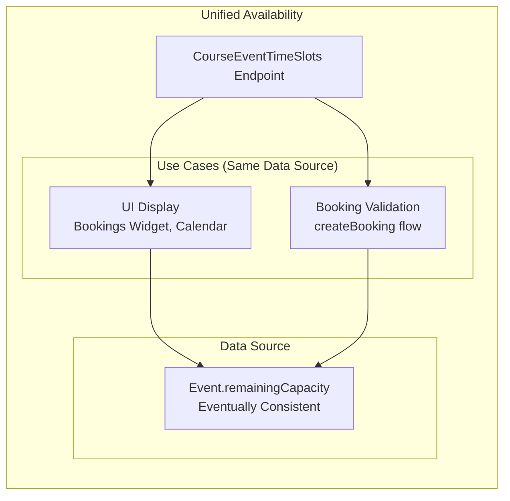

### Why This Works for Both Use Cases

| Concern | Why It's Acceptable |
|---------|---------------------|
| **"Validation needs consistent data"** | Policy checks (tooEarly, tooLate, etc.) ARE consistent - only capacity is eventual |
| **"Could lead to overbooking"** | Race window is small; platform allows negative `remainingCapacity`; handled operationally |
| **"User sees wrong availability"** | If stale, booking fails gracefully; user retries; better than slow response |
| **"Different from appointments"** | Appointments have resource exclusivity (1:1); classes/courses have shared capacity (N:1) |

### Trade-offs We Accept

| Trade-off | What We Get | What We Give Up |
|-----------|-------------|-----------------|
| **Eventual consistency** | Fast response, no extra RPC to Bookings | Rare race condition for last spot |
| **Unified endpoint** | Simpler architecture, one source of truth | Can't have different consistency per use case |
| **Event-based capacity** | No aggregation queries, pre-calculated | Small window of stale data after booking |

### Edge Cases and Platform Handling

| Edge Case | What Happens | How Handled |
|-----------|--------------|-------------|
| **Two users book last spot simultaneously** | Both pass availability check, both bookings created | `Event.remainingCapacity` becomes negative; business handles operationally (refund/reschedule) |
| **User sees "1 spot" but booking fails** | Event was just updated, UI was stale | User sees error, retries, gets fresh data |
| **Capacity shows negative** | More bookings than capacity | Display can clamp to 0; no functional impact |
| **Policy check fails** | `tooLateToBook`, `bookOnlineDisabled`, etc. | These are ALWAYS consistent (time-based, config-based) - no race possible |

### Why NOT Separate Display vs Validation Endpoints

| Reason | Explanation |
|--------|-------------|
| **Proven pattern** | `ListEventTimeSlots` for classes already uses this model for both use cases |
| **Complexity** | Maintaining two data paths (eventual + consistent) doubles code and testing |
| **Performance** | Consistent queries to Bookings add latency; not justified for shared-capacity services |
| **Rare failure mode** | Overbooking race is extremely rare (requires two requests for last spot within ms) |
| **Graceful degradation** | If eventual data causes booking failure, user gets clear error and can retry |

### Current Implementation Landscape

| Service | Service Types | Used For | Status |
|---------|---------------|----------|--------|
| `AvailabilityTimeSlots` | Appointments | Display + Validation | ✅ Active |
| `EventTimeSlots` (ListEventTimeSlots) | Classes | Display + Validation | ✅ Active |
| `MultiServiceAvailabilityTimeSlots` | Multi-Service | Display + Validation | ✅ Active |
| **Course Availability** | Courses | - | ❌ **Missing** |
| `AvailabilityCalendar.getScheduleAvailability` | Courses | Validation only | ⚠️ **Deprecated** |
| `AvailabilityCalendar.getSlotAvailability` | Classes/Appointments | Validation only | ⚠️ **Deprecated** |

### Problems We Are Solving

This design document addresses three categories of problems:

#### 1. Client Support Experience & Performance

| Problem | Description | Impact |
|---------|-------------|--------|
| **Server logic on client side** | Clients must calculate availability themselves (sum participants, check policies) | Inconsistent implementations, error-prone |
| **Blocks server updates** | Adding new features (e.g., course waitlist, new booking policy) cannot be rolled out without client updates | Feature velocity bottleneck |
| **Client version inconsistency** | Different client versions may have different availability calculations | Business logic fragmentation |
| **Multiple API calls required** | Clients need 3+ API calls for course availability | Higher latency, more complexity |
| **Deprecated API usage** | Clients forced to use deprecated Schedule V1 and AvailabilityCalendar | Technical debt, migration blocker |

#### 2. Complete Migration from Deprecated APIs

The following deprecated APIs must be fully replaced:

| Deprecated API | Replacement | Migration Status |
|----------------|-------------|------------------|
| `Schedule V1` (schedules proxy) | Schedule V3 + ScheduleTimeFrames V3 | 🔄 In Progress |
| `AvailabilityCalendar.getScheduleAvailability` | **NEW: CourseEventTimeSlots Endpoint** | ❌ No replacement exists |
| `AvailabilityCalendar.getSlotAvailability` | `EventTimeSlots.listEventTimeSlots` | 🔄 In Progress (via feature toggle) |

**Services Still Using Deprecated AvailabilityCalendar**:

| Service | RPC Used | Purpose | Migration Required |
|---------|----------|---------|-------------------|
| Bookings Service | `getScheduleAvailability` | Course availability during createBooking | ✅ Yes |
| Bookings Service | `getSlotAvailability` | Class availability during createBooking | 🔄 In Progress |
| Bookings Gateway | `getSlotAvailability` | Availability validation | 🔄 In Progress |
| Waiting List Service | `getSlotAvailability` | Check spots on booking cancellation | ✅ Yes |

#### 3. Platform Consistency

| Issue | Description |
|-------|-------------|
| **Different patterns for similar services** | Classes use `ListEventTimeSlots`, Courses use manual client calculation |
| **Missing modern API for courses** | `service-availability` module supports appointments, classes, multi-service - but NOT courses |
| **Documentation recommends deprecated flow** | Official Wix docs direct users to deprecated APIs |

### New UI/UX Capabilities Enabled

The new course availability endpoint enables several UI/UX improvements:

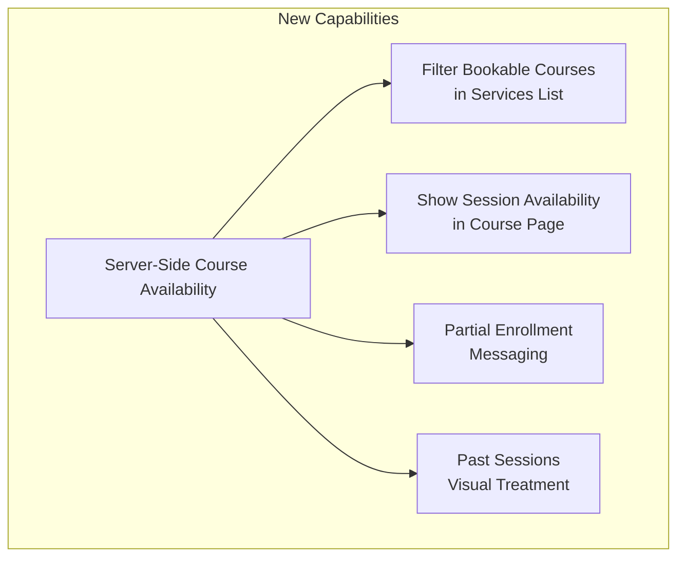

| Capability | Description | User Value |
|------------|-------------|------------|
| **Filter Bookable Courses** | On the services-list page, filter and show only courses that are currently bookable | Users don't waste time clicking into unavailable courses |
| **Session Availability Indicators** | On the course service-page, mark which individual sessions are still available vs. already occurred | Clear visual indication of what the user will attend |
| **Partial Enrollment Messaging** | When booking a course with `bookAfterStartPolicy = true`, display message like *"Your registration will include 22/25 sessions in this course"* | Transparent communication about what user is purchasing |
| **Past Sessions Visual Treatment** | Gray out or visually differentiate sessions that have already occurred | Clear UX that past sessions won't be attended |

### Business Context: bookAfterStartPolicy Usage

**DORA Data Analysis**:

| Metric | Value |
|--------|-------|
| **Courses with bookAfterStartPolicy enabled** | 69,764 |
| **Total active courses with bookings** | 205,612 |
| **Percentage with policy enabled** | **33.93%** |

> **Definition**: Active courses = not deleted, with at least one confirmed booking in the last 365 days

**Key Insights**:
- ~1 in 3 courses allow late enrollment - significant demand for partial enrollment functionality
- This is NOT an edge case - nearly 70K courses rely on this policy
- Must support `bookAfterStartPolicy` - affects 33% of courses

---

## 📘 Relevant Material

### Links to JIRA / Slack Threads

- **JIRA**: [To be created]
- **Design Research**: `/bookings-backend/service-availability/docs/research/`
- **Draft Document**: `/bookings-backend/service-availability/docs/course-availability-design-draft.md`

### Communication Channels on Slack

- **Primary**: `#bookings-platform`
- **Architecture Review**: `#server-guild-architecture`
- **Dependencies**: `#services-team`, `#calendar-team`

### External Documentation

- [Wix Bookings End-to-End Booking Flows - Book a Course](https://dev.wix.com/docs/api-reference/business-solutions/bookings/end-to-end-booking-flows#book-a-course)
- [List Event Time Slots API](https://dev.wix.com/docs/api-reference/business-solutions/bookings/time-slots/time-slots-v2/list-event-time-slots)

> ⚠️ **ACTION ITEM**: Update official documentation to reflect new course availability endpoint once implemented.

---

## 📘 Requirements

### Product Description

**Goal**: Enable course availability through a modern API in the `service-availability` module, providing unified API patterns for all service types (appointments, classes, courses).

**Use Cases**:
1. **Bookings Widget** (frontend): Display course session availability in calendar view
2. **Mobile Apps**: Show bookable course sessions with real-time capacity
3. **Third-Party Integrations**: Partner systems query course availability
4. **Vibe Integration**: Modern headless booking flows

### Scope - What Will/Won't Be Covered

**✅ IN SCOPE**:
- New `ListCourseEventTimeSlots` endpoint in service-availability
- Server-side policy enforcement for booking policies:
  - `limitEarlyBooking`
  - `limitLateBooking`
  - `bookAfterStartPolicy` ⚠️ **NEW - requires SPI extension**
  - `bookOnlineDisabled`
  - `remainingCapacity`
- Schedule-level policy calculation using `ScheduleTimeFrames V3.firstEventStartDate`
- Gradual rollout with feature flag
- Integration with Bookings service via AvailabilityCalendar proxy layer

**❌ OUT OF SCOPE**:
- Waitlist support for courses (future consideration)
- Materialized participant count (use Events V3 `remainingCapacity`)
- Changes to booking creation flow (availability only)

### Assumptions

1. **Events V3** provides accurate `remainingCapacity` per session (eventually consistent)
2. **ScheduleTimeFrames V3** provides `firstEventStartDate` and `lastEventEndDate`
3. Course rescheduling is **infrequent** (hours/days between changes)
4. Eventually consistent data is **acceptable** for availability display
5. `createBooking` validation will catch any race conditions (authoritative check)

### Constraints

**Dependencies**:
- ScheduleTimeFrames V3 API (existing - no changes required)
- Events V3 API (existing - no changes required)
- `BookingPolicyProvider` SPI extension required (add `bookAfterStartPolicy`)

**Technical Constraints**:
- Must maintain backward compatibility (no breaking changes)
- Must follow Wix Server Guild standards and Loom Prime framework

---

## 📘 High Level Design

### Solution Overview

Create a new dedicated endpoint `ListCourseEventTimeSlots` in the `service-availability` module, following the same pattern as existing endpoints:

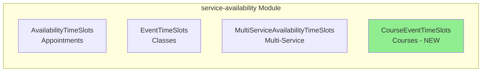

### General Availability Data Flow

All availability endpoints follow a common pattern:

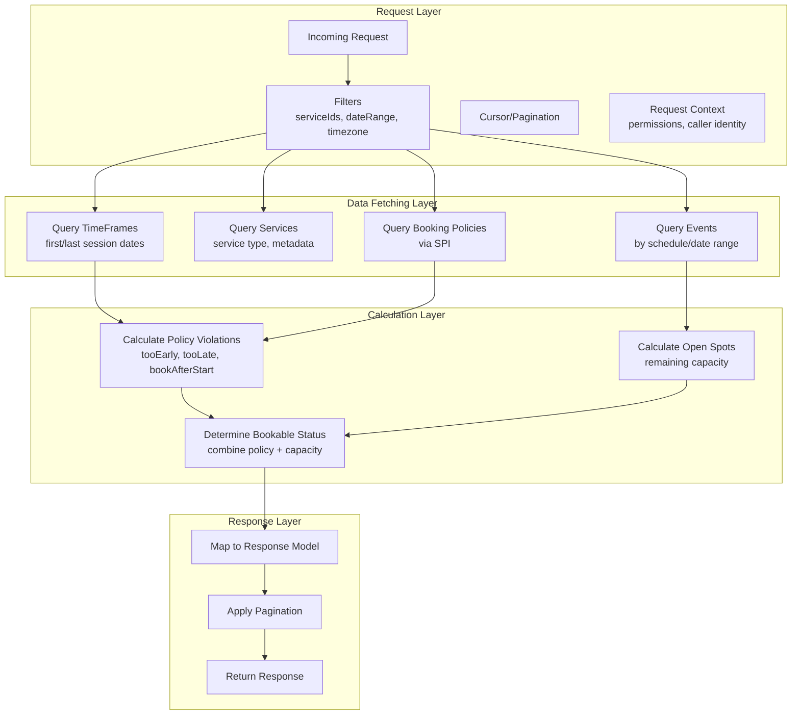

---

## 📘 Current Architecture

### Current Course Availability - Internal Client (Bookings Widget)

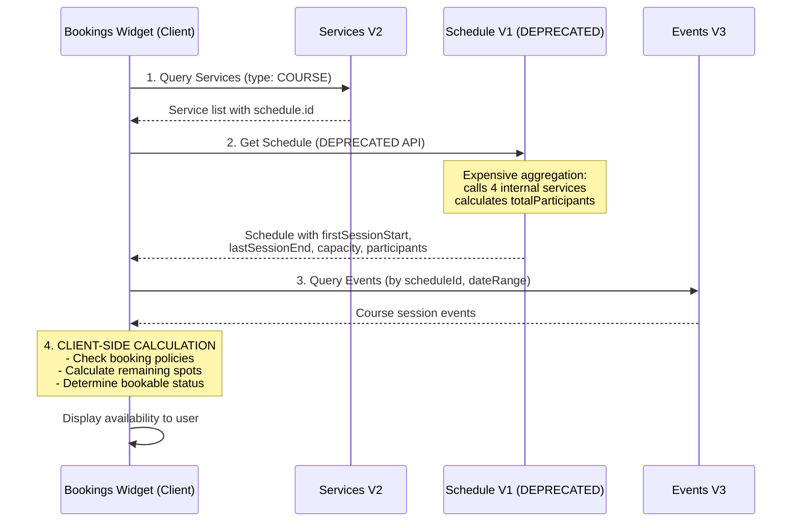

### Current Course Availability - External Client (Third-Party)

According to the [official documentation](https://dev.wix.com/docs/api-reference/business-solutions/bookings/end-to-end-booking-flows#book-a-course):

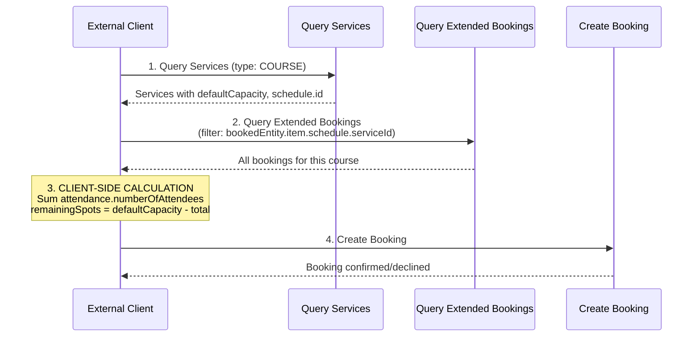

### Current Bookings Service Availability Validation

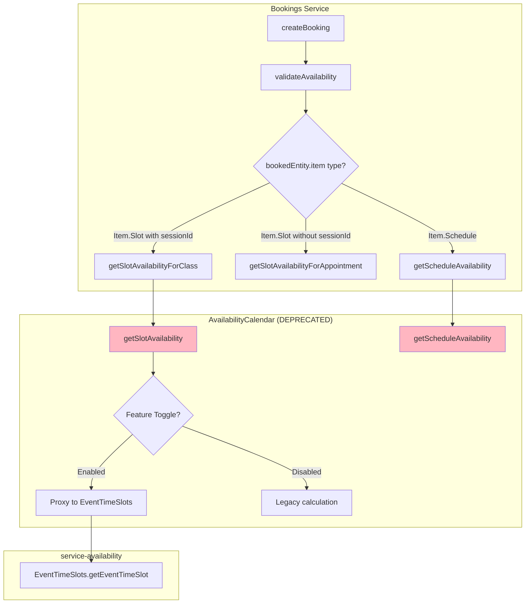

### Issues with Current Architecture

| Issue | Description | Impact |
|-------|-------------|--------|
| **Client-Side Calculation** | Clients must implement availability logic themselves | Inconsistent implementations, error-prone |
| **Multiple API Calls** | Requires 3+ sequential API calls | Higher latency, poor performance |
| **No Policy Enforcement** | Clients don't receive `bookingPolicyViolations` | Must implement policies themselves or skip |
| **Deprecated API Dependency** | Uses deprecated Schedule V1 and AvailabilityCalendar | Migration blocker |
| **No Session Details** | Only aggregate capacity, no per-session info | Poor UX for displaying sessions |

### Current createBooking Availability Validation Per Service Type

When `createBooking` is called, the Bookings service validates availability differently per service type:

| Service Type | Availability Source | Consistency | Capacity Data |
|--------------|---------------------|-------------|---------------|
| **Appointments** | `AvailabilityCalendar.getSlotAvailability` | Consistent | Checks resource conflicts, slot generation |
| **Classes** (toggle ON) | `EventTimeSlots.getEventTimeSlot` via proxy | **Eventually Consistent** | Uses `Event.remainingCapacity` |
| **Classes** (toggle OFF) | `AvailabilityCalendar.getSlotAvailability` | Consistent | Queries Bookings directly |
| **Courses** | `AvailabilityCalendar.getScheduleAvailability` | Consistent | Sums confirmed bookings by scheduleId |

**Key Insight**: When the feature toggle `conductSpecsAvailabilitycalendarProxyClassServicesToEventTimeSlotsSpec` is ON, class booking validation uses the same eventually consistent data as the display endpoint (`ListEventTimeSlots`).

**Edge Case - Class Availability with Toggle ON**:

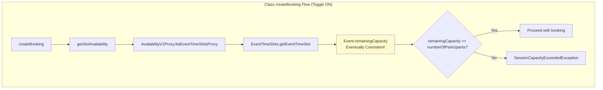

**Why this is acceptable**:
1. Event updates happen shortly after booking creation (exact latency TBD - needs measurement)
2. Race conditions are rare (requires two bookings for last spot within a small window)
3. Policy violations (tooLate, tooEarly, etc.) still block invalid bookings
4. For high-contention scenarios, eventual consistency is a deliberate trade-off for performance

---

## 📘 Planned Design Description

### Elevator Pitch

Create a new `ListCourseEventTimeSlots` endpoint that returns course session availability with server-side policy calculation, using `ScheduleTimeFrames V3` for policy reference time and `Event.remainingCapacity` for capacity - enabling clients to get complete availability in a single API call.

### New Endpoint Data Flow

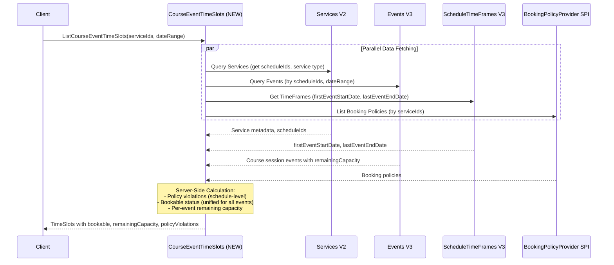

### Parallel vs Sequential Data Fetching

| Data Source | Can Parallelize? | Depends On |
|-------------|------------------|------------|
| Query Services | ✅ Yes | Request only |
| Query Events | ✅ Yes | Request only |
| Query ScheduleTimeFrames | ✅ Yes | Request only (uses scheduleIds) |
| Query Booking Policies | ✅ Yes | Request only (uses serviceIds) |
| Calculate Policy Violations | ❌ No | Requires TimeFrames (firstEventStartDate) + Policies |
| Calculate Capacity | ❌ No | Requires Events (remainingCapacity) |

**Performance Benefit**:
- Current (Client): 3 sequential calls = Sum of all latencies
- New (Server): 4 parallel calls = Max of all latencies

### How Bookings Service Will Use New Endpoint

**No changes required to Bookings service code**. The integration happens at the `AvailabilityCalendar` layer:

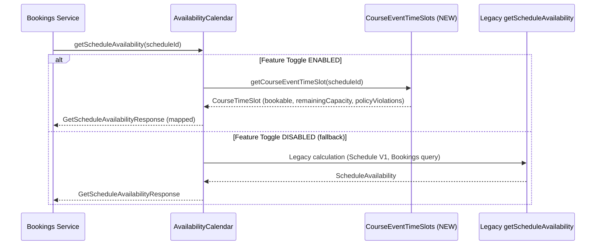

---

## 📘 Target Design Blueprint

### Data Sources

| Data | Recommended Source | Rationale |
|------|-------------------|-----------|
| Session Events | Events V3 | Direct access, includes capacity |
| Remaining Capacity | Event.remainingCapacity | Fast, eventually consistent (acceptable for display) |
| Policy Reference Time | **ScheduleTimeFrames V3** (`firstEventStartDate`) | Non-deprecated, correct course semantics |
| Booking Policies | BookingPolicyProvider SPI | Standard pattern, extensible |

> ⚠️ **Deprecated Sources to Avoid**:
> - `Schedule V1` - fully deprecated
> - `Services V2.schedule.firstSessionStart` - populated from deprecated Schedule V1

### Course vs Class Policy Calculation

| Policy | Classes | Courses |
|--------|---------|---------|
| **Reference Time** | `event.start` | `ScheduleTimeFrames.firstEventStartDate` |
| **tooLateToBook** | `now > event.start - limitLateBookingMinutes` | `now > firstEventStartDate - limitLateBookingMinutes` |
| **tooEarlyToBook** | `now < event.start - limitEarlyBookingMinutes` | `now < firstEventStartDate - limitEarlyBookingMinutes` |
| **bookAfterStartPolicy** | N/A (past events are unbookable) | If `now > firstEventStartDate`, check `bookAfterStartPolicy.enabled` |
| **Unified bookable** | Per-event decision | Same for all events in course |
| **remainingCapacity** | Per-event | Per-event (from Event.remainingCapacity) |

### Consistency Trade-off: Legacy vs New

| Aspect | Current (AvailabilityCalendar) | New (CourseEventTimeSlots) |
|--------|-------------------------------|---------------------------|
| **Data Source for Capacity** | Query Bookings (consistent) | Event.remainingCapacity (eventual) |
| **Policy Reference Time** | Schedule V1.firstSessionStart | ScheduleTimeFrames V3.firstEventStartDate |
| **Dependencies** | Schedule V1, Bookings, Services | Events V3, ScheduleTimeFrames V3, Services V2 |
| **Performance** | Slower (Bookings query) | Faster (no extra query) |
| **Consistency** | Consistent | Eventually consistent |
| **Used for** | Booking validation only | **Both display AND validation** |

> **Key Decision**: We accept eventual consistency for BOTH display and validation because:
> 1. Policy checks remain consistent (time-based calculations)
> 2. Capacity race conditions are rare and operationally manageable
> 3. Performance gain outweighs the small risk
> 4. Same pattern proven successful with `ListEventTimeSlots` for classes

### Policy vs Capacity Consistency Analysis

**Policy calculations are ALWAYS consistent** because they only use:
- Timestamps (`now()` vs `event.start` or `schedule.firstEventStartDate`)
- Service configuration (`Service.bookingPolicy`) - read fresh from Services V2 on each request

**Only capacity calculation is eventually consistent** - depends on `Event.remainingCapacity` being updated.

| Calculation | Data Used | Consistent? |
|-------------|-----------|-------------|
| `tooEarlyToBook` | `now()`, `firstEventStartDate`, `limitEarlyBookingMinutes` | ✅ Yes |
| `tooLateToBook` | `now()`, `firstEventStartDate`, `limitLateBookingMinutes` | ✅ Yes |
| `bookOnlineDisabled` | `Service.bookingPolicy.bookOnlineDisabled` | ✅ Yes |
| `bookAfterStartPolicy` | `now()`, `firstEventStartDate`, `bookAfterStartPolicy.enabled` | ✅ Yes |
| `remainingCapacity` | `Event.remainingCapacity` | ⚠️ Eventually consistent |

### Event Update Pipeline (Eventual Consistency Flow)

When a booking is created, the following async pipeline updates `Event.remainingCapacity`:

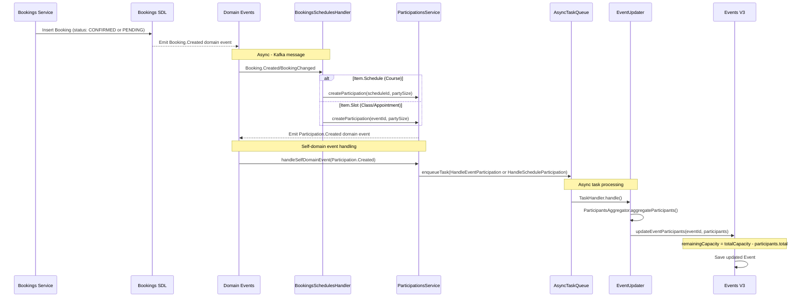

**Key Points**:
1. **Trigger**: Both `CONFIRMED` and `PENDING` booking statuses trigger participation creation
2. **Async nature**: The pipeline is fully asynchronous via domain events and task queues
3. **Latency**: Depends on Kafka consumer lag and task queue processing (no measured SLA - needs monitoring data)
4. **No capacity validation in Participations**: The platform does NOT reject participation if event is at capacity - it simply updates `remainingCapacity` (can become negative)

> ⚠️ **TODO**: Measure actual p50/p99 latency from `Booking.Created` to `Event.remainingCapacity` update using production metrics.

### Overbooking Edge Case

**Q: What happens if two concurrent bookings race for the last spot?**

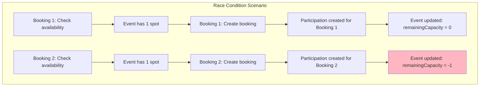

**Answer**: The platform allows this - both bookings succeed because:
1. Availability check (`validateSlotAvailability`) happens BEFORE booking SDL insert
2. If both requests pass the check before either updates the event, both proceed
3. `Event.remainingCapacity` can become negative (no hard constraint)
4. This is an **intentional design choice**: performance and simplicity over strict consistency

**Business Mitigation**:
- This race window is very small (milliseconds)
- Overbooking can be handled operationally (refund, reschedule)
- For high-demand scenarios, consider adding a rate limiter or semaphore (out of scope)

### Why Eventual Consistency is Acceptable

| Factor | Justification |
|--------|---------------|
| **Small window** | Async pipeline assumed to complete quickly (latency TBD - needs measurement) |
| **Low collision probability** | Most bookings don't race for last spot |
| **Policy still blocks** | If course is `tooLateToBook`, capacity doesn't matter |
| **Operational handling** | Business can handle rare overbookings |
| **Performance gain** | Avoiding consistent Bookings query significantly improves latency |
| **Alignment with classes** | Same pattern used for class availability (proven) |

---

## 📘 Alternative Solutions / Design Dilemmas

### Dilemma 1: New Endpoint vs Extend ListEventTimeSlots

**Option A: Extend `ListEventTimeSlots`**
- Add course support to existing class availability endpoint
- Unified API for all event-based services (classes + courses)

**Option B: Create New `ListCourseEventTimeSlots` Endpoint** ✅ **RECOMMENDED**
- Dedicated endpoint for course availability
- Follows existing pattern of separate endpoints per service type

| Reason | Explanation |
|--------|-------------|
| **Follows existing pattern** | `service-availability` already has 3 separate endpoints (appointments, classes, multi-service). Adding a 4th for courses is consistent. |
| **Code clarity** | Avoids complex type-checking logic to differentiate course vs class. Each endpoint has clear responsibility. |
| **Safe rollout** | New functionality is completely isolated from existing endpoints. Zero risk of breaking class availability. |
| **Tailored optimization** | Course-specific optimizations (e.g., schedule-level policy calculation) without affecting classes. |
| **Future flexibility** | Course-specific features (e.g., course waitlist) can be added without impacting other endpoints. |

### Dilemma 2: Capacity Data Source

| Option | Source | Pros | Cons |
|--------|--------|------|------|
| **A: Event.remainingCapacity** ✅ | Events V3 | Fast, no extra call, unified with classes | Eventually consistent |
| **B: Query Participations** | Participations V3 | Consistent | Slower (extra RPC) |
| **C: Query Bookings** | Bookings V2 | Consistent | Slower (extra RPC) |

**Recommendation**: Option A - aligns with class availability pattern, acceptable for display

### Dilemma 3: Policy Reference Time

| Option | Source | Deprecated? |
|--------|--------|-------------|
| **A: Schedule V1.firstSessionStart** | Schedule V1 | ⚠️ **Deprecated** |
| **B: ScheduleTimeFrames V3** ✅ | `firstEventStartDate` | ✅ No |
| **C: Query first event directly** | Events V3 | ✅ No (extra call) |

**Recommendation**: Option B - non-deprecated, already used internally

---

## 📘 APIs

### New Endpoint: ListCourseEventTimeSlots

**Endpoint**: `POST /bookings/availability/v2/course-event-time-slots`

**Request Parameters**:

| Parameter | Required | Description |
|-----------|----------|-------------|
| `service_ids` | Optional | Filter by course service IDs (max 100) |
| `from_local_date` | Required | Start of date range (ISO 8601) |
| `to_local_date` | Required | End of date range (ISO 8601) |
| `time_zone` | Optional | Timezone (default: business timezone) |
| `include_non_bookable` | Optional | Include non-bookable slots (default: true) |
| `cursor_paging` | Optional | Cursor-based pagination |

**Response Fields** (per TimeSlot):

| Field | Description |
|-------|-------------|
| `service_id` | Course service ID |
| `schedule_id` | Schedule ID (course identifier) |
| `event_id` | Individual session event ID |
| `local_start_date` | Session start time |
| `local_end_date` | Session end time |
| `bookable` | Whether course can be booked (unified for all events) |
| `remaining_capacity` | Spots remaining for this session |
| `total_capacity` | Total capacity for this session |
| `booking_policy_violations` | Policy violations (tooEarly, tooLate, etc.) |

### SPI Extension Required

**BookingPolicyProvider SPI** needs extension to include `bookAfterStartPolicy`:

| Current Fields | New Field Required |
|----------------|-------------------|
| `limit_early_booking_minutes` | `book_after_start_policy.enabled` |
| `limit_late_booking_minutes` | |
| `book_online_disabled` | |
| `max_participants_per_booking` | |

---

## ✅ Wix Ecosystem Requirements

### ✅ Experiments & Feature Toggles

| Toggle | Description | Default | Rollout |
|--------|-------------|---------|---------|
| `course_availability_enabled` | Enable new CourseEventTimeSlots endpoint | false | 1% → 10% → 50% → 100% |
| `proxy_course_to_new_endpoint` | AvailabilityCalendar proxies to new endpoint | false | After endpoint stable |

### ✅ PII

**Not Applicable** - Course availability contains no PII (only aggregated capacity numbers, no participant names/details).

### ✅ GDPR

**Not Applicable** - No personal data stored or processed. Availability queries are anonymous.

### ✅ BI

**BI Events**:
1. `course_availability_query` - Track query usage, latency, cache hits
2. `course_policy_violation` - Track policy violation types
3. `course_availability_error` - Track errors and dependency issues

### ✅ Accessibility

**Not Applicable** - Backend API only, no UI components. Frontend teams are responsible for accessibility compliance.

### ✅ Audit

**Minimal** - Read-only API. Course availability queries logged via BI events. No Activity Log required (non-mutating).

### ✅ Presence in Wix Platforms

| Platform | Impact | Notes |
|----------|--------|-------|
| Editor | No impact | Uses Services V2 for configuration |
| Editor Preview | May use new endpoint | Previewing availability |
| Business Manager | May use new endpoint | Reporting |
| OneApp | May use new endpoint | Mobile availability |
| Branded Apps | May use new endpoint | Mobile availability |
| POS | No impact | Doesn't show availability |

**Potential Breakage**: **NONE** - All changes are backward compatible

### ✅ Translations

**Not Required** - API responses contain only timestamps (locale-agnostic), capacity numbers (numeric), and boolean flags (language-agnostic).

---

## ✅ Non Functional Requirements

### ✅ Rollout / Rollout Strategy

| Phase | Duration | Rollout % | KPIs |
|-------|----------|-----------|------|
| Dark Launch | 1 week | 0% | Zero errors, latency baseline |
| 1% Rollout | 3 days | 1% | Error rate < 0.1% |
| 10% Rollout | 5 days | 10% | Response parity with legacy |
| 50% Rollout | 1 week | 50% | Performance improvement confirmed |
| 100% Rollout | Ongoing | 100% | Zero critical incidents |

**Rollback Strategy**: Feature flag OFF reverts to previous behavior

### ✅ Monitoring, Alerts and Troubleshooting

**Metrics**:
- `availability.course_requests.total` (counter)
- `availability.latency_ms` (histogram)
- `availability.policy_violations.<type>` (counter)
- `availability.dependency_errors` (counter)

**Alerts**:

| Alert | Condition | Severity | Action |
|-------|-----------|----------|--------|
| High Error Rate | > 1% for 5 min | 🚨 Critical | Page on-call, rollback |
| Dependency Failure | ScheduleTimeFrames down | ⚠️ Warning | Check dependency health |

**Urgent Channel**: `#bookings-platform-alerts`

### ✅ Performance & Scale

**Expected Capacity**:

| Metric | Year 1 | Year 3 |
|--------|--------|--------|
| Course Availability Queries | 10M/year | 50M/year |
| Peak RPM | ~500 | ~2000 |

**Performance Impact**:
- 4 parallel calls vs 3 sequential = Net performance improvement
- No extra Bookings query = Reduced dependency load

### ✅ High Availability & Durability

**Availability SLA**: 99.9% (inherits service-availability SLA)

**Dependency Availability**:

| Dependency | Impact if Down | Mitigation |
|-----------|----------------|------------|
| ScheduleTimeFrames V3 | Policy calculation fails | Fallback to query first event |
| Events V3 | All queries fail | Retry with exponential backoff |
| Services V2 | Course detection fails | Return error |

### ✅ Error Handling & Resilience

**Graceful Degradation**:
- ScheduleTimeFrames V3 down → Fallback to query first event from Events V3
- Events V3 down → Fail request (no fallback data source)
- SPI missing `bookAfterStartPolicy` → Treat as disabled (safe default)

**Feature Killer**: Toggle `course_availability_enabled` to OFF

### ✅ Security Vulnerability

**Authentication**: Wix OAuth 2.0 (existing pattern)
**Authorization**: Provider read permission required
**STRIDE Analysis**: Low risk - read-only API, no PII, public availability data

### ✅ Testing

**Unit Tests** (>90% coverage):
- Course detection logic
- Policy calculation (all policies including `bookAfterStartPolicy`)
- Schedule-level vs event-level policy calculation

**Integration Tests**:
- End-to-end course availability query
- Policy enforcement verification
- Backward compatibility with AvailabilityCalendar proxy

**Edge Cases**:
- Course with `bookAfterStartPolicy = true` and first session in past
- Course fully booked
- Query range that excludes first session

---

## Open Questions

### Technical Questions

| # | Question | Options | Recommendation | Status |
|---|----------|---------|----------------|--------|
| 1 | Should all course events return the same `bookable` value? | A) Yes (schedule-level) B) Per-event | A - unified for course semantics | Pending product |
| 2 | How to handle `bookAfterStartPolicy` for past events? | A) Show as bookable B) Show as informational | B - bookable for future only | Pending product |
| 3 | Should we add course waitlist support in v1? | A) Include B) Defer | B - defer to future iteration | Pending product |
| 4 | SPI extension for `bookAfterStartPolicy` - acceptable? | A) Yes B) Find alternative | A - additive change | Pending review |

### Business Questions

| # | Question | Impact | Owner |
|---|----------|--------|-------|
| 5 | Timeline for Schedule V1 full deprecation? | Migration planning | Product |
| 6 | External developer communication plan? | Third-party migration | DevRel |
| 7 | Documentation update ownership? | Action item tracking | DevRel |

### Dependencies

| Dependency | Description | Owner | Status |
|------------|-------------|-------|--------|
| BookingPolicyProvider SPI | Add `bookAfterStartPolicy` field | service-availability team | Not started |
| ScheduleTimeFrames V3 | `firstEventStartDate`, `lastEventEndDate` | calendar team | ✅ Available |
| Services V2 | Service type, scheduleId mapping | services team | ✅ Available |
| Events V3 | Session events with `remainingCapacity` | calendar team | ✅ Available |

---

## Meeting Summaries and Decisions

### Meeting 1: Design Kickoff
**Date**: [TBD]  
**Participants**: [TBD]

**Decisions**:
- [ ] Approve new endpoint approach (vs extending ListEventTimeSlots)
- [ ] Confirm SPI extension acceptable
- [ ] Agree on rollout timeline

**Action Items**:

| Action | Owner | JIRA | Status |
|--------|-------|------|--------|
| Schedule architecture review | [TBD] | [TBD] | Pending |
| Create implementation JIRAs | [TBD] | [TBD] | Pending |

---

## Execution Plan

### Phase 1: Implement New Endpoint

**Duration**: 2 weeks

**Deliverables**:
- [ ] `ListCourseEventTimeSlots` endpoint implementation
- [ ] `GetCourseEventTimeSlot` endpoint implementation
- [ ] BookingPolicyProvider SPI extension (`bookAfterStartPolicy`)
- [ ] Unit tests (>90% coverage)
- [ ] Integration tests

### Phase 2: Rollout New Endpoint

**Duration**: 2 weeks

**Deliverables**:
- [ ] Deploy with feature flag OFF
- [ ] Gradual rollout: 1% → 10% → 50% → 100%
- [ ] Validate response parity with AvailabilityCalendar

### Phase 3: Client Migration

**Duration**: 4 weeks

**Deliverables**:
- [ ] Update Bookings Widget to use new endpoint
- [ ] Update external documentation
- [ ] Publish migration guide

### Phase 4: Bookings Service Migration

**Duration**: 3 weeks

**Deliverables**:
- [ ] Add proxy toggle in AvailabilityCalendar
- [ ] Implement fallback mechanism
- [ ] Gradual rollout of proxy

### Phase 5: Remove Legacy Implementation

**Duration**: 2 weeks

**Deliverables**:
- [ ] Remove deprecated code paths
- [ ] Archive legacy tests

### Phase 6: Full Deprecation

**Duration**: 4 weeks

**Deliverables**:
- [ ] Mark Schedule V1 as fully deprecated
- [ ] Mark AvailabilityCalendar.getScheduleAvailability as removed
- [ ] Update all documentation

**Final State**:
- Schedule V1: Fully deprecated
- AvailabilityCalendar: Fully deprecated
- All course availability: Via new endpoint

---

## Changelog

| Version | Date | Changes |
|---------|------|---------|
| 3.0 | Jan 2026 | Restructured to match standard design template, aligned sections |
| 2.0 | Jan 2026 | Added availability domains, current flow analysis, data sources, rollout plan |
| 1.0 | Jan 2026 | Initial draft |

---

*Document Version: 3.0*
