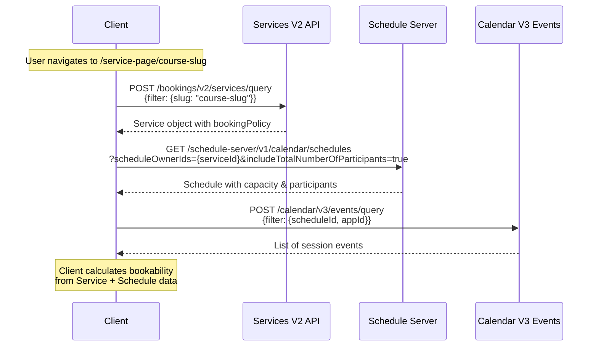
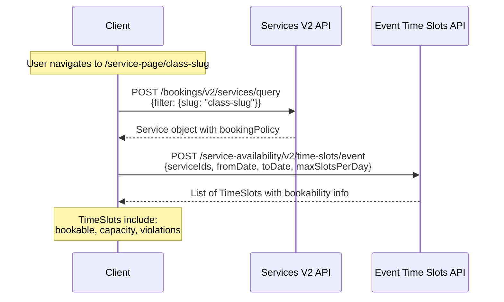
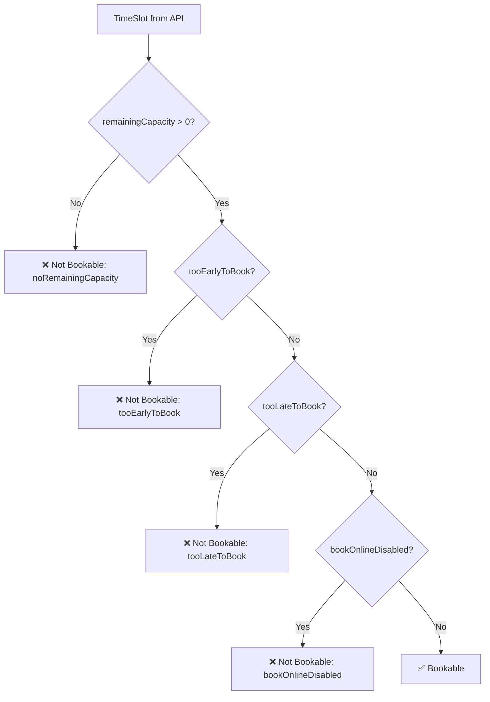
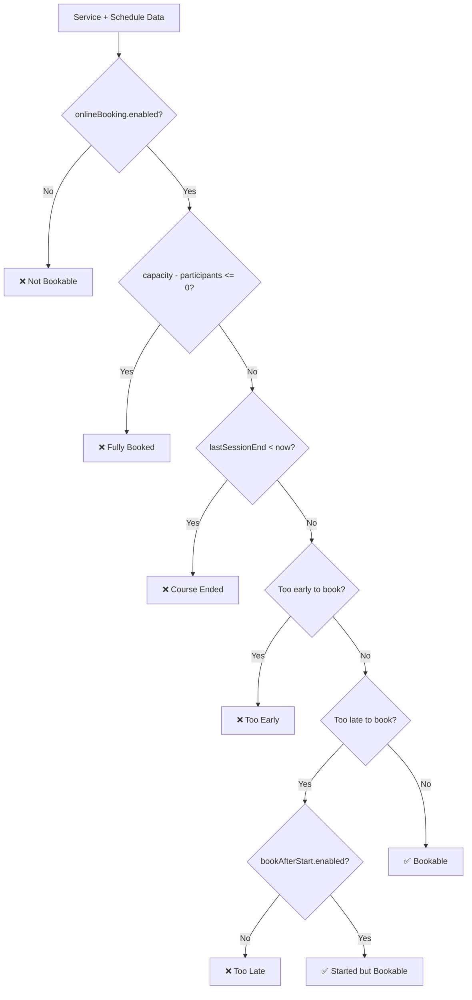
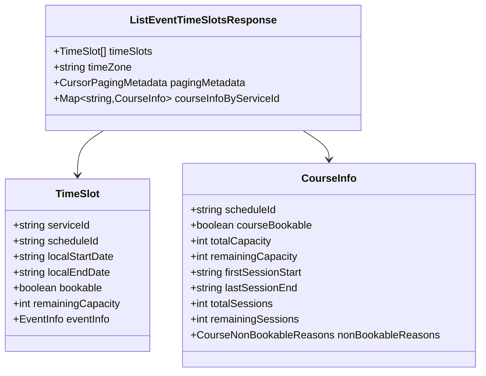
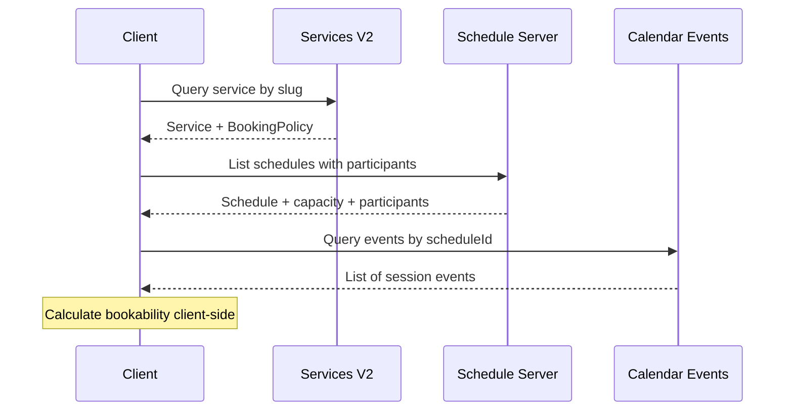
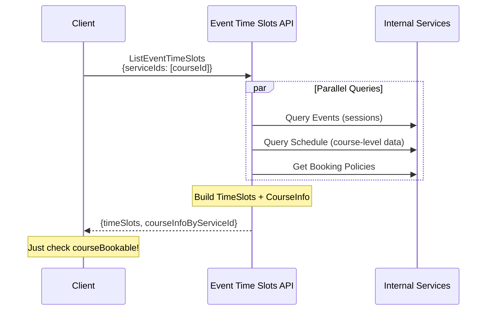

# Wix Bookings Client Flow Analysis

## Table of Contents

1. [Overview](#overview)
2. [Page Flows](#page-flows)
   - [/book-online Page](#1-book-online-page)
   - [/service-page](#2-service-page)
3. [API Reference](#api-reference)
4. [Class vs Course Flow Comparison](#class-vs-course-flow-comparison)
5. [System Design Proposal](#system-design-proposal)

---

## Overview

This document analyzes the client-side flow for Wix Bookings, tracing the API calls and data flow for both **Class** and **Course** service types.

### Service Types

| Type | Description | Booking Model |
|------|-------------|---------------|
| **CLASS** | Single group session (e.g., Yoga class) | Book individual sessions (event-level) |
| **COURSE** | Multi-session series (e.g., 8-week cooking course) | Book all sessions together (schedule-level) |

### Official Documentation

- [About Wix Bookings](https://dev.wix.com/docs/rest/business-solutions/bookings/introduction)
- [Bookings Architecture](https://dev.wix.com/docs/rest/business-solutions/bookings/architecture-and-data-flow)
- [Time Slots API](https://dev.wix.com/docs/rest/business-solutions/bookings/time-slots/introduction)
- [List Event Time Slots](https://dev.wix.com/docs/rest/business-solutions/bookings/time-slots/time-slots-v2/list-event-time-slots)
- [Calendar Events Query](https://dev.wix.com/docs/rest/business-management/calendar/events-v3/query-events)
- [End-to-End Booking Flows](https://dev.wix.com/docs/rest/business-solutions/bookings/end-to-end-booking-flows)

---

## Page Flows

### 1. /book-online Page

This is the main booking page that lists all available services.

#### Step 1: Query Services

**Request:**
```
POST /bookings/v2/services/query
```

**Source Code:** [Services Query](https://github.com/wix-private/scheduler/blob/master/bookings-backend/services-2/src/com/wixpress/bookings/services/v2/ServicesService.scala)

**Official Docs:** [Query Services API](https://dev.wix.com/docs/rest/business-solutions/bookings/services/services-v2/query-services)

**Response Structure:**

```json
{
  "services": [
    {
      "id": "cd3eb411-3f95-4a13-b529-7134330df50c",
      "type": "COURSE",
      "name": "Course No Staff",
      "defaultCapacity": 100,
      "onlineBooking": {
        "enabled": true,
        "requireManualApproval": false
      },
      "bookingPolicy": {
        "id": "7a0fdb27-9c4b-4911-9cbe-9f8cb07694d6",
        "limitEarlyBookingPolicy": {
          "enabled": false,
          "earliestBookingInMinutes": 10080
        },
        "limitLateBookingPolicy": {
          "enabled": false,
          "latestBookingInMinutes": 1440
        },
        "bookAfterStartPolicy": {
          "enabled": false
        }
      },
      "schedule": {
        "id": "847af652-1833-42df-9fe6-0dbdfd8ced0e",
        "firstSessionStart": "2026-01-21T15:30:00Z",
        "lastSessionEnd": "2026-04-21T15:30:00Z"
      }
    },
    {
      "id": "512eb85b-61cd-4397-ae5a-1b698c8b32af",
      "type": "CLASS",
      "name": "Yoga Flow",
      "defaultCapacity": 10,
      "schedule": {
        "id": "35beb0bb-37b8-4e2f-90c3-5585078425aa",
        "firstSessionStart": "2026-01-08T21:30:00Z"
      }
    }
  ]
}
```

#### Step 2: Get Schedule Details (For Courses Only)

For **COURSE** services, an additional call is made to get capacity and participant information.

**Request:**
```
GET /schedule-reader-server/v1/calendar/schedules
    ?scheduleOwnerIds=cd3eb411-3f95-4a13-b529-7134330df50c
    &includeTotalNumberOfParticipants=true
```

**Source Code:** [SchedulesService.scala#L63](https://github.com/wix-private/scheduler/blob/master/bookings-backend/calendar-3/schedules/src/com/wixpress/calendar/schedules/v3/SchedulesService.scala#L63)

**Proto Definition:** [schedules_service.proto#L372](https://github.com/wix-private/scheduler/blob/master/bookings-backend/calendar-3/schedules/proto/wix/calendar/schedules/v3/schedules_service.proto#L372)

**Response Structure:**

```json
{
  "schedules": [
    {
      "id": "847af652-1833-42df-9fe6-0dbdfd8ced0e",
      "scheduleOwnerId": "cd3eb411-3f95-4a13-b529-7134330df50c",
      "firstSessionStart": "2026-01-21T15:30:00Z",
      "lastSessionEnd": "2026-04-21T15:30:00Z",
      "timeZone": "America/Chicago",
      "tags": ["COURSE"],
      "capacity": 100,
      "totalNumberOfParticipants": 1,
      "status": "CREATED"
    }
  ]
}
```

> **Open Question:** Is the schedule call made on initial page load, or only when needed? Does this happen on every refresh?

#### Client-Side Logic

The client uses the data from these calls to:
1. Display the list of services with booking status
2. Enable/disable the "Book Now" button based on availability
3. Show additional details in the widget (e.g., "3 spots left")

---

### 2. /service-page

After clicking "Book Now", the user is redirected to the service detail page.

#### Course Service Flow



##### Step 1: Query Service Details

**Request:**
```
POST /bookings/v2/services/query
Content-Type: application/json

{
  "conditionalFields": ["STAFF_MEMBER_DETAILS"],
  "query": {
    "filter": {
      "hidden": false,
      "supportedSlugs.name": "ai-with-tamir"
    }
  }
}
```

**Returns:** Full service object including `bookingPolicy` and `schedule` info.

##### Step 2: Get Schedule with Participants

**Request:**
```
GET /schedule-server/v1/calendar/schedules
    ?scheduleOwnerIds=5c09be59-0972-4851-aff1-cedf823011ca
    &includeTotalNumberOfParticipants=true
```

**Key Fields Used:**
- `capacity`: Total spots (e.g., 5)
- `totalNumberOfParticipants`: Currently booked (e.g., 2)
- `firstSessionStart`, `lastSessionEnd`: Course timeline

##### Step 3: Query Session Events

**Request:**
```
POST /calendar/v3/events/query
Content-Type: application/json

{
  "fromLocalDate": "2026-01-07T09:00:00",
  "toLocalDate": "2026-04-29T12:30:00",
  "query": {
    "filter": {
      "$and": [
        {"appId": "13d21c63-b5ec-5912-8397-c3a5ddb27a97"},
        {"scheduleId": "01ebfc3c-8044-4dd1-a91a-705cf242dad5"}
      ]
    }
  }
}
```

**Official Docs:** [Query Events](https://dev.wix.com/docs/rest/business-management/calendar/events-v3/query-events)

**Source Code:** [events_service.proto#L744](https://github.com/wix-private/scheduler/blob/master/bookings-backend/calendar-3/events/proto/wix/calendar/events/v3/events_service.proto#L744)

> **Open Question:** Does booking policy enforcement calculation happen again on this page? How costly is this process?

---

#### Class Service Flow



##### Step 1: Query Service Details

Same as course - query by slug to get service object.

##### Step 2: Get Event Time Slots

**Request:**
```
POST /service-availability/v2/time-slots/event
Content-Type: application/json

{
  "timeZone": "America/Chicago",
  "fromLocalDate": "2026-01-07T11:01:07",
  "toLocalDate": "2026-01-31T23:59:59",
  "serviceIds": ["512eb85b-61cd-4397-ae5a-1b698c8b32af"],
  "maxSlotsPerDay": 1,
  "includeNonBookable": true,
  "eventFilter": {},
  "cursorPaging": {"limit": 1000}
}
```

**Official Docs:** [List Event Time Slots](https://dev.wix.com/docs/rest/business-solutions/bookings/time-slots/time-slots-v2/list-event-time-slots)

**Source Code:** [EventTimeSlots.scala#L43](https://github.com/wix-private/scheduler/blob/master/bookings-backend/service-availability/src/com/wixpress/bookings/availability/v2/EventTimeSlots.scala#L43)

**Proto Definition:** [event_time_slots.proto#L169](https://github.com/wix-private/scheduler/blob/master/bookings-backend/service-availability/proto/com/wixpress/bookings/availability/v2/event_time_slots.proto#L169)

**Response Includes:**
- `bookable`: Whether slot can be booked
- `remainingCapacity`: Spots left
- `bookingPolicyViolations`: Why not bookable (tooEarly, tooLate, etc.)

##### Calendar Day Selection

When user selects a specific day in the calendar view:

```
POST /service-availability/v2/time-slots/event
Content-Type: application/json

{
  "timeZone": "America/Chicago",
  "fromLocalDate": "2026-01-15T00:00:00",
  "toLocalDate": "2026-01-15T23:59:59",
  "serviceIds": ["512eb85b-61cd-4397-ae5a-1b698c8b32af"],
  "includeNonBookable": true,
  "eventFilter": {},
  "cursorPaging": {"limit": 1000}
}
```

> **Open Question:** Are all booking policy enforcements done in the backend, or is some logic still calculated on the client?

---

## API Reference

### APIs Used

| API | Endpoint | Purpose | Used By |
|-----|----------|---------|---------|
| **Services V2** | `/bookings/v2/services/query` | Get service definitions | Both |
| **Schedule Server** | `/schedule-server/v1/calendar/schedules` | Get schedule with participants | Course |
| **Calendar V3 Events** | `/calendar/v3/events/query` | Get session events | Course |
| **Event Time Slots** | `/service-availability/v2/time-slots/event` | Get bookable time slots | Class |

### Key Data Structures

#### Service Object
```typescript
interface Service {
  id: string;
  type: 'APPOINTMENT' | 'CLASS' | 'COURSE';
  name: string;
  defaultCapacity: number;
  onlineBooking: {
    enabled: boolean;
  };
  bookingPolicy: BookingPolicy;
  schedule: {
    id: string;
    firstSessionStart: string;
    lastSessionEnd?: string;
  };
}
```

#### Schedule Object
```typescript
interface Schedule {
  id: string;
  scheduleOwnerId: string;  // = Service ID
  capacity: number;
  totalNumberOfParticipants: number;
  firstSessionStart: string;
  lastSessionEnd: string;
  tags: string[];  // ['COURSE'] or ['CLASS']
  status: 'CREATED' | 'CANCELLED';
}
```

#### TimeSlot Object
```typescript
interface TimeSlot {
  serviceId: string;
  localStartDate: string;
  localEndDate: string;
  bookable: boolean;
  totalCapacity: number;
  remainingCapacity: number;
  bookableCapacity: number;
  eventInfo: {
    eventId: string;
  };
  bookingPolicyViolations?: {
    tooEarlyToBook: boolean;
    tooLateToBook: boolean;
    bookOnlineDisabled: boolean;
  };
}
```

---

## Class vs Course Flow Comparison

### Current API Call Comparison

| Aspect | Class | Course |
|--------|-------|--------|
| **API Calls** | 2 (Services + TimeSlots) | 3 (Services + Schedule + Events) |
| **Bookability Calculation** | Server-side (in TimeSlots API) | Client-side |
| **Capacity Source** | Per-event (TimeSlot.remainingCapacity) | Per-schedule (Schedule.capacity - participants) |
| **Session Data** | TimeSlot per session | Event per session |
| **Schedule ID in Response** | ❌ Not included | ✅ Via Schedule API |

### Decision Flow Comparison

#### Class Bookability (Server-Side)



#### Course Bookability (Client-Side)



### Gap Analysis

| Feature | Class Support | Course Support | Gap |
|---------|--------------|----------------|-----|
| Get time slots via single API | ✅ EventTimeSlots | ❌ Requires 3 APIs | Missing |
| Server-side bookability | ✅ Calculated | ❌ Client calculates | Missing |
| remainingCapacity | ✅ Per-slot | ⚠️ Correct but not in same API | API gap |
| scheduleId for booking | ⚠️ Not populated | ❌ Separate API | Missing |
| Policy violations | ✅ Included | ❌ Client calculates | Missing |
| Pagination | ✅ Cursor-based | N/A | N/A |

---

## System Design Proposal

### Goal

Add support for **COURSE** services in the `ListEventTimeSlots` API, providing:
1. Same unified API for both classes and courses
2. Server-side bookability calculation
3. Course-level availability info (scheduleId, courseBookable, etc.)
4. Reduced API calls (3 → 1)

### Key Insight: Course Data is Shared Across Sessions

Unlike classes where each session has independent capacity:
- **Course capacity is at schedule level**
- All sessions share the same `remainingCapacity`
- `bookable`, `bookingPolicyViolations` are the same for all sessions

Therefore, we should NOT duplicate course-level info in each TimeSlot.

### Proposed Solution

Add `CourseInfo` at the **response level** (not per TimeSlot):



### Flow Comparison

#### Current Course Flow (3 API Calls)



#### Proposed Course Flow (1 API Call)



### Implementation Details

See: [Course Availability System Design](./course-availability-system-design.md)

### Benefits

| Benefit | Description |
|---------|-------------|
| **Fewer API calls** | 3 → 1 (67% reduction) |
| **Server-side logic** | Bookability calculated consistently on backend |
| **No data duplication** | CourseInfo at response level, not per slot |
| **Backwards compatible** | New optional fields, existing clients unaffected |
| **Unified API** | Same endpoint for classes and courses |
| **Better caching** | Single response can be cached |

### Cons

| Concern | Mitigation |
|---------|------------|
| Additional complexity in backend | Modular design, feature flags |
| Need to identify course services | Cache service types |
| Pagination edge case | Query Schedule directly for course-level data |

### Open Questions

1. **Caching:** Should course info be cached? For how long?
2. **Feature flag:** Rollout strategy for new fields?
3. **Frontend migration:** Timeline for updating client code?
4. **Deprecation:** When to deprecate the old course flow?

---

## Task List

Based on the analysis above, here are the tasks to complete:

### 1. Trace Class Request Logic ✅

**Documented above** - See "Class Service Flow" section with:
- Sequence diagram
- Decision flowchart
- API request/response examples
- Source code links

### 2. Describe Current Course Behavior

**What happens today if you send a course serviceId to ListEventTimeSlots:**

```json
{
  "serviceIds": ["course-service-id"],
  "fromLocalDate": "2026-03-01T00:00:00",
  "toLocalDate": "2026-04-01T00:00:00"
}
```

**Result:** 
- ✅ Returns TimeSlots for each course session
- ✅ Capacity is correct (propagated from schedule-level participations)
- ❌ `scheduleId` is not populated in TimeSlot
- ❌ No course-level `courseBookable` indicator
- ❌ Client still needs to query Schedule API for participant count

### 3. Comparison Table ✅

See "Gap Analysis" table above.

### 4. System Design Proposal ✅

See "System Design Proposal" section above and linked document.

---

## References

### Source Code Links

| File | Description |
|------|-------------|
| [EventTimeSlots.scala](https://github.com/wix-private/scheduler/blob/master/bookings-backend/service-availability/src/com/wixpress/bookings/availability/v2/EventTimeSlots.scala) | Main time slots implementation |
| [event_time_slots.proto](https://github.com/wix-private/scheduler/blob/master/bookings-backend/service-availability/proto/com/wixpress/bookings/availability/v2/event_time_slots.proto) | Proto definitions |
| [SchedulesService.scala](https://github.com/wix-private/scheduler/blob/master/bookings-backend/calendar-3/schedules/src/com/wixpress/calendar/schedules/v3/SchedulesService.scala) | Schedule server implementation |
| [events_service.proto](https://github.com/wix-private/scheduler/blob/master/bookings-backend/calendar-3/events/proto/wix/calendar/events/v3/events_service.proto) | Calendar events proto |

### Official Documentation

| Topic | Link |
|-------|------|
| About Wix Bookings | https://dev.wix.com/docs/rest/business-solutions/bookings/introduction |
| Time Slots API | https://dev.wix.com/docs/rest/business-solutions/bookings/time-slots/introduction |
| List Event Time Slots | https://dev.wix.com/docs/rest/business-solutions/bookings/time-slots/time-slots-v2/list-event-time-slots |
| Query Events | https://dev.wix.com/docs/rest/business-management/calendar/events-v3/query-events |
| End-to-End Booking Flows | https://dev.wix.com/docs/rest/business-solutions/bookings/end-to-end-booking-flows |
| Bookings Architecture | https://dev.wix.com/docs/rest/business-solutions/bookings/architecture-and-data-flow |

### Related Design Documents

| Document | Description |
|----------|-------------|
| [course-availability-design.md](./course-availability-design.md) | Original exploration and analysis |
| [course-availability-system-design.md](./course-availability-system-design.md) | Complete system design proposal |
| [zero-to-hero-guide.md](./zero-to-hero-guide.md) | Comprehensive glossary and concepts |

