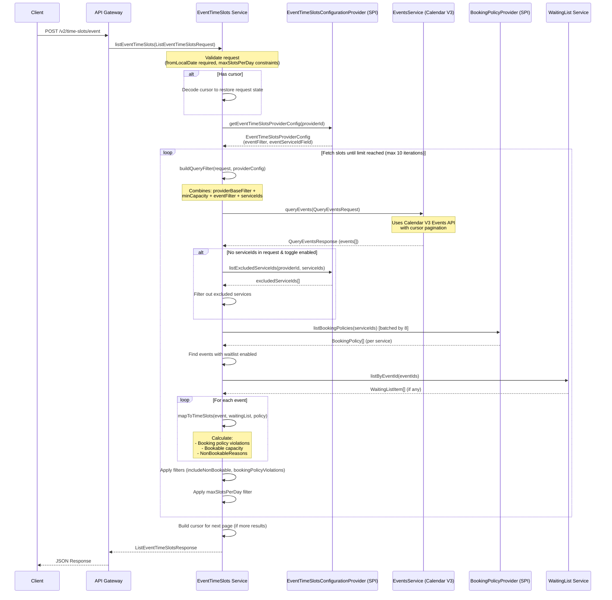

# Course Availability Design Document

## Task Overview

**Goal**: Incorporate course availability as part of class availability (event-based availability) in the `service-availability` module.

**Key Considerations**:
- This is not only for Vibe use cases - we may want to migrate the live site course flow to use this as well
- Both classes and courses share the same concern: event-based availability
- May need changes outside of availability (e.g., a Service field indicating registration type)

**Reference Documentation**:
- [List Event Time Slots API](https://dev.wix.com/docs/api-reference/business-solutions/bookings/time-slots/time-slots-v2/list-event-time-slots)
- [Book a Course Flow](https://dev.wix.com/docs/api-reference/business-solutions/bookings/end-to-end-booking-flows#book-a-course)

---

## Service Availability Module Architecture

### Overview

The `service-availability` module is a **Loom Prime service** that provides time slot availability APIs for Wix Bookings. It exposes three main services:

| Service | Purpose | Service Type |
|---------|---------|--------------|
| `AvailabilityTimeSlots` | Primary service for **appointment-based** availability | Primary |
| `EventTimeSlots` | Secondary service for **class/event-based** availability | Secondary |
| `MultiServiceAvailabilityTimeSlots` | Secondary service for multi-service booking scenarios | Secondary |

### Build Configuration

```bazel
# From BUILD.bazel
prime_app(
    name = "service-availability",
    artifact = "com.wixpress.bookings.availability.service-availability",
    service = "com.wixpress.bookings.availability.v2.AvailabilityTimeSlots",
    secondary_services = [
        "com.wixpress.bookings.availability.v2.MultiServiceAvailabilityTimeSlots",
        "com.wixpress.bookings.availability.v2.EventTimeSlots",
    ],
    spi_services = [
        "com.wixpress.bookings.availability.spi.v2.AvailabilityTimeSlotsConfigurationProvider",
        "com.wixpress.bookings.availability.spi.v2.BookingPolicyProvider",
        "com.wixpress.bookings.availability.spi.v2.MultiServiceBookingPolicyProvider",
        "com.wixpress.bookings.availability.spi.v2.EventTimeSlotsConfigurationProvider",
    ],
    rpcs = [
        "wix.bookings.services.v2.ServicesService",
        "wix.calendar.events.v3.EventsService",
        "wix.calendar.schedules.v3.SchedulesService",
        "com.wix.bookings.api.v1.WaitingList",
        # ... other RPCs
    ],
)
```

### Key Dependencies

- **Calendar V3 Events API** - Source of class session events
- **Services V2 API** - Service definitions and types
- **Booking Policies** - Policy rules for availability
- **Waiting List API** - Waitlist capacity management

---

## Full Request Path: `listEventTimeSlots`

### Sequence Diagram



### Request Flow Steps

1. **Request Validation**
   - `fromLocalDate` is required (unless cursor provided)
   - If `maxSlotsPerDay` specified, `toLocalDate` must be within 1 month

2. **Cursor Handling**
   - If cursor exists, decode it to restore full request state
   - Cursor is JWT-encrypted containing all filter parameters

3. **SPI Configuration**
   - Get provider config (default: Bookings app ID)
   - Config contains `eventFilter` and `eventServiceIdField`

4. **Event Query Loop** (max 10 iterations)
   - Build combined filter from provider config + request filters
   - Query Calendar V3 Events with pagination
   - Filter hidden services if no explicit serviceIds provided
   - Get booking policies for all service IDs
   - Get waiting list items for events with waitlist enabled
   - Map events to TimeSlots with all metadata

5. **Response Building**
   - Apply `maxSlotsPerDay` filter if specified
   - Build cursor for next page if more results exist
   - Return TimeSlots with paging metadata

---

## Request Object: `ListEventTimeSlotsRequest`

```protobuf
message ListEventTimeSlotsRequest {
  // ID of the provider that supplies the events and booking policies.
  // Default: Bookings app ID (13d21c63-b5ec-5912-8397-c3a5ddb27a97)
  google.protobuf.StringValue provider_id = 1;

  // Lower boundary for localStartDate (required unless cursor provided)
  // Format: YYYY-MM-DDThh:mm:ss (ISO-8601)
  google.protobuf.StringValue from_local_date = 2;

  // Upper boundary for localStartDate (required unless cursor provided)
  // Format: YYYY-MM-DDThh:mm:ss (ISO-8601)
  google.protobuf.StringValue to_local_date = 3;

  // Time zone in IANA format (e.g., "America/New_York")
  // Default: business site properties timezone
  google.protobuf.StringValue time_zone = 4;

  // Optional service IDs filter (max 100)
  repeated google.protobuf.StringValue service_ids = 5;

  // Whether to include non-bookable time slots
  // Default: true
  google.protobuf.BoolValue include_non_bookable = 6;

  // Minimum bookable capacity filter
  google.protobuf.Int32Value min_bookable_capacity = 7;

  // Optional filter to apply to events (resource, location, etc.)
  google.protobuf.Struct event_filter = 8;

  // Maximum slots per day (requires toLocalDate within 1 month)
  google.protobuf.Int32Value max_slots_per_day = 9;

  // Cursor-based paging (default limit: 50)
  CursorPaging cursor_paging = 10;

  // Booking policy violation filters
  BookingPolicyViolations booking_policy_violations = 11;
}
```

---

## Response Object: `ListEventTimeSlotsResponse`

```protobuf
message ListEventTimeSlotsResponse {
  // Retrieved time slots matching the specified filters
  repeated TimeSlot time_slots = 1;

  // Time zone used for the response
  google.protobuf.StringValue time_zone = 2;

  // Paging metadata (hasNext, cursors)
  CursorPagingMetadata paging_metadata = 3;
}
```

---

## TimeSlot Object

```protobuf
message TimeSlot {
  // Service ID (empty for multi-service bookings)
  google.protobuf.StringValue service_id = 1;
  
  // Local start/end dates in ISO-8601 format
  google.protobuf.StringValue local_start_date = 2;
  google.protobuf.StringValue local_end_date = 3;
  
  // Whether customers can book this slot
  google.protobuf.BoolValue bookable = 4;
  
  // Location information
  Location location = 5;
  
  // Event info (eventId, waitingList) - ONLY for classes, NOT for courses currently
  EventInfo event_info = 6;
  
  // Capacity fields
  google.protobuf.Int32Value total_capacity = 7;
  google.protobuf.Int32Value remaining_capacity = 8;
  google.protobuf.Int32Value bookable_capacity = 12;
  
  // Policy violations (tooEarlyToBook, tooLateToBook, bookOnlineDisabled)
  BookingPolicyViolations booking_policy_violations = 9;
  
  // Available resources (staff, equipment, rooms)
  repeated AvailableResources available_resources = 10;
  
  // Nested time slots for multi-service bookings
  repeated NestedTimeSlot nested_time_slots = 11;
  
  // Reasons why slot is not bookable
  NonBookableReasons non_bookable_reasons = 13;
  
  // Schedule ID
  google.protobuf.StringValue schedule_id = 14;
}

message EventInfo {
  // Event ID (references wix.calendar.v3.event)
  google.protobuf.StringValue event_id = 1;
  
  // Waitlist information (if service has waitlist)
  WaitingList waiting_list = 2;
}

message BookingPolicyViolations {
  google.protobuf.BoolValue too_early_to_book = 1;
  google.protobuf.Timestamp earliest_booking_date = 4;
  google.protobuf.BoolValue too_late_to_book = 2;
  google.protobuf.BoolValue book_online_disabled = 3;
}

message NonBookableReasons {
  google.protobuf.BoolValue no_remaining_capacity = 1;
  google.protobuf.BoolValue violates_booking_policy = 2;
  google.protobuf.BoolValue reserved_for_waiting_list = 3;
  google.protobuf.BoolValue event_cancelled = 4;
}
```

---

## Current Course Availability Implementation

### Backend: `GetScheduleAvailability` API

Currently, course availability is checked via a **completely separate** API in `AvailabilityCalendar`:

```scala
// From availability-calendar/src/com/wixpress/bookings/availability/AvailabilityCalendar.scala

private def getScheduleAvailabilityForCourse(scheduleId: String, shouldNotCallConsistentQuery: Boolean)
                                            (implicit callScope: CallScope): Future[GetScheduleAvailabilityResponse] = {
  val scheduleFuture = schedulesAdapter.getScheduleById(scheduleId)
  for {
    schedule <- scheduleFuture
    catalogData <- catalogService.getCatalogData(Seq(schedule.scheduleOwnerId.get))
    totalSpots = schedule.capacity.getOrElse(0)
    openSpots <- if (shouldNotCallConsistentQuery) {
      Future.successful(totalSpots - schedule.totalNumberOfParticipants)
    } else getRemainingSpotsForCourse(schedule.id, totalSpots)
    bookingPolicy = catalogData.getBookingPolicy(scheduleId)
  } yield {
    val bookingPolicySettings = bookingPolicy.flatMap(_.maxParticipantsPerBooking.map(maxParticipants => 
      BookingPolicySettings(Some(maxParticipants))))
    val policyViolations = bookingPolicyViolations(Right(schedule), bookingPolicy)
    GetScheduleAvailabilityResponse(
      availability = Some(ScheduleAvailability()
        .withOpenSpots(openSpots)
        .withTotalSpots(totalSpots)
        .withBookingPolicyViolations(policyViolations)),
      bookingPolicySettings = bookingPolicySettings
    )
  }
}

private def getRemainingSpotsForCourse(scheduleId: String, totalSpots: Int)(implicit callScope: CallScope) = {
  val query = bookingsAdapter.buildQueryForExistingCourseBookings(scheduleId)
  for {
    bookingsEntries <- bookingsAdapter.consistentQueryBookings(query)
  } yield remainingOpenSpots(totalSpots, bookingsEntries)
}
```

### Frontend: Course Booking Flow

```typescript
// From statics/viewer/angular/scheduler-client/app/modules/offering/offering-page/offering-page.component.ts

this.props.onBook = () => {
  this.trackingSrv.trackOfferingBookingClick(this.offering);
  if (this.offeringValidationsSrv.isOfferingAllowedForSelectionByPremium(this.offering.type)) {
    if (this.offering.type === OfferingType.COURSE) {
      this.storeSelectedTimezone();
    }
    if (this.offeringValidationsSrv.isOfferingOfferedAsPricingPlan(this.offering)) {
      this.doPricingPlanNavigation();
    } else {
      if (this.experimentsEnabler.isEnforcePolicyOnCourseEnabled() && this.offering.type === OfferingType.COURSE) {
        if (this.offering.futureBookingsPolicy && !this.isOfferingOpenForBookInAdvance()) {
          this.notifyNotOpenForBookInAdvance(this.offering.futureBookingsPolicy.limitXMinutesToTheFuture);
          return;
        }
        if (this.isOfferingPassBookingWindow()) {
          this.notifyOfferingPassBookingWindow();
          return;
        }
      }
      // Course goes directly to calendar without ListEventTimeSlots
      this.navigateToCalendar();
    }
  }
}
```

**Key Observation**: Current course flow does NOT use `ListEventTimeSlots` - it goes directly from service selection to booking.

---

## Comparison: Classes vs Courses

| Aspect | Class | Course |
|--------|-------|--------|
| **Availability API** | `ListEventTimeSlots` | `GetScheduleAvailability` |
| **Entity Level** | Per-Event (session) | Per-Schedule (entire course) |
| **Data Source** | Calendar Events V3 | Schedules + Bookings query |
| **TimeSlot structure** | Has `eventInfo.eventId` | N/A |
| **Capacity Calculation** | Per-session remaining | Total across all sessions |
| **Booking Model** | Book individual sessions | Book entire course |
| **Waitlist Support** | Yes | No |

### What They Share (Event-Based)

- Both are group services with capacity
- Both have booking policies (tooEarlyToBook, tooLateToBook, bookOnlineDisabled)
- Both need remaining capacity calculation
- Both are **not dynamically generated slots** (unlike appointments)

---

## SPI Configuration

### EventTimeSlotsConfigurationProvider

```protobuf
// From proto-spi/com/wixpress/bookings/availability/spi/v2/event_time_slots_configuration_provider.proto

service EventTimeSlotsConfigurationProvider {
  option (.wix.spi.service) = {
    spi_identifier: "com.wixpress.appservice.api.ComponentType.EVENT_TIME_SLOTS_CONFIGURATION_PROVIDER",
    config_message: "com.wixpress.bookings.availability.spi.v2.EventTimeSlotsProviderConfig",
    app_id: "13d21c63-b5ec-5912-8397-c3a5ddb27a97",
  };

  // Returns service IDs to exclude from results
  rpc ListExcludedServiceIds(ListExcludedServiceIdsRequest) returns (ListExcludedServiceIdsResponse);
}

message EventTimeSlotsProviderConfig {
  // Deployment URI
  .wix.common.spi.SpiBaseUri deployment_uri = 1;

  // Filter for events - for Bookings: {"type": "CLASS"}
  // THIS IS THE KEY FILTER THAT CURRENTLY EXCLUDES COURSES
  google.protobuf.Struct event_filter = 2;

  // Field path to extract service ID from event (e.g., "externalScheduleId")
  google.protobuf.StringValue event_service_id_field = 3;
  
  // Toggle for listExcludedServiceIds
  bool toggle_list_excluded_service_ids_enabled = 4;
}
```

**Current Issue**: The `event_filter` is set to `{"type": "CLASS"}` which explicitly excludes courses.

---

## Service Types in Bookings

```protobuf
// From services-2/proto/wix/bookings/services/v2/service.proto

message ServiceTypeEnum {
  enum ServiceType {
    UNKNOWN_SERVICE_TYPE = 0;
    APPOINTMENT = 1;  // Dynamic slot generation
    CLASS = 2;        // Event-based, per-session booking
    COURSE = 3;       // Event-based, full-course booking
  }
}
```

---

## Draft Solution Steps

### Phase 1: Analysis & Design

#### 1.1 Understand Course Event Structure
- [ ] Verify how courses are represented in Calendar V3 Events
- [ ] Check if courses have `type: "COURSE"` events or just schedules
- [ ] Determine if course sessions appear as separate events
- [ ] Document the relationship between Course Service → Schedule → Events

#### 1.2 Decide on Availability Model

| Option | Description | Pros | Cons |
|--------|-------------|------|------|
| **A** | Course as single "time slot" (like today's `GetScheduleAvailability`) | Simple, matches current booking model | Doesn't show session details |
| **B** | Course sessions as individual events (like classes) | More flexibility for display | Capacity is at course level, not session |
| **C** | Hybrid - course as a slot with nested session info | Best of both worlds | More complex implementation |

#### 1.3 Define Service Registration Type
Consider adding a field to Service to indicate availability model:

```protobuf
// Proposed addition to Service proto
enum RegistrationType {
  UNKNOWN_REGISTRATION_TYPE = 0;
  AVAILABILITY_BASED = 1;  // Appointments - generate slots dynamically
  EVENT_BASED = 2;         // Classes, Courses - use calendar events
}

// Or more granularly:
enum BookingGranularity {
  UNKNOWN_GRANULARITY = 0;
  PER_SLOT = 1;      // Appointments - book individual generated slots
  PER_SESSION = 2;   // Classes - book individual sessions
  PER_SCHEDULE = 3;  // Courses - book entire schedule
}
```

---

### Phase 2: Backend Implementation

#### 2.1 Extend EventTimeSlotsConfigurationProvider SPI

**Option A**: Update event filter to include courses
```json
{
  "type": {
    "$in": ["CLASS", "COURSE"]
  }
}
```

**Option B**: Add separate configuration for course events
```protobuf
message EventTimeSlotsProviderConfig {
  // Existing fields...
  
  // NEW: Separate filter for course events
  google.protobuf.Struct course_event_filter = 5;
  
  // NEW: Toggle to enable course support
  bool include_courses = 6;
}
```

#### 2.2 Modify EventTimeSlots.scala for Course Support

Key changes needed:
1. Detect course events vs class events
2. Handle schedule-level capacity for courses
3. Add course-specific response fields

```scala
// Pseudo-code for course handling
private def mapToTimeSlots(event: Event, ...): TimeSlot = {
  val serviceType = getServiceType(eventServiceId)
  
  serviceType match {
    case ServiceType.CLASS => 
      // Existing logic - per-session capacity
      mapClassEventToTimeSlot(event, waitingList, policy)
      
    case ServiceType.COURSE =>
      // New logic - schedule-level capacity
      mapCourseEventToTimeSlot(event, scheduleCapacity, policy)
  }
}
```

#### 2.3 Course Availability Calculation

For courses, capacity = schedule capacity - total bookings

```scala
private def getCourseAvailability(scheduleId: String): Future[CourseAvailability] = {
  for {
    schedule <- schedulesAdapter.getScheduleById(scheduleId)
    totalSpots = schedule.capacity.getOrElse(0)
    bookingsCount <- getBookingsCountForSchedule(scheduleId)
    remainingSpots = Math.max(0, totalSpots - bookingsCount)
  } yield CourseAvailability(totalSpots, remainingSpots)
}
```

#### 2.4 Add Course Support to TimeSlot Proto

```protobuf
message TimeSlot {
  // Existing fields...
  
  // NEW: Course-specific information
  CourseInfo course_info = 15;
}

message CourseInfo {
  // Schedule ID for the course
  google.protobuf.StringValue schedule_id = 1;
  
  // First session date
  google.protobuf.StringValue first_session_date = 2;
  
  // Last session date  
  google.protobuf.StringValue last_session_date = 3;
  
  // Total number of sessions in the course
  google.protobuf.Int32Value total_sessions = 4;
  
  // Sessions that have already occurred
  google.protobuf.Int32Value past_sessions = 5;
}
```

---

### Phase 3: Service Model Enhancement

#### 3.1 Add Registration Type to Service

Update `services-2` proto:

```protobuf
message Service {
  // Existing fields...
  
  // NEW: Indicates how availability is calculated and bookings are made
  RegistrationInfo registration_info = XX;
}

message RegistrationInfo {
  // How availability is determined
  AvailabilityType availability_type = 1;
  
  // Booking granularity
  BookingGranularity booking_granularity = 2;
  
  enum AvailabilityType {
    UNKNOWN_AVAILABILITY_TYPE = 0;
    SLOT_BASED = 1;   // Appointments - dynamically generated
    EVENT_BASED = 2;  // Classes, Courses - calendar events
  }
  
  enum BookingGranularity {
    UNKNOWN_GRANULARITY = 0;
    PER_SLOT = 1;      // Appointments
    PER_SESSION = 2;   // Classes
    PER_SCHEDULE = 3;  // Courses
  }
}
```

---

### Phase 4: Frontend & Migration

#### 4.1 Update Frontend Flow

- [ ] Migrate course booking flow to use `ListEventTimeSlots`
- [ ] Handle course-specific display (show course info, not individual sessions)
- [ ] Update availability calendar component to support courses

#### 4.2 Backwards Compatibility

- [ ] Keep `GetScheduleAvailability` working for existing integrations
- [ ] Add feature toggle for gradual rollout
- [ ] Support both old and new course flows during transition

---

### Phase 5: Testing & Documentation

#### 5.1 Test Scenarios

| Scenario | Description |
|----------|-------------|
| Mixed service types | Query with both class and course serviceIds |
| Course capacity edge cases | Full course, 1 spot left, 0 capacity |
| Booking policy enforcement | tooEarlyToBook, tooLateToBook for courses |
| Pagination | Mixed class/course results across pages |
| Started courses | Course with past sessions |
| Cancelled course sessions | Some sessions cancelled |

#### 5.2 Update API Documentation

- [ ] Document course support in `ListEventTimeSlots`
- [ ] Update end-to-end booking flow docs
- [ ] Add course-specific examples

---

## Open Questions

### 1. Slot Representation
**Should courses return individual session time slots or a single course slot?**

| Approach | Pros | Cons |
|----------|------|------|
| Individual sessions | More flexibility for display, consistent with classes | Confusing - can't book individual sessions |
| Single slot | Simpler, matches booking model | Less detail about sessions |
| Single slot with session metadata | Best information density | More complex response structure |

### 2. Capacity Semantics
**How to handle `minBookableCapacity` for courses?**
- Does it apply to total course capacity?
- Or per-session capacity?

### 3. Waitlist Support
**Should waitlist support extend to courses?**
- Currently `WaitingList` is class-only
- Is this a future requirement?

### 4. Started Courses
**What if a course has both past and future sessions?**
- Show only remaining sessions?
- Show course as unavailable if started?
- Show course with `startedCourse: true` flag?

### 5. Cancelled Sessions
**How to handle partially cancelled courses?**
- Some sessions cancelled but course still bookable?
- All remaining sessions cancelled = course unavailable?

---

## File References

| File | Description |
|------|-------------|
| `service-availability/BUILD.bazel` | Service definition and dependencies |
| `service-availability/src/.../EventTimeSlots.scala` | Main implementation |
| `service-availability/proto/.../event_time_slots.proto` | API proto definitions |
| `service-availability/proto/.../time_slot.proto` | TimeSlot message definition |
| `service-availability/proto-spi/.../event_time_slots_configuration_provider.proto` | SPI configuration |
| `availability-calendar/src/.../AvailabilityCalendar.scala` | Current course availability |
| `services-2/proto/.../service.proto` | Service type definitions |
| `statics/viewer/angular/scheduler-client/...` | Frontend course flow |

---

## Next Steps

1. **Investigate** how courses are represented in Calendar V3 Events
2. **Decide** on availability model (Option A/B/C)
3. **Design** proto changes for course support
4. **Implement** backend changes with feature toggle
5. **Test** thoroughly with mixed service types
6. **Migrate** frontend to use new API
7. **Document** and communicate changes

