# Course Availability - Sequence Diagrams

This document describes the frontend flows for checking course availability and fetching course sessions in the Wix Bookings Service Details Widget.

---

## Diagram 1: Checking if a Course is Available for Booking

This flow determines whether a course can be booked by the user, and what message to display if it cannot.


### File References

| Step | File | Lines | Purpose |
|------|------|-------|---------|
| 1-3 | `src/components/BookingServicePage/controller-logic/init-widgets.ts` | 139-153 | Controller initialization, API calls |
| 1 | `src/api/BookingsApi.ts` | 55-70 | `queryServicesBySlug()` - fetches Service data |
| 3 | `src/api/BookingsApi.ts` | 88-100 | `listSchedule()` - fetches Schedule for courses |
| 4 | `src/mappers/booking-policy.mapper.ts` | entire file | Maps Service + Schedule → BookingPolicyDto |
| 5 | `src/service-page-view-model/body-view-model/bodyViewModel.ts` | 26-76 | Determines final availability & message type |
| 6-7 | `src/components/BookingServicePage/Widget/Body/Body.tsx` | 40-77 | Renders availability messages |

---

## Diagram 2: Fetching and Presenting Course Sessions (Events)

This flow fetches all sessions/events for a course and transforms them into a displayable schedule.

```mermaid
sequenceDiagram
    autonumber
    participant Client as Client (Widget)
    participant Controller as Controller<br/>(init-widgets.ts)
    participant Fetcher as SchedulingFetcher<br/>(scheduling-fetcher.ts)
    participant BookingsApi as BookingsApi<br/>(BookingsApi.ts)
    participant ScheduleVM as SchedulingSectionVM<br/>(schedulingSectionViewModel.ts)
    participant CalendarAPI as Calendar V3 API<br/>(@wix/ambassador-calendar-v3-event)
    participant ScheduleRPC as Schedule RPC<br/>(schedule.api.ts)

    Client->>Controller: Page Load (after service fetched)
    
    Controller->>Controller: getServiceSchedulingDataByLocation(locationId)
    Controller->>Client: setProps({ scheduleViewModel: LOADING })

    rect rgb(200, 220, 255)
        Note over Controller,ScheduleRPC: Step 1: Fetch Sessions
        
        Controller->>Fetcher: getServiceSchedulingData(service, settings, ...)
        
        Fetcher->>Fetcher: isCourseService(service)?
        
        Note over Fetcher: Calculate date range:<br/>from = schedule.firstSessionStart<br/>to = schedule.lastSessionEnd
        
        Fetcher->>Fetcher: Check experiment:<br/>useQueryEventsInServicePage
        
        alt useQueryEvents = true (New API)
            Fetcher->>BookingsApi: queryEvents({ from, to, scheduleId, timezone })
            BookingsApi->>CalendarAPI: HTTP: queryEvents()
            Note right of CalendarAPI: Params:<br/>- fromLocalDate<br/>- toLocalDate<br/>- filter: { appId, scheduleId }
            CalendarAPI-->>BookingsApi: Event[]
            Note right of CalendarAPI: Response:<br/>- start.utcDate<br/>- end.utcDate<br/>- resources[].name (staff)<br/>- location.name
            BookingsApi-->>Fetcher: { sessions: Event[] }
        else useQueryEvents = false (Legacy)
            Fetcher->>ScheduleRPC: httpClient.request(getSchedule(...))
            Note over ScheduleRPC: Calls:<br/>• getSessions() via schedule-server<br/>• getCatalogDataForSchedule()
            ScheduleRPC-->>Fetcher: { sessions: CatalogSessionDto[] }
            Note right of ScheduleRPC: Response:<br/>- startDate<br/>- endDate<br/>- durationInMinutes<br/>- staffName<br/>- locationName
        end
        
        Fetcher-->>Controller: ServiceSchedulingData { sessions }
    end

    rect rgb(255, 230, 180)
        Note over Controller,ScheduleVM: Step 2: Transform to View Model
        
        Controller->>ScheduleVM: schedulingSectionViewModelFactory({ sessions, businessInfo, ... })
        
        Note over ScheduleVM: For each session:<br/>• Format date (Intl.DateTimeFormat)<br/>• Extract startTime (hour:minute)<br/>• Calculate duration text<br/>• Get staff name<br/>• Get location name
        
        Note over ScheduleVM: Group by day:<br/>• sortSessions() → by date, location, staff<br/>• formatDays() → SchedulingDayViewModel[]
        
        ScheduleVM-->>Controller: SchedulingSectionViewModel
        Note right of ScheduleVM: Returns:<br/>{ schedulingDaysViewModel: [...],<br/>  status: SUCCESS,<br/>  firstSessionDate,<br/>  lastSessionDate,<br/>  isBookable }
    end

    Controller->>Client: setProps({ scheduleViewModel })

    rect rgb(220, 210, 255)
        Note over Client: Step 3: Render Schedule UI
        
        Note over Client: Widget.tsx → Scheduling.tsx:<br/><br/>if status = SUCCESS:<br/>  ┌─────────────────────────────┐<br/>  │ Mon, Jan 10                 │<br/>  │  • 10:00 AM - 45 min        │<br/>  │    John Smith - Main Studio │<br/>  │  • 2:00 PM - 45 min         │<br/>  │    Jane Doe - Room A        │<br/>  │                             │<br/>  │ Wed, Jan 12                 │<br/>  │  • 10:00 AM - 45 min        │<br/>  │    John Smith - Main Studio │<br/>  └─────────────────────────────┘<br/><br/>if status = EMPTY:<br/>  → Show empty state message<br/><br/>if status = LOADING:<br/>  → Show loading spinner
    end
```



### File References

| Step | File | Lines | Purpose |
|------|------|-------|---------|
| 1 | `src/components/BookingServicePage/controller-logic/init-widgets.ts` | 343-414 | Triggers session fetch by location |
| 2-4 | `src/components/BookingServicePage/controller-logic/scheduling-fetcher.ts` | 38-77 | Determines course type & date range |
| 5a | `src/api/BookingsApi.ts` | 102-131 | `queryEvents()` - new Calendar V3 API |
| 5b | `src/api/schedule.api.ts` | entire file | `getSchedule()` - legacy serverless RPC |
| 6 | `src/service-page-view-model/scheduling-section-view-model/schedulingSectionViewModel.ts` | entire file | Transforms sessions → display view model |
| 7-8 | `src/components/BookingServicePage/Widget/Widget.tsx` | 81-101 | Renders scheduling section |

---

## Backend APIs Summary

| Purpose | API Package | Endpoint |
|---------|-------------|----------|
| **Get Service Details** | `@wix/ambassador-bookings-services-v2-service` | `queryServices()` |
| **Get Schedule (capacity, participants)** | `@wix/ambassador-schedule-server` | `ScheduleServer.Schedules().list()` |
| **Get Sessions (new)** | `@wix/ambassador-calendar-v3-event` | `queryEvents()` |
| **Get Sessions (legacy)** | Serverless RPC via `schedule.api.ts` | `getSchedule()` → `getSessions()` |
| **Get Business Settings** | `@wix/ambassador-bookings-v2-bookings-settings` | `getBookingsSettings()` |

---

## Key Data Types

### BookingPolicyDto

```typescript
// File: src/types/shared-types.d.ts

interface BookingPolicyDto {
  isBookable: boolean;              // Is online booking enabled?
  isFullyBooked: boolean;           // Are all spots taken?
  isTooEarlyToBook: boolean;        // Is booking window not open yet?
  timeUntilServiceIsOpen: string;   // Human-readable time until booking opens
  isTooLateToBook: boolean;         // Has booking deadline passed?
  isServiceAvailable: boolean;      // Does service have sessions & not ended?
  isServiceStartedAndBookable: boolean; // Started but still bookable?
  numberOfSpotsLeft?: number;       // Remaining capacity
  cancellationPolicy?: string;      // Cancellation policy text
}
```

### CatalogSessionDto (Legacy)

```typescript
// File: src/types/shared-types.d.ts

interface CatalogSessionDto {
  startDate: string;         // ISO date string
  endDate: string;           // ISO date string
  durationInMinutes: number; // Session duration
  staffName: string;         // Staff member name
  locationName?: any;        // Location name (optional)
}
```

### Event (New Calendar V3)

```typescript
// From: @wix/ambassador-calendar-v3-event/types

interface Event {
  start: { utcDate: Date };
  end: { utcDate: Date };
  resources: Array<{ id: string; name: string }>;  // Staff members
  location: { id: string; name: string };
  scheduleId: string;
  // ... other fields
}
```

### SchedulingSectionViewModel

```typescript
// File: src/service-page-view-model/scheduling-section-view-model/schedulingSectionViewModel.ts

interface SchedulingSectionViewModel {
  schedulingDaysViewModel?: SchedulingDayViewModel[];
  status: SchedulingSectionStatus;  // LOADING | EMPTY | FAILED | SUCCESS
  firstSessionDate?: string;        // Formatted first session date
  lastSessionDate?: string;         // Formatted last session date
  isBookable: boolean;
}

interface SchedulingDayViewModel {
  date: string;                     // Formatted date (e.g., "Mon, Jan 10")
  dailySessions: DailySession[];
}

interface DailySession {
  startTime: string;        // Formatted time (e.g., "10:00 AM")
  durationText: string;     // Human-readable duration (e.g., "45 min")
  durationAriaLabel: string;
  staffName: string;
  locationName?: string;
}
```

---

## Availability Decision Logic


**Legend:**
- 🔵 **Blue boxes** = Course is BOOKABLE (success)
- 🟠 **Orange boxes** = Course is NOT BOOKABLE (blocked)

---

## Architecture Overview


**Legend:**
- 🔵 **Blue** = Frontend components
- 🟠 **Orange** = Backend APIs
