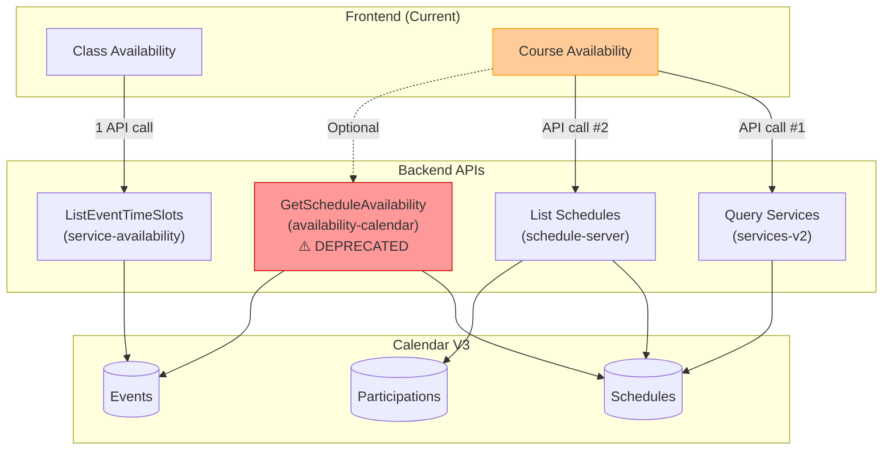
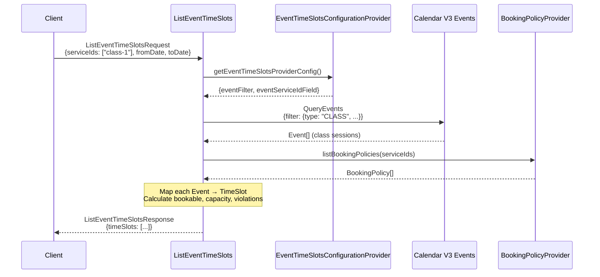
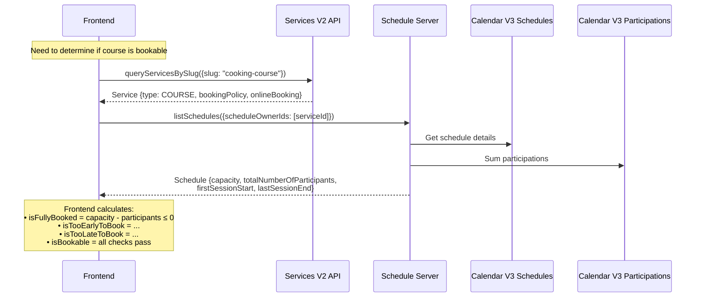
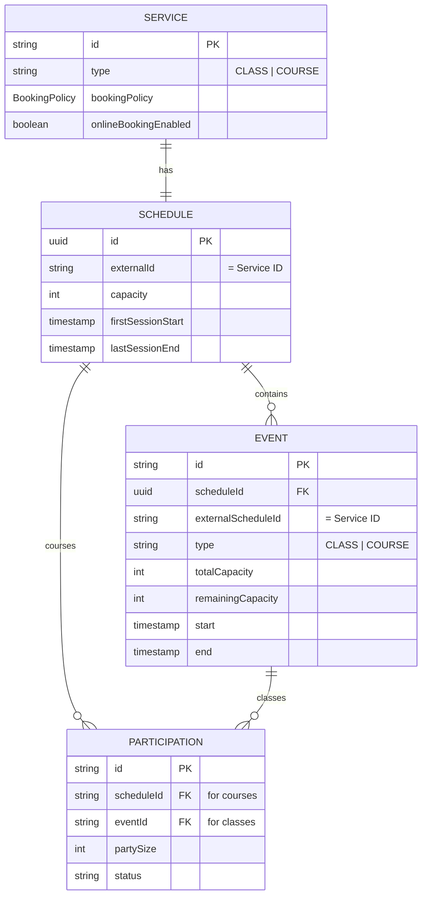
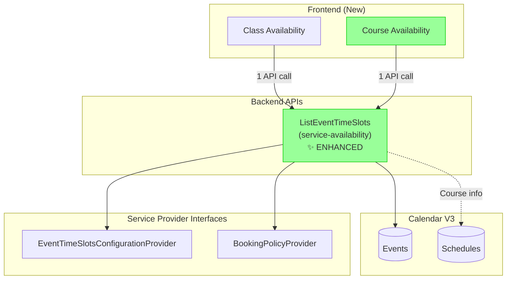
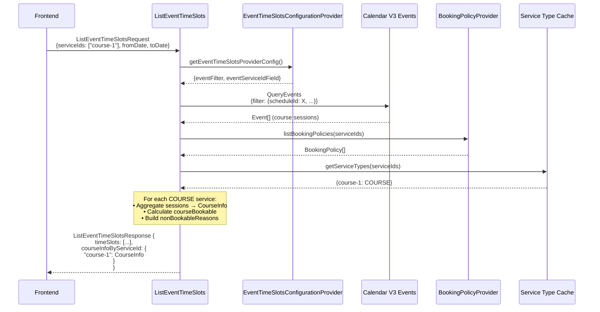
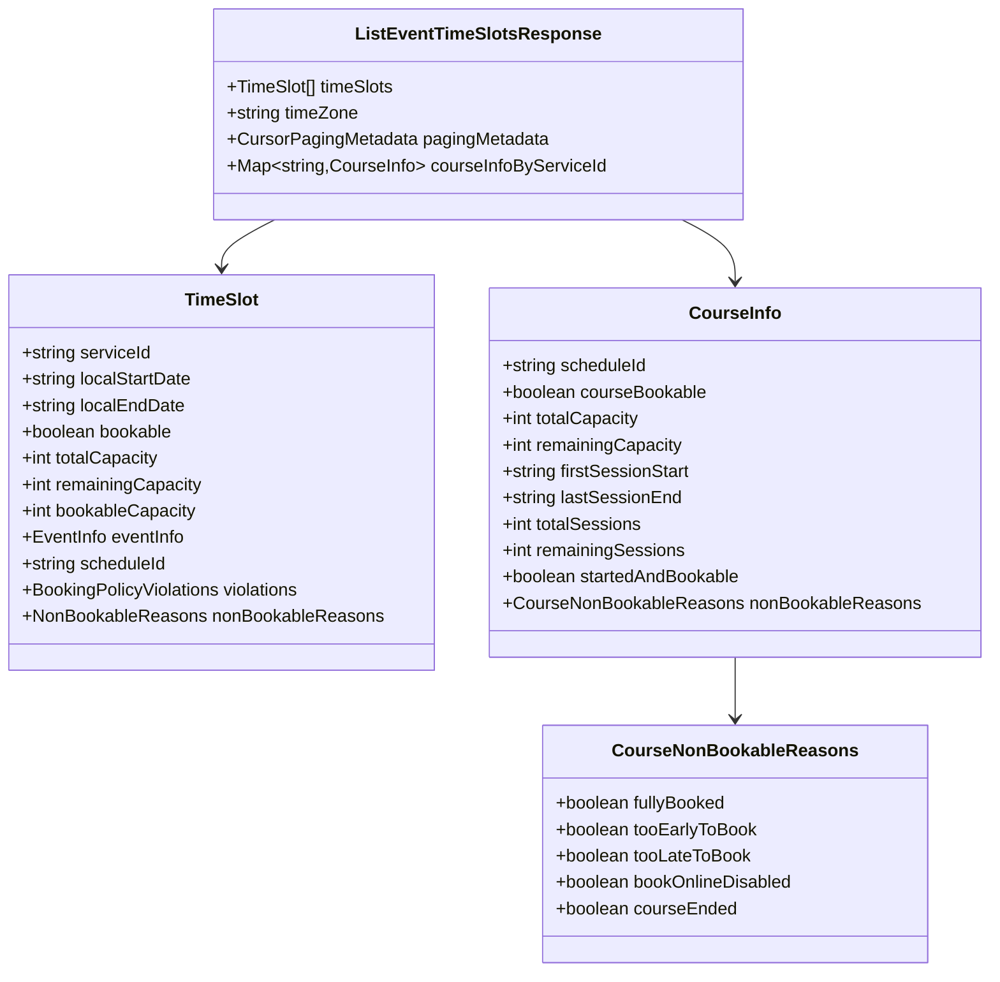
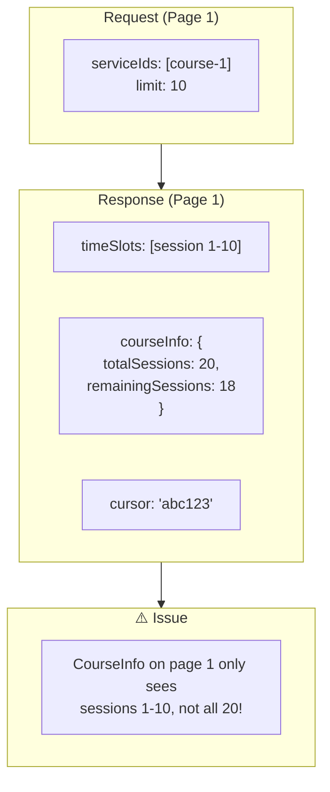
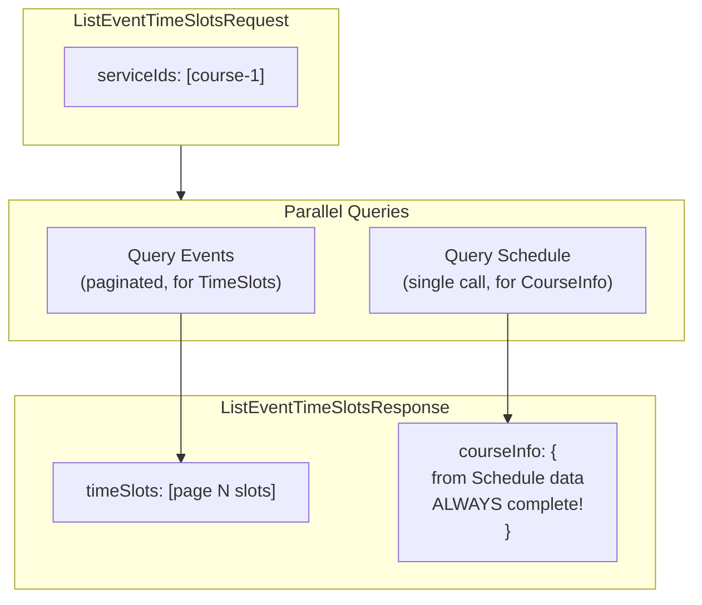
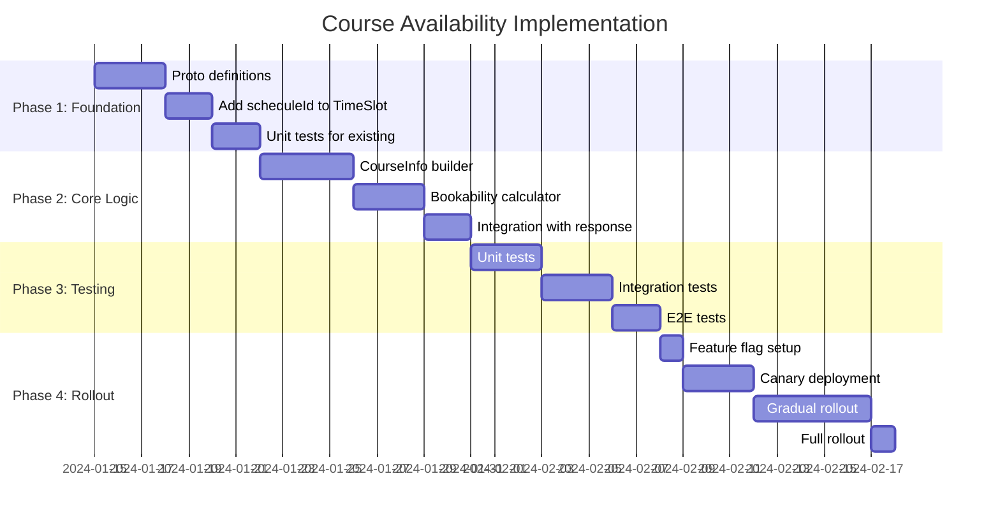

# Course Availability System Design

## Executive Summary

This document proposes extending the `ListEventTimeSlots` API to support course availability, enabling a unified event-based availability endpoint for both classes and courses. The key innovation is adding response-level `CourseInfo` to provide course-specific booking information without duplicating data across individual time slots.

---

## 1. Current System Design

### 1.1 Architecture Overview



### 1.2 Current Class Availability Flow



**Result:** Client gets everything needed in **1 API call**.

### 1.3 Current Course Availability Flow



**Result:** Client needs **2+ API calls** + client-side calculation.

### 1.4 Current Data Model



---

## 2. Proposed System Design

### 2.1 New Architecture



### 2.2 New Course Availability Flow



### 2.3 New Response Structure



---

## 3. Proposed Changes

### 3.1 Proto Changes

#### 3.1.1 ListEventTimeSlotsResponse (Modified)

```protobuf
// File: event_time_slots.proto

message ListEventTimeSlotsResponse {
  // Existing fields (unchanged)
  repeated TimeSlot time_slots = 1;
  google.protobuf.StringValue time_zone = 2;
  wix.common.CursorPagingMetadata paging_metadata = 3;
  
  // NEW: Course-level availability info
  // Only contains entries for course-type services in the request
  // Key = service_id, Value = CourseInfo
  map<string, CourseInfo> course_info_by_service_id = 4;
}
```

#### 3.1.2 CourseInfo (New Message)

```protobuf
// File: event_time_slots.proto (or new file: course_info.proto)

/*
Course-level availability information.
Only populated for services with type = COURSE.
*/
message CourseInfo {
  /*
  Schedule ID for booking the course.
  This is the ID to use when creating a booking for the course.
  */
  google.protobuf.StringValue schedule_id = 1 [
    (.wix.api.format) = GUID,
    (.wix.api.referenced_entity) = "wix.calendar.v3.schedule"
  ];
  
  /*
  Whether the course can be booked.
  Takes into account: capacity, booking policies, course timeline.
  */
  google.protobuf.BoolValue course_bookable = 2;
  
  /*
  Maximum number of participants for the course.
  */
  google.protobuf.Int32Value total_capacity = 3;
  
  /*
  Number of spots still available.
  Calculated as: total_capacity - current_participants
  */
  google.protobuf.Int32Value remaining_capacity = 4;
  
  /*
  Start time of the first session (ISO 8601 local datetime).
  */
  google.protobuf.StringValue first_session_start = 5;
  
  /*
  End time of the last session (ISO 8601 local datetime).
  */
  google.protobuf.StringValue last_session_end = 6;
  
  /*
  Total number of sessions in the course.
  */
  google.protobuf.Int32Value total_sessions = 7;
  
  /*
  Number of sessions that haven't started yet.
  */
  google.protobuf.Int32Value remaining_sessions = 8;
  
  /*
  Whether the course has started but is still bookable.
  True when: firstSessionStart < now < lastSessionEnd AND bookAfterStartPolicy.enabled = true
  */
  google.protobuf.BoolValue started_and_bookable = 9;
  
  /*
  Reasons why the course is not bookable (if course_bookable = false).
  */
  CourseNonBookableReasons non_bookable_reasons = 10;
}

/*
Reasons why a course cannot be booked.
*/
message CourseNonBookableReasons {
  /*
  Course is at full capacity.
  */
  google.protobuf.BoolValue fully_booked = 1;
  
  /*
  Booking window hasn't opened yet (limitEarlyBookingPolicy).
  */
  google.protobuf.BoolValue too_early_to_book = 2;
  
  /*
  Booking deadline has passed and bookAfterStart is disabled.
  */
  google.protobuf.BoolValue too_late_to_book = 3;
  
  /*
  Online booking is disabled for this service.
  */
  google.protobuf.BoolValue book_online_disabled = 4;
  
  /*
  All sessions have ended.
  */
  google.protobuf.BoolValue course_ended = 5;
}
```

#### 3.1.3 TimeSlot (Minor Addition)

```protobuf
// File: time_slot.proto

message TimeSlot {
  // ... existing fields 1-13 ...
  
  // Already exists but NOT currently populated - will now be populated
  google.protobuf.StringValue schedule_id = 14 [
    (.wix.api.format) = GUID,
    (.wix.api.referenced_entity) = "wix.calendar.v3.schedule"
  ];
  
  // Note: No CourseInfo here - it's at the response level
}
```

### 3.2 Scala Implementation Changes

#### 3.2.1 EventTimeSlots.scala - Main Changes

```scala
// File: EventTimeSlots.scala

class EventTimeSlots(
  context: AvailabilityTimeSlotsContext,
  eventBasedCalculator: EventTimeSlotsCalculator,
  waitingListAdapter: WaitingListAdapter,
  bookingPolicyProvider: BookingPolicyProvider,
  visibility: Visibility[Log],
  eventTimeSlotsConfigurationProvider: EventTimeSlotsConfigurationProvider,
  schedulesAdapter: SchedulesAdapter,  // NEW: Add dependency
  servicesAdapter: ServicesAdapter,     // NEW: Add dependency
)(implicit ec: ExecutionContext) extends EventTimeSlotsLoomPrimed {

  override def listEventTimeSlots(request: ListEventTimeSlotsRequest)
                                 (implicit callScope: CallScope): Future[ListEventTimeSlotsResponse] = {
    for {
      // Existing logic
      eventTimeSlotsProviderConfig <- eventTimeSlotsConfigurationProvider.getEventTimeSlotsProviderConfig(request.providerId)
      filter = buildQueryFilter(request, eventTimeSlotsProviderConfig)
      
      // Run in parallel: fetch time slots AND identify course services
      courseServiceIds <- identifyCourseServices(request.serviceIds)
      
      // Parallel execution for better performance
      ((allSlots, hasMoreResults), courseInfoByServiceId) <- inParallel(
        fetchAllSlots(request, filter, ...),
        buildCourseInfoFromSchedules(courseServiceIds)
      )
      
    } yield ListEventTimeSlotsResponse(
      timeSlots = allSlots,
      timeZone = request.timeZone,
      pagingMetadata = buildPagingMetadata(allSlots, hasMoreResults, request),
      courseInfoByServiceId = courseInfoByServiceId  // NEW
    )
  }

  // NEW METHOD: Identify which services are courses
  private def identifyCourseServices(
    serviceIds: Seq[String]
  )(implicit callScope: CallScope): Future[Seq[String]] = {
    if (serviceIds.isEmpty) {
      Future.successful(Seq.empty)
    } else {
      for {
        services <- servicesAdapter.getServices(serviceIds)
      } yield services
        .filter(_.`type` == ServiceType.COURSE)
        .map(_.id)
    }
  }

  // NEW METHOD: Build CourseInfo from Schedule data (pagination-safe)
  private def buildCourseInfoFromSchedules(
    courseServiceIds: Seq[String]
  )(implicit callScope: CallScope): Future[Map[String, CourseInfo]] = {
    
    if (courseServiceIds.isEmpty) {
      return Future.successful(Map.empty)
    }
    
    for {
      // Get schedules - this is the source of truth for course-level data
      schedules <- schedulesAdapter.listSchedules(
        scheduleOwnerIds = courseServiceIds,
        includeTotalNumberOfParticipants = true
      )
      
      // Get booking policies for all course services
      policies <- bookingPolicyProvider.listBookingPolicies(courseServiceIds)
      policyByServiceId = policies.map(p => p.serviceId -> p).toMap
      
      // Build CourseInfo for each course
      courseInfos = schedules
        .filter(_.status == ScheduleStatus.CREATED)
        .flatMap { schedule =>
          val serviceId = schedule.externalId.getOrElse(schedule.id)
          val policy = policyByServiceId.get(serviceId)
          Some(serviceId -> buildCourseInfoFromSchedule(schedule, policy))
        }
        
    } yield courseInfos.toMap
  }

  // NEW METHOD: Build CourseInfo from a single Schedule
  private def buildCourseInfoFromSchedule(
    schedule: Schedule,
    policy: Option[BookingPolicy]
  ): CourseInfo = {
    val now = LocalDateTime.now()
    
    // Data from Schedule - always complete, not affected by pagination
    val scheduleId = schedule.id
    val totalCapacity = schedule.capacity.getOrElse(0)
    val currentParticipants = schedule.totalNumberOfParticipants.getOrElse(0)
    val remainingCapacity = totalCapacity - currentParticipants
    
    // Schedule has these fields from first/last session
    val firstSessionStart = schedule.firstSessionStart.map(_.toString)
    val lastSessionEnd = schedule.lastSessionEnd.map(_.toString)
    
    // Calculate course-level bookability
    val (courseBookable, nonBookableReasons) = calculateCourseBookability(
      firstSessionStart = firstSessionStart,
      lastSessionEnd = lastSessionEnd,
      remainingCapacity = Some(remainingCapacity),
      policy = policy,
      now = now
    )
    
    val startedAndBookable = isStartedAndBookable(
      firstSessionStart = firstSessionStart,
      lastSessionEnd = lastSessionEnd,
      policy = policy,
      now = now
    )
    
    CourseInfo(
      scheduleId = Some(scheduleId),
      courseBookable = Some(courseBookable),
      totalCapacity = Some(totalCapacity),
      remainingCapacity = Some(remainingCapacity),
      firstSessionStart = firstSessionStart,
      lastSessionEnd = lastSessionEnd,
      totalSessions = schedule.totalSessions,      // If available on Schedule
      remainingSessions = calculateRemainingSessions(schedule, now),
      startedAndBookable = Some(startedAndBookable),
      nonBookableReasons = if (courseBookable) None else Some(nonBookableReasons)
    )
  }

  // NEW METHOD: Calculate remaining sessions (future sessions only)
  private def calculateRemainingSessions(
    schedule: Schedule,
    now: LocalDateTime
  ): Option[Int] = {
    // Option 1: If schedule has session dates
    schedule.sessionDates.map { dates =>
      dates.count(d => LocalDateTime.parse(d).isAfter(now))
    }
    // Option 2: Query events count (more expensive)
    // This could be done lazily or cached
  }

  // NEW METHOD: Calculate course bookability
  private def calculateCourseBookability(
    firstSessionStart: Option[String],
    lastSessionEnd: Option[String],
    remainingCapacity: Option[Int],
    policy: Option[BookingPolicy],
    now: LocalDateTime
  ): (Boolean, CourseNonBookableReasons) = {
    
    // Check each blocking condition
    val fullyBooked = remainingCapacity.exists(_ <= 0)
    val courseEnded = lastSessionEnd.exists(d => LocalDateTime.parse(d).isBefore(now))
    val bookOnlineDisabled = policy.flatMap(_.onlineBooking).exists(!_.enabled)
    
    // Too early: booking window hasn't opened yet
    val tooEarlyToBook = policy.flatMap(_.limitEarlyBooking).exists { leb =>
      leb.earliestBookingInMinutes.exists { minutes =>
        firstSessionStart.exists { fss =>
          val sessionStart = LocalDateTime.parse(fss)
          Duration.between(now, sessionStart).toMinutes > minutes
        }
      }
    }
    
    // Too late: deadline passed AND can't book after start
    val courseStarted = firstSessionStart.exists(d => LocalDateTime.parse(d).isBefore(now))
    val canBookAfterStart = policy.flatMap(_.bookAfterStart).exists(_.enabled)
    
    val tooLateToBook = policy.flatMap(_.limitLateBooking).exists { llb =>
      llb.latestBookingInMinutes.exists { minutes =>
        firstSessionStart.exists { fss =>
          val sessionStart = LocalDateTime.parse(fss)
          val minutesUntilStart = Duration.between(now, sessionStart).toMinutes
          minutesUntilStart < minutes && !canBookAfterStart
        }
      }
    } || (courseStarted && !canBookAfterStart)
    
    // Build reasons object
    val reasons = CourseNonBookableReasons(
      fullyBooked = Some(fullyBooked),
      tooEarlyToBook = Some(tooEarlyToBook),
      tooLateToBook = Some(tooLateToBook),
      bookOnlineDisabled = Some(bookOnlineDisabled),
      courseEnded = Some(courseEnded)
    )
    
    // Course is bookable if none of the blocking conditions are true
    val isBookable = !fullyBooked && !courseEnded && !bookOnlineDisabled && 
                     !tooEarlyToBook && !tooLateToBook
    
    (isBookable, reasons)
  }

  // NEW METHOD: Check if course started but still bookable
  private def isStartedAndBookable(
    firstSessionStart: Option[String],
    lastSessionEnd: Option[String],
    policy: Option[BookingPolicy],
    now: LocalDateTime
  ): Boolean = {
    val courseStarted = firstSessionStart.exists(d => LocalDateTime.parse(d).isBefore(now))
    val courseNotEnded = lastSessionEnd.exists(d => LocalDateTime.parse(d).isAfter(now))
    val canBookAfterStart = policy.flatMap(_.bookAfterStart).exists(_.enabled)
    
    courseStarted && courseNotEnded && canBookAfterStart
  }

  // MODIFIED: Add scheduleId to TimeSlot mapping (one-line change to existing method)
  private def mapToTimeSlots(event: Event, ...): TimeSlot = {
    // ... all existing logic unchanged ...
    
    TimeSlot(
      serviceId = Some(eventServiceId),
      localStartDate = startDateToUse,
      localEndDate = endDateToUse,
      bookable = Some(bookable),
      remainingCapacity = Some(safeRemainingCapacity),
      totalCapacity = event.totalCapacity,
      bookableCapacity = Some(bookableCapacity),
      eventInfo = eventInfo,
      availableResources = availableResources,
      location = event.location.map(_.mapToAvailabilityLocation),
      bookingPolicyViolations = bookingPolicyViolation,
      nonBookableReasons = nonBookableReasons,
      scheduleId = event.scheduleId,  // ← NEW: Add this single line!
    )
  }
  
  // Helper for parallel execution
  private def inParallel[A, B](fa: Future[A], fb: Future[B]): Future[(A, B)] = {
    fa.zip(fb)
  }
}
```

---

## 4. Edge Cases

### 4.1 Edge Case Matrix

| Edge Case | Scenario | Expected Behavior |
|-----------|----------|-------------------|
| **Empty course** | Course with no sessions | `courseInfo.totalSessions = 0`, `courseBookable = false`, `reason = courseEnded` |
| **All sessions past** | All sessions ended | `remainingSessions = 0`, `courseBookable = false`, `reason = courseEnded` |
| **Course started, bookAfterStart enabled** | First session passed | `startedAndBookable = true`, `courseBookable = true` |
| **Course started, bookAfterStart disabled** | First session passed | `startedAndBookable = false`, `courseBookable = false`, `reason = tooLateToBook` |
| **Mixed service types** | Request: class + course | TimeSlots for both, `courseInfoByServiceId` only for course |
| **Multiple courses** | Request: course-1, course-2 | Separate entries in `courseInfoByServiceId` map |
| **No serviceIds specified** | Generic query | TimeSlots returned, no `courseInfo` (can't determine types without IDs) |
| **Pagination** | Large course (50+ sessions) | Cursor pagination works, `courseInfo` reflects ALL sessions |
| **Zero capacity** | Course capacity = 0 | `fullyBooked = true`, `courseBookable = false` |
| **Booking window not open** | `earliestBookingInMinutes` not reached | `tooEarlyToBook = true`, `courseBookable = false` |

### 4.2 Pagination Consideration



**Solution Options:**

1. **Option A: Pre-query all sessions for course info**
   - When building `CourseInfo`, query ALL course sessions (not just current page)
   - More accurate but requires additional query

2. **Option B: Only include CourseInfo on first page**
   - Mark with `isComplete: false` if paginated
   - Simpler but less useful

3. **Option C: Aggregate from schedule directly** ✅ **(Recommended)**
   - Get `firstSessionStart`, `lastSessionEnd`, `capacity` from Schedule, not Events
   - Most accurate, minimal overhead

**Recommended: Option C** - Query Schedule for course-level info.

### 4.3 Pagination Solution Implementation



**Implementation:**

```scala
private def buildCourseInfoIfNeeded(
  serviceIds: Seq[String],
  timeSlots: Seq[TimeSlot]  // Only used for session count in current page
)(implicit callScope: CallScope): Future[Map[String, CourseInfo]] = {
  
  for {
    // 1. Identify which services are courses
    serviceTypes <- getServiceTypes(serviceIds)
    courseServiceIds = serviceTypes.filter(_._2 == ServiceType.COURSE).keys.toSeq
    
    // 2. Get schedules for course services (accurate source of truth)
    schedules <- getSchedulesForServices(courseServiceIds)
    
    // 3. Get booking policies
    policies <- bookingPolicyProvider.listBookingPolicies(courseServiceIds)
    policyByServiceId = policies.map(p => p.serviceId -> p).toMap
    
    // 4. Build CourseInfo from Schedule data (not from paginated Events)
    courseInfos = courseServiceIds.flatMap { serviceId =>
      schedules.get(serviceId).map { schedule =>
        val policy = policyByServiceId.get(serviceId)
        val courseInfo = buildCourseInfoFromSchedule(schedule, policy)
        serviceId -> courseInfo
      }
    }
    
  } yield courseInfos.toMap
}

private def buildCourseInfoFromSchedule(
  schedule: Schedule,
  policy: Option[BookingPolicy]
)(implicit callScope: CallScope): CourseInfo = {
  val now = LocalDateTime.now()
  
  // Data from Schedule (always complete, not affected by pagination)
  val scheduleId = schedule.id
  val totalCapacity = schedule.capacity
  val remainingCapacity = schedule.capacity - schedule.totalNumberOfParticipants
  val firstSessionStart = schedule.firstSessionStart
  val lastSessionEnd = schedule.lastSessionEnd
  
  // Calculate bookability from complete schedule data
  val (courseBookable, nonBookableReasons) = calculateCourseBookability(
    firstSessionStart = firstSessionStart,
    lastSessionEnd = lastSessionEnd,
    remainingCapacity = Some(remainingCapacity),
    policy = policy,
    now = now
  )
  
  val startedAndBookable = isStartedAndBookable(
    firstSessionStart = firstSessionStart,
    lastSessionEnd = lastSessionEnd,
    policy = policy,
    now = now
  )
  
  // Session counts can be derived or queried separately
  // For now, we can query event count or leave as optional
  val totalSessions = schedule.totalSessions  // If available on schedule
  val remainingSessions = calculateRemainingSessions(schedule, now)
  
  CourseInfo(
    scheduleId = Some(scheduleId),
    courseBookable = Some(courseBookable),
    totalCapacity = Some(totalCapacity),
    remainingCapacity = Some(remainingCapacity),
    firstSessionStart = firstSessionStart,
    lastSessionEnd = lastSessionEnd,
    totalSessions = totalSessions,
    remainingSessions = remainingSessions,
    startedAndBookable = Some(startedAndBookable),
    nonBookableReasons = if (courseBookable) None else Some(nonBookableReasons)
  )
}

private def getSchedulesForServices(
  courseServiceIds: Seq[String]
)(implicit callScope: CallScope): Future[Map[String, Schedule]] = {
  // Query Schedule Server or Calendar Schedules API
  // serviceId = externalScheduleId in Calendar terms
  for {
    schedules <- context.rpc.schedulesService.listSchedules(
      ListSchedulesRequest(
        scheduleOwnerIds = courseServiceIds,
        includeTotalNumberOfParticipants = true
      )
    )
  } yield schedules.schedules
    .filter(_.status == ScheduleStatus.CREATED)
    .map(s => s.externalId.getOrElse(s.id) -> s)
    .toMap
}
```

**Why This Solution Works:**

| Aspect | Events-Based (Problem) | Schedule-Based (Solution) |
|--------|------------------------|---------------------------|
| Capacity | Correct (propagated) | Correct (source of truth) |
| firstSessionStart | Only if in current page | Always accurate |
| lastSessionEnd | Only if in current page | Always accurate |
| totalSessions | Only current page count | Accurate (from schedule) |
| Pagination impact | Incomplete data | No impact |
| API calls | 0 extra | 1 extra (batched) |

**Performance Consideration:**

The extra Schedule query is:
- Batched (single call for all course services)
- Parallel with Event query (can run concurrently)
- Cached (schedules don't change often)

```scala
// Run in parallel for better performance
for {
  (timeSlots, schedules) <- inParallel(
    fetchTimeSlots(request),
    getSchedulesForServices(courseServiceIds)
  )
  courseInfo = buildCourseInfoFromSchedules(schedules, policies)
} yield ListEventTimeSlotsResponse(timeSlots, courseInfo)
```

---

## 5. Pros and Cons

### 5.1 Pros

| Benefit | Description |
|---------|-------------|
| **Reduced API calls** | Frontend: 2+ calls → 1 call |
| **Server-side calculation** | Complex bookability logic moves to backend |
| **No data duplication** | CourseInfo at response level, not per-slot |
| **Backwards compatible** | New optional fields, existing clients unaffected |
| **Unified API** | Classes and courses use same endpoint |
| **Better caching** | Single response can be cached entirely |
| **Simpler frontend** | Just check `courseBookable` instead of complex logic |
| **Consistent behavior** | Bookability rules enforced server-side |

### 5.2 Cons

| Drawback | Description | Mitigation |
|----------|-------------|------------|
| **Additional complexity** | Backend needs service type awareness | Cache service types |
| **Pagination edge case** | CourseInfo accuracy across pages | Query Schedule directly |
| **Breaking change for response** | New field added | Optional field, backwards compatible |
| **Performance overhead** | Need to identify course services | Batch service type queries |
| **Dependency on Services API** | Need to call Services to get types | Use SPI or cache |

### 5.3 Alternative Approaches Considered

| Approach | Why Rejected |
|----------|--------------|
| **CourseInfo per TimeSlot** | Duplicates data N times, larger payload |
| **Separate endpoint for courses** | Fragments API, duplicates logic |
| **Client-side calculation (status quo)** | Multiple API calls, inconsistent logic |
| **Extend GetScheduleAvailability** | Deprecated API, doesn't return sessions |

---

## 6. Implementation Roadmap

### 6.1 Phase Overview



### 6.2 Phase 1: Foundation (Week 1)

**Goal:** Set up proto definitions and basic infrastructure.

- [ ] **1.1 Proto Changes**
  - Add `CourseInfo` message to proto
  - Add `CourseNonBookableReasons` message
  - Add `course_info_by_service_id` field to `ListEventTimeSlotsResponse`
  - Run proto generation

- [ ] **1.2 Add scheduleId to TimeSlot**
  - Modify `mapToTimeSlots()` to include `event.scheduleId`
  - This is a safe, additive change

- [ ] **1.3 Baseline Tests**
  - Ensure existing class availability tests pass
  - Add tests for new `scheduleId` field

### 6.3 Phase 2: Core Logic (Week 2)

**Goal:** Implement course info calculation.

- [ ] **2.1 Service Type Resolution**
  - Add method to get service types for given service IDs
  - Consider caching strategy
  - Handle case when service type unknown

- [ ] **2.2 CourseInfo Builder**
  - Implement `buildCourseInfoIfNeeded()`
  - Implement `buildCourseInfo()`
  - Aggregate session data correctly

- [ ] **2.3 Bookability Calculator**
  - Implement `calculateCourseBookability()`
  - Implement `isStartedAndBookable()`
  - Handle all policy types

- [ ] **2.4 Response Integration**
  - Wire CourseInfo into response
  - Handle pagination considerations

### 6.4 Phase 3: Testing (Week 3)

**Goal:** Comprehensive test coverage.

- [ ] **3.1 Unit Tests**
  - Test `buildCourseInfo()` with various scenarios
  - Test `calculateCourseBookability()` edge cases
  - Test mixed class/course requests

- [ ] **3.2 Integration Tests**
  - End-to-end course availability request
  - Verify response structure
  - Test with real Calendar V3 data

- [ ] **3.3 Edge Case Tests**
  - Empty course
  - All sessions past
  - Started and bookable
  - Multiple courses
  - Pagination behavior

### 6.5 Phase 4: Rollout (Week 4)

**Goal:** Safe production deployment.

- [ ] **4.1 Feature Flag**
  - Add Petri experiment for course info
  - Default: disabled
  - Allow per-site enablement

- [ ] **4.2 Canary Deployment**
  - Deploy to canary environment
  - Monitor for errors
  - Verify response structure

- [ ] **4.3 Gradual Rollout**
  - Enable for 1% of traffic
  - Monitor latency and errors
  - Increase to 10%, 50%, 100%

- [ ] **4.4 Frontend Migration**
  - Coordinate with frontend team
  - Update frontend to use new fields
  - Deprecate old flow

---

## 7. API Contract Examples

### 7.1 Request Example

```json
{
  "provider_id": "bookings",
  "service_ids": ["5f364552-0b91-4d97-982d-fdf3fe5d9682"],
  "from_local_date": "2026-03-01T00:00:00",
  "to_local_date": "2026-04-01T00:00:00",
  "time_zone": "America/New_York"
}
```

### 7.2 Response Example (Course)

```json
{
  "time_slots": [
    {
      "service_id": "5f364552-0b91-4d97-982d-fdf3fe5d9682",
      "schedule_id": "8edc0bb2-2688-4b11-824d-eed023c8cc07",
      "local_start_date": "2026-03-05T10:00:00",
      "local_end_date": "2026-03-05T12:00:00",
      "bookable": true,
      "total_capacity": 20,
      "remaining_capacity": 12,
      "bookable_capacity": 12,
      "event_info": {
        "event_id": "evt-session-1"
      },
      "booking_policy_violations": {
        "too_early_to_book": false,
        "too_late_to_book": false,
        "book_online_disabled": false
      }
    },
    {
      "service_id": "5f364552-0b91-4d97-982d-fdf3fe5d9682",
      "schedule_id": "8edc0bb2-2688-4b11-824d-eed023c8cc07",
      "local_start_date": "2026-03-12T10:00:00",
      "local_end_date": "2026-03-12T12:00:00",
      "bookable": true,
      "total_capacity": 20,
      "remaining_capacity": 12,
      "bookable_capacity": 12,
      "event_info": {
        "event_id": "evt-session-2"
      }
    }
  ],
  "time_zone": "America/New_York",
  "paging_metadata": {
    "has_next": false
  },
  "course_info_by_service_id": {
    "5f364552-0b91-4d97-982d-fdf3fe5d9682": {
      "schedule_id": "8edc0bb2-2688-4b11-824d-eed023c8cc07",
      "course_bookable": true,
      "total_capacity": 20,
      "remaining_capacity": 12,
      "first_session_start": "2026-03-05T10:00:00",
      "last_session_end": "2026-04-30T12:00:00",
      "total_sessions": 8,
      "remaining_sessions": 8,
      "started_and_bookable": false
    }
  }
}
```

### 7.3 Response Example (Mixed Class + Course)

```json
{
  "time_slots": [
    {
      "service_id": "class-service-id",
      "local_start_date": "2026-03-05T14:00:00",
      "bookable": true
    },
    {
      "service_id": "course-service-id",
      "schedule_id": "course-schedule-id",
      "local_start_date": "2026-03-05T10:00:00",
      "bookable": true
    }
  ],
  "course_info_by_service_id": {
    "course-service-id": {
      "schedule_id": "course-schedule-id",
      "course_bookable": true
    }
  }
}
```

---

## 8. Monitoring and Observability

### 8.1 Metrics to Track

| Metric | Description | Alert Threshold |
|--------|-------------|-----------------|
| `course_info_build_latency_ms` | Time to build CourseInfo | p99 > 100ms |
| `course_info_requests_total` | Requests with course services | N/A (monitoring) |
| `course_info_cache_hit_ratio` | Service type cache effectiveness | < 80% |
| `course_bookable_true_ratio` | Percentage of bookable courses | < 50% (investigate) |

### 8.2 Logging

```scala
visibility.expose(LogEvent.Info(
  s"[CourseInfo] Built for serviceId=$serviceId, " +
  s"courseBookable=$courseBookable, " +
  s"remainingCapacity=$remainingCapacity, " +
  s"totalSessions=$totalSessions"
))
```

---

## 9. Future Considerations

### 9.1 Potential Enhancements

1. **Waitlist for Courses** - Extend CourseInfo with waitlist capacity
2. **Session-Level Attendance** - Track which sessions participant will attend
3. **Partial Course Booking** - Book remaining sessions only (for started courses)
4. **Course Bundle Pricing** - Include pricing info in CourseInfo

### 9.2 Deprecation Path

1. Mark `GetScheduleAvailability` as deprecated in proto
2. Add deprecation logging when called
3. Migrate all clients to `ListEventTimeSlots`
4. Remove deprecated endpoint after grace period

---

## 10. Appendix

### 10.1 Related Documentation

- [Original Design Document](./course-availability-design.md)
- [ListEventTimeSlots API Docs](https://dev.wix.com/docs/api-reference/business-solutions/bookings/time-slots/time-slots-v2/list-event-time-slots)
- [Course Booking Flow](https://dev.wix.com/docs/api-reference/business-solutions/bookings/end-to-end-booking-flows#book-a-course)

### 10.2 Glossary

| Term | Definition |
|------|------------|
| **TimeSlot** | Represents a single bookable time period (class session or course session) |
| **CourseInfo** | Aggregated course-level information for booking decisions |
| **Schedule-Level Participation** | Booking model where participation is linked to schedule (courses) |
| **Event-Level Participation** | Booking model where participation is linked to specific event (classes) |
| **SPI** | Service Provider Interface - extensibility mechanism for providers |

