```mermaid
flowchart TB
    subgraph Current["Current Response"]
        TS1["TimeSlot {<br/>  serviceId<br/>  scheduleId: ❌ null<br/>  bookable<br/>  remainingCapacity<br/>}"]
    end
    
    subgraph ProposalA["Proposal A Response"]
        TS2["TimeSlot {<br/>  serviceId<br/>  scheduleId: ✅ populated<br/>  bookable<br/>  remainingCapacity<br/>  isCourse: ✅ new<br/>}"]
    end
    
    Current --> ProposalA
```

```mermaid
flowchart TB
    subgraph Client["Client"]
        C_Class["Class Availability"]
        C_Course["Course Availability"]
    end
    
    subgraph APIs["Availability APIs"]
        ETS["ListEventTimeSlots<br/>/v2/time-slots/event<br/>(Classes only)"]
        CTS["ListCourseTimeSlots<br/>/v2/time-slots/course<br/>(Courses only) ✨ NEW"]
    end
    
    subgraph Backend["Backend Services"]
        Cal["Calendar V3"]
        Sched["Schedules"]
    end
    
    C_Class --> ETS
    C_Course --> CTS
    
    ETS --> Cal
    CTS --> Sched
    CTS --> Cal
```

# Course Availability: Design Proposals Comparison

## Executive Summary

This document presents three distinct design proposals for adding course availability support to the `ListEventTimeSlots` API. Each proposal represents a different trade-off between complexity, performance, and flexibility.

| Proposal | Name | Complexity | API Calls | Backend Changes | Risk |
|----------|------|------------|-----------|-----------------|------|
| **A** | Minimal Enhancement | Low | 1 | Small | Low |
| **B** | Unified Response-Level CourseInfo | Medium | 1 | Medium | Medium |
| **C** | Dedicated Course Availability API | High | 1 (new) | Large | High |

---

## Current State

### The Problem

```
┌─────────────────────────────────────────────────────────────────────────────┐
│                         CURRENT CLIENT FLOW                                 │
└─────────────────────────────────────────────────────────────────────────────┘

CLASS AVAILABILITY (Works Well):
┌──────────┐     1 API Call     ┌────────────────────┐
│  Client  │ ─────────────────► │ ListEventTimeSlots │
└──────────┘                    └────────────────────┘
                                         │
                                         ▼
                                   TimeSlots[] with:
                                   ✅ bookable
                                   ✅ remainingCapacity
                                   ✅ bookingPolicyViolations

COURSE AVAILABILITY (Problematic):
┌──────────┐     3 API Calls    ┌────────────────────┐
│  Client  │ ─────────────────► │ Services V2 Query  │ ─┐
└──────────┘                    └────────────────────┘  │
     │                                                   │
     │                          ┌────────────────────┐  │
     └─────────────────────────►│  Schedule Server   │ ─┤
                                └────────────────────┘  │
     │                                                   │
     │                          ┌────────────────────┐  │
     └─────────────────────────►│ Calendar V3 Events │ ─┘
                                └────────────────────┘
                                         │
                                         ▼
                               Client-side calculation of:
                               - isFullyBooked
                               - isTooEarlyToBook
                               - isTooLateToBook
                               - isBookable
```

### Key Differences: Classes vs Courses

| Aspect | Class | Course |
|--------|-------|--------|
| Booking target | Individual event (session) | Entire schedule |
| Capacity | Per-event | Per-schedule |
| Participation | Event-level | Schedule-level |
| Booking entity | `eventId` | `scheduleId` |
| Sessions | Independent | All-or-nothing |

---

# Proposal A: Minimal Enhancement

## Overview

**Philosophy:** Make the smallest possible changes to enable course support without restructuring the API.

**Key Changes:**
1. Populate the existing `scheduleId` field in TimeSlot (currently empty)
2. Include COURSE events in the query (update filter)
3. Add a simple `isCourse` flag to TimeSlot

## Architecture



## Proto Changes

```protobuf
message TimeSlot {
  // Existing fields (unchanged)
  google.protobuf.StringValue service_id = 1;
  google.protobuf.StringValue local_start_date = 2;
  google.protobuf.StringValue local_end_date = 3;
  google.protobuf.BoolValue bookable = 4;
  google.protobuf.Int32Value total_capacity = 7;
  google.protobuf.Int32Value remaining_capacity = 8;
  // ... other existing fields ...
  
  // EXISTING but now populated
  google.protobuf.StringValue schedule_id = 14;
  
  // NEW: Simple flag to identify course slots
  google.protobuf.BoolValue is_course = 15;
}
```

## Implementation Changes

### EventTimeSlots.scala

```scala
// Only 2 changes needed:

// 1. Update mapToTimeSlots to populate scheduleId
private def mapToTimeSlots(event: Event, ...): TimeSlot = {
  // ... existing logic ...
  
  TimeSlot(
    serviceId = Some(eventServiceId),
    // ... other fields ...
    scheduleId = event.scheduleId,  // ← ADD THIS (one line!)
    isCourse = Some(event.`type`.contains("COURSE")),  // ← ADD THIS
  )
}

// 2. Update SPI config to include COURSE events
// In EventTimeSlotsConfigurationProvider implementation:
// Change filter from {"type": "CLASS"} to {"type": {"$in": ["CLASS", "COURSE"]}}
```

## Response Example

```json
{
  "time_slots": [
    {
      "service_id": "course-123",
      "schedule_id": "8edc0bb2-2688-4b11-824d-eed023c8cc07",
      "local_start_date": "2026-03-05T10:00:00",
      "local_end_date": "2026-03-05T12:00:00",
      "bookable": true,
      "total_capacity": 20,
      "remaining_capacity": 12,
      "is_course": true,
      "event_info": {
        "event_id": "session-1-event"
      }
    },
    {
      "service_id": "course-123",
      "schedule_id": "8edc0bb2-2688-4b11-824d-eed023c8cc07",
      "local_start_date": "2026-03-12T10:00:00",
      "is_course": true
    }
  ]
}
```

## Client Migration

```typescript
// Client code change:
const courseSlots = response.timeSlots.filter(slot => slot.isCourse);

if (courseSlots.length > 0) {
  const firstSlot = courseSlots[0];
  
  // Use scheduleId for booking (now available!)
  const scheduleId = firstSlot.scheduleId;
  
  // Capacity is already correct (same for all course slots)
  const remainingCapacity = firstSlot.remainingCapacity;
  
  // Client still calculates course-level bookability
  // but gets all data from ONE API call
}
```

## Pros & Cons

### ✅ Pros

| Benefit | Description |
|---------|-------------|
| **Minimal code changes** | ~20 lines of code |
| **Low risk** | No restructuring, easy rollback |
| **Fast implementation** | Days, not weeks |
| **Backwards compatible** | New fields are optional |
| **Reduces API calls** | 3 → 1 (scheduleId now included) |

### ❌ Cons

| Drawback | Description |
|----------|-------------|
| **Client still calculates** | Bookability logic remains on frontend |
| **Duplicate data** | Course info repeated per session |
| **No courseBookable** | Client must aggregate from slots |
| **Missing course metadata** | No firstSessionStart, lastSessionEnd, etc. |
| **Inconsistent semantics** | TimeSlot.bookable = session bookable, not course bookable |

---

# Proposal B: Unified Response-Level CourseInfo

## Overview

**Philosophy:** Add course-level information at the response level to avoid duplication and enable server-side bookability calculation.

**Key Changes:**
1. Populate `scheduleId` in TimeSlot
2. Add `courseInfoByServiceId` map to response
3. Server calculates `courseBookable`
4. Query Schedule API for accurate course-level data

## Architecture


## Proto Changes

```protobuf
message ListEventTimeSlotsResponse {
  // Existing fields
  repeated TimeSlot time_slots = 1;
  google.protobuf.StringValue time_zone = 2;
  CursorPagingMetadata paging_metadata = 3;
  
  // NEW: Course-level info (no duplication!)
  map<string, CourseInfo> course_info_by_service_id = 4;
}

message CourseInfo {
  // For booking
  google.protobuf.StringValue schedule_id = 1;
  
  // Overall course bookability (server-calculated!)
  google.protobuf.BoolValue course_bookable = 2;
  
  // Capacity
  google.protobuf.Int32Value total_capacity = 3;
  google.protobuf.Int32Value remaining_capacity = 4;
  
  // Timeline
  google.protobuf.StringValue first_session_start = 5;
  google.protobuf.StringValue last_session_end = 6;
  
  // Session counts
  google.protobuf.Int32Value total_sessions = 7;
  google.protobuf.Int32Value remaining_sessions = 8;
  
  // Special states
  google.protobuf.BoolValue started_and_bookable = 9;
  
  // Why not bookable
  CourseNonBookableReasons non_bookable_reasons = 10;
}

message CourseNonBookableReasons {
  google.protobuf.BoolValue fully_booked = 1;
  google.protobuf.BoolValue too_early_to_book = 2;
  google.protobuf.BoolValue too_late_to_book = 3;
  google.protobuf.BoolValue book_online_disabled = 4;
  google.protobuf.BoolValue course_ended = 5;
}
```

## Implementation Changes

### EventTimeSlots.scala

```scala
class EventTimeSlots(..., schedulesAdapter: SchedulesAdapter) {

  override def listEventTimeSlots(request: ListEventTimeSlotsRequest)
                                 (implicit cs: CallScope): Future[ListEventTimeSlotsResponse] = {
    for {
      // Existing logic
      (allSlots, hasMoreResults) <- fetchAllSlots(...)
      
      // NEW: Identify course services and build CourseInfo
      courseServiceIds <- identifyCourseServices(request.serviceIds)
      courseInfoByServiceId <- buildCourseInfoFromSchedules(courseServiceIds)
      
    } yield ListEventTimeSlotsResponse(
      timeSlots = allSlots,
      timeZone = request.timeZone,
      pagingMetadata = ...,
      courseInfoByServiceId = courseInfoByServiceId  // NEW
    )
  }

  private def buildCourseInfoFromSchedules(
    courseServiceIds: Seq[String]
  )(implicit cs: CallScope): Future[Map[String, CourseInfo]] = {
    for {
      // Query Schedule API for accurate course-level data
      schedules <- schedulesAdapter.listSchedules(
        scheduleOwnerIds = courseServiceIds,
        includeTotalNumberOfParticipants = true
      )
      
      policies <- bookingPolicyProvider.listBookingPolicies(courseServiceIds)
      
    } yield schedules.map { schedule =>
      val serviceId = schedule.externalId
      val policy = policies.find(_.serviceId == serviceId)
      
      serviceId -> buildCourseInfo(schedule, policy)
    }.toMap
  }

  private def buildCourseInfo(schedule: Schedule, policy: Option[BookingPolicy]): CourseInfo = {
    val now = LocalDateTime.now()
    val remainingCapacity = schedule.capacity - schedule.totalNumberOfParticipants
    
    val (courseBookable, reasons) = calculateCourseBookability(
      firstSessionStart = schedule.firstSessionStart,
      lastSessionEnd = schedule.lastSessionEnd,
      remainingCapacity = remainingCapacity,
      policy = policy,
      now = now
    )
    
    CourseInfo(
      scheduleId = Some(schedule.id),
      courseBookable = Some(courseBookable),
      totalCapacity = schedule.capacity,
      remainingCapacity = Some(remainingCapacity),
      firstSessionStart = schedule.firstSessionStart.map(_.toString),
      lastSessionEnd = schedule.lastSessionEnd.map(_.toString),
      totalSessions = schedule.totalSessions,
      remainingSessions = calculateRemainingSessions(schedule, now),
      startedAndBookable = Some(isStartedAndBookable(schedule, policy, now)),
      nonBookableReasons = if (courseBookable) None else Some(reasons)
    )
  }
}
```

## Response Example

```json
{
  "time_slots": [
    {
      "service_id": "course-123",
      "schedule_id": "8edc0bb2-...",
      "local_start_date": "2026-03-05T10:00:00",
      "bookable": true,
      "remaining_capacity": 12
    },
    {
      "service_id": "course-123",
      "schedule_id": "8edc0bb2-...",
      "local_start_date": "2026-03-12T10:00:00",
      "bookable": true,
      "remaining_capacity": 12
    }
  ],
  "course_info_by_service_id": {
    "course-123": {
      "schedule_id": "8edc0bb2-2688-4b11-824d-eed023c8cc07",
      "course_bookable": true,
      "total_capacity": 20,
      "remaining_capacity": 12,
      "first_session_start": "2026-03-05T10:00:00",
      "last_session_end": "2026-04-30T12:00:00",
      "total_sessions": 8,
      "remaining_sessions": 8,
      "started_and_bookable": false
    }
  }
}
```

## Client Migration

```typescript
// Client code - much simpler!
const courseInfo = response.courseInfoByServiceId[serviceId];

if (courseInfo) {
  // Direct access to course bookability
  const canBook = courseInfo.courseBookable;
  const scheduleId = courseInfo.scheduleId;
  const spotsLeft = courseInfo.remainingCapacity;
  
  // Show sessions from timeSlots
  const sessions = response.timeSlots.filter(s => s.serviceId === serviceId);
  
  // Display course-level info
  showCourseInfo({
    bookable: canBook,
    totalSessions: courseInfo.totalSessions,
    remainingSessions: courseInfo.remainingSessions,
    sessions: sessions
  });
}
```

## Pros & Cons

### ✅ Pros

| Benefit | Description |
|---------|-------------|
| **Server-side calculation** | `courseBookable` computed on backend |
| **No data duplication** | CourseInfo at response level |
| **Complete course info** | All metadata in one place |
| **Clean separation** | Slots = sessions, CourseInfo = course-level |
| **Supports multiple courses** | Map keyed by serviceId |
| **Pagination-safe** | CourseInfo from Schedule API, not paginated events |

### ❌ Cons

| Drawback | Description |
|----------|-------------|
| **Additional dependency** | Needs SchedulesAdapter |
| **Extra API call** | Query Schedule API (batched, parallelized) |
| **More code** | ~200 lines of new code |
| **Mixed service handling** | Must detect course vs class |
| **Migration complexity** | Frontend needs to use new fields |

---

# Proposal C: Dedicated Course Availability API

## Overview

**Philosophy:** Create a purpose-built API for course availability that's optimized for the course booking use case.

**Key Changes:**
1. New endpoint: `/v2/time-slots/course`
2. Returns course-centric response (not session-centric)
3. Separate from `ListEventTimeSlots`
4. Can evolve independently

## Architecture



## Proto Changes

```protobuf
// New file: course_time_slots.proto

service CourseTimeSlots {
  rpc ListCourseTimeSlots(ListCourseTimeSlotsRequest) 
      returns (ListCourseTimeSlotsResponse);
}

message ListCourseTimeSlotsRequest {
  // Service IDs (must be COURSE type)
  repeated google.protobuf.StringValue service_ids = 1;
  
  // Optional: filter by date range for session display
  google.protobuf.StringValue from_local_date = 2;
  google.protobuf.StringValue to_local_date = 3;
  
  // Time zone
  google.protobuf.StringValue time_zone = 4;
  
  // Include session details?
  google.protobuf.BoolValue include_sessions = 5;
  
  // Pagination
  CursorPaging cursor_paging = 6;
}

message ListCourseTimeSlotsResponse {
  // One entry per course (not per session!)
  repeated CourseAvailability courses = 1;
  
  google.protobuf.StringValue time_zone = 2;
  CursorPagingMetadata paging_metadata = 3;
}

message CourseAvailability {
  // Course identification
  google.protobuf.StringValue service_id = 1;
  google.protobuf.StringValue schedule_id = 2;
  
  // Bookability (server-calculated)
  google.protobuf.BoolValue bookable = 3;
  
  // Capacity
  google.protobuf.Int32Value total_capacity = 4;
  google.protobuf.Int32Value remaining_capacity = 5;
  
  // Timeline
  google.protobuf.StringValue first_session_start = 6;
  google.protobuf.StringValue last_session_end = 7;
  
  // Sessions info
  google.protobuf.Int32Value total_sessions = 8;
  google.protobuf.Int32Value remaining_sessions = 9;
  
  // Optional: individual sessions
  repeated CourseSession sessions = 10;
  
  // Policy info
  BookingPolicyViolations booking_policy_violations = 11;
  CourseNonBookableReasons non_bookable_reasons = 12;
  
  // Resources
  repeated AvailableResources available_resources = 13;
  Location location = 14;
}

message CourseSession {
  google.protobuf.StringValue event_id = 1;
  google.protobuf.StringValue local_start_date = 2;
  google.protobuf.StringValue local_end_date = 3;
  google.protobuf.BoolValue is_past = 4;
  google.protobuf.BoolValue is_cancelled = 5;
}
```

## Implementation

### CourseTimeSlots.scala (New Service)

```scala
class CourseTimeSlots(
  context: AvailabilityTimeSlotsContext,
  schedulesAdapter: SchedulesAdapter,
  eventsAdapter: EventsAdapter,
  bookingPolicyProvider: BookingPolicyProvider,
)(implicit ec: ExecutionContext) extends CourseTimeSlotsLoomPrimed {

  override def listCourseTimeSlots(request: ListCourseTimeSlotsRequest)
                                  (implicit cs: CallScope): Future[ListCourseTimeSlotsResponse] = {
    for {
      // Get schedules for requested services
      schedules <- schedulesAdapter.listSchedules(
        scheduleOwnerIds = request.serviceIds,
        includeTotalNumberOfParticipants = true
      )
      
      // Get booking policies
      policies <- bookingPolicyProvider.listBookingPolicies(request.serviceIds)
      policyByServiceId = policies.map(p => p.serviceId -> p).toMap
      
      // Optionally get sessions
      sessionsByScheduleId <- if (request.includeSessions.getOrElse(false)) {
        fetchSessions(schedules.map(_.id), request.fromLocalDate, request.toLocalDate)
      } else {
        Future.successful(Map.empty[String, Seq[Event]])
      }
      
      // Build response
      courses = schedules.map { schedule =>
        buildCourseAvailability(
          schedule = schedule,
          policy = policyByServiceId.get(schedule.externalId),
          sessions = sessionsByScheduleId.getOrElse(schedule.id, Seq.empty)
        )
      }
      
    } yield ListCourseTimeSlotsResponse(
      courses = courses,
      timeZone = request.timeZone
    )
  }

  private def buildCourseAvailability(
    schedule: Schedule,
    policy: Option[BookingPolicy],
    sessions: Seq[Event]
  ): CourseAvailability = {
    val now = LocalDateTime.now()
    val remainingCapacity = schedule.capacity - schedule.totalNumberOfParticipants
    
    val (bookable, reasons) = calculateCourseBookability(schedule, policy, now)
    
    CourseAvailability(
      serviceId = schedule.externalId,
      scheduleId = Some(schedule.id),
      bookable = Some(bookable),
      totalCapacity = schedule.capacity,
      remainingCapacity = Some(remainingCapacity),
      firstSessionStart = schedule.firstSessionStart.map(_.toString),
      lastSessionEnd = schedule.lastSessionEnd.map(_.toString),
      totalSessions = Some(sessions.size),
      remainingSessions = Some(sessions.count(s => s.start.isAfter(now))),
      sessions = sessions.map(mapToSession),
      bookingPolicyViolations = calculateViolations(schedule, policy, now),
      nonBookableReasons = if (bookable) None else Some(reasons)
    )
  }
}
```

### BUILD.bazel Updates

```bazel
prime_app(
    name = "service-availability",
    # ... existing config ...
    
    secondary_services = [
        "com.wixpress.bookings.availability.v2.MultiServiceAvailabilityTimeSlots",
        "com.wixpress.bookings.availability.v2.EventTimeSlots",
        "com.wixpress.bookings.availability.v2.CourseTimeSlots",  # NEW
    ],
)
```

## Response Example

```json
{
  "courses": [
    {
      "service_id": "course-123",
      "schedule_id": "8edc0bb2-2688-4b11-824d-eed023c8cc07",
      "bookable": true,
      "total_capacity": 20,
      "remaining_capacity": 12,
      "first_session_start": "2026-03-05T10:00:00",
      "last_session_end": "2026-04-30T12:00:00",
      "total_sessions": 8,
      "remaining_sessions": 8,
      "sessions": [
        {
          "event_id": "evt-1",
          "local_start_date": "2026-03-05T10:00:00",
          "local_end_date": "2026-03-05T12:00:00",
          "is_past": false,
          "is_cancelled": false
        },
        {
          "event_id": "evt-2",
          "local_start_date": "2026-03-12T10:00:00",
          "local_end_date": "2026-03-12T12:00:00",
          "is_past": false,
          "is_cancelled": false
        }
      ],
      "booking_policy_violations": {
        "too_early_to_book": false,
        "too_late_to_book": false,
        "book_online_disabled": false
      }
    }
  ],
  "time_zone": "America/Chicago"
}
```

## Client Migration

```typescript
// Client code - purpose-built for courses
const response = await courseTimeSlotsApi.listCourseTimeSlots({
  serviceIds: [courseServiceId],
  includeSessions: true
});

const course = response.courses[0];

// Everything is course-centric
showCourseDetails({
  bookable: course.bookable,
  scheduleId: course.scheduleId,  // For booking
  totalCapacity: course.totalCapacity,
  remainingCapacity: course.remainingCapacity,
  sessions: course.sessions
});
```

## Pros & Cons

### ✅ Pros

| Benefit | Description |
|---------|-------------|
| **Purpose-built** | Optimized for course use case |
| **Clean API** | Course-centric response, not session-centric |
| **Independent evolution** | Can add course features without affecting classes |
| **No backwards compatibility** | Fresh start, no legacy constraints |
| **Clear semantics** | CourseAvailability.bookable = can book course |
| **Optional sessions** | Include sessions only when needed |

### ❌ Cons

| Drawback | Description |
|----------|-------------|
| **New service** | Additional code, testing, documentation |
| **API fragmentation** | Two endpoints for event-based availability |
| **Discovery** | Clients must know which API to use |
| **Duplicate logic** | Some shared code with EventTimeSlots |
| **Migration burden** | Full frontend rewrite for courses |
| **Maintenance cost** | Two APIs to maintain |

---

# Comparison Matrix

## Feature Comparison

| Feature | Proposal A | Proposal B | Proposal C |
|---------|-----------|-----------|-----------|
| **scheduleId in response** | ✅ | ✅ | ✅ |
| **courseBookable server-side** | ❌ | ✅ | ✅ |
| **No data duplication** | ❌ | ✅ | ✅ |
| **Course metadata (dates, sessions)** | ❌ | ✅ | ✅ |
| **Single unified API** | ✅ | ✅ | ❌ |
| **Minimal changes** | ✅ | ❌ | ❌ |
| **Independent evolution** | ❌ | ⚠️ | ✅ |
| **Clear semantics** | ⚠️ | ✅ | ✅ |

## Implementation Effort

| Aspect | Proposal A | Proposal B | Proposal C |
|--------|-----------|-----------|-----------|
| **Proto changes** | ~10 lines | ~80 lines | ~150 lines |
| **Backend code** | ~20 lines | ~200 lines | ~400 lines |
| **New dependencies** | None | SchedulesAdapter | SchedulesAdapter, EventsAdapter |
| **Test cases** | ~10 | ~30 | ~50 |
| **Documentation** | Minimal | Moderate | Full API docs |
| **Estimated effort** | 2-3 days | 1-2 weeks | 3-4 weeks |

## Risk Assessment

| Risk | Proposal A | Proposal B | Proposal C |
|------|-----------|-----------|-----------|
| **Breaking changes** | Very Low | Low | Medium |
| **Performance regression** | Very Low | Low | Low |
| **Integration issues** | Very Low | Medium | High |
| **Client migration** | Easy | Moderate | Hard |
| **Rollback difficulty** | Easy | Easy | Hard |

## Client Impact

| Aspect | Proposal A | Proposal B | Proposal C |
|--------|-----------|-----------|-----------|
| **API calls saved** | 2 (3→1) | 2 (3→1) | 2 (3→1) |
| **Client logic removed** | Some | Most | All |
| **Migration complexity** | Low | Medium | High |
| **New patterns to learn** | None | CourseInfo map | New API |

---

# Decision Framework

## When to Choose Proposal A

Choose **Proposal A (Minimal Enhancement)** if:

- ⏰ Time-to-market is critical (need it in days, not weeks)
- 🎯 Goal is just to reduce API calls, not move logic to server
- 📊 Client team prefers to keep existing calculation logic
- 🔒 Risk tolerance is very low
- 📈 This is a temporary solution before larger refactor

## When to Choose Proposal B

Choose **Proposal B (Unified Response-Level CourseInfo)** if:

- ✅ Goal is unified API for classes AND courses
- 🧮 Want to move bookability logic to server
- 📦 Prefer not to fragment APIs
- 🔄 Frontend team ready for moderate migration
- ⚖️ Willing to accept medium complexity for better design

## When to Choose Proposal C

Choose **Proposal C (Dedicated Course API)** if:

- 🎯 Course use case has unique requirements
- 🔮 Expect significant divergence from class logic
- 👥 Separate teams own class vs course features
- 📚 Want clearest possible API semantics
- 🏗️ Building for long-term, not quick fix

---

# Recommendation

## Primary Recommendation: Proposal B

**I recommend Proposal B (Unified Response-Level CourseInfo)** for the following reasons:

### 1. Best Balance of Trade-offs

```
                    Simplicity ◄─────────────────────► Completeness
                         │                                   │
Proposal A: ─────────────┼─────────●                        │
                         │                                   │
Proposal B: ─────────────┼─────────────────●                │
                         │                                   │
Proposal C: ─────────────┼──────────────────────────────────●
                         │                                   │
                    (too simple)                      (overkill)
```

### 2. Achieves Key Goals

| Goal | Proposal B Delivers |
|------|---------------------|
| Reduce API calls | ✅ 3 → 1 |
| Server-side bookability | ✅ `courseBookable` |
| No data duplication | ✅ Response-level CourseInfo |
| Unified API | ✅ Same endpoint for class + course |
| Backwards compatible | ✅ New optional fields |

### 3. Right Level of Investment

- **Not too little** (unlike Proposal A): Actually solves the problem
- **Not too much** (unlike Proposal C): Doesn't require new service

### 4. Enables Future Evolution


If course requirements diverge significantly, Proposal C can still be implemented later.

### 5. Implementation Roadmap


---

## Alternative Recommendation: Proposal A as Interim

If time constraints are severe, implement **Proposal A first**, then evolve to **Proposal B**:


This gives immediate value (reduces API calls) while building toward the complete solution.

---

## Summary

| If... | Then Choose |
|-------|-------------|
| Need it immediately | Proposal A |
| Want the right solution | **Proposal B** ✅ |
| Courses will diverge significantly | Proposal C |

