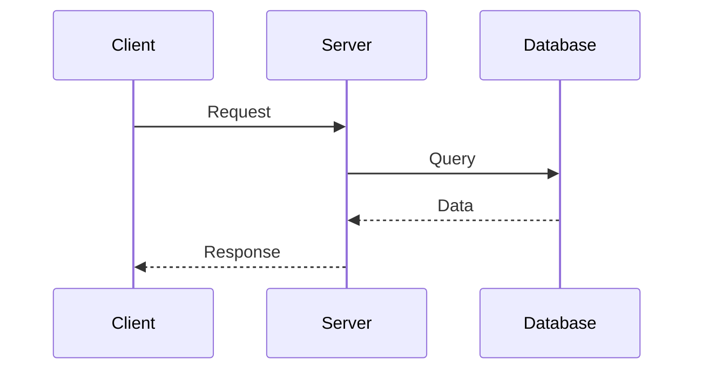
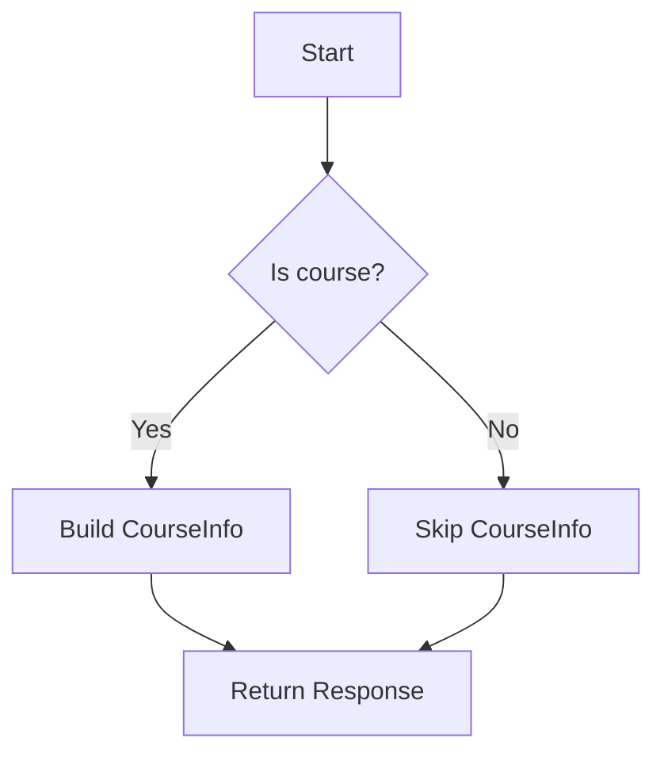
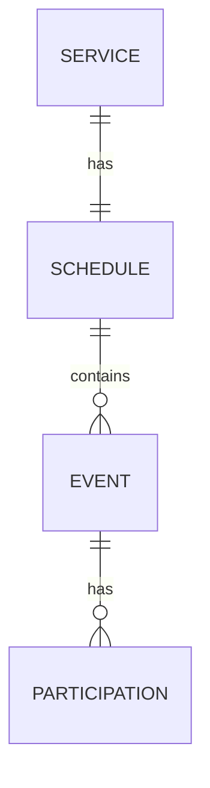

# Zero to Hero: Course Availability System Guide

## Welcome!

This guide will take you from knowing nothing to fully understanding the Course Availability system. We'll start with the basics and build up to the complex architectural concepts.

---

# Part 1: The Business Domain

## What is Wix Bookings?

Wix Bookings is a platform that helps businesses manage appointments and reservations. Think of it like:
- A yoga studio booking system
- A hair salon appointment scheduler
- A cooking class registration system

### The Three Types of Services

```
┌─────────────────────────────────────────────────────────────────────────────┐
│                        TYPES OF BOOKABLE SERVICES                           │
└─────────────────────────────────────────────────────────────────────────────┘

┌─────────────────┐     ┌─────────────────┐     ┌─────────────────┐
│   APPOINTMENT   │     │      CLASS      │     │     COURSE      │
├─────────────────┤     ├─────────────────┤     ├─────────────────┤
│ • 1-on-1        │     │ • Group session │     │ • Multi-session │
│ • Single time   │     │ • Single time   │     │ • Series of     │
│ • Example:      │     │ • Example:      │     │   sessions      │
│   Haircut,      │     │   Yoga class,   │     │ • Example:      │
│   Consultation  │     │   Spin class    │     │   8-week        │
│                 │     │                 │     │   cooking course│
│                 │     │ • Book one      │     │                 │
│                 │     │   session at    │     │ • Book ALL      │
│                 │     │   a time        │     │   sessions      │
│                 │     │                 │     │   together      │
└─────────────────┘     └─────────────────┘     └─────────────────┘
     Dynamic                Event-Based            Event-Based
    Availability           (per-session)          (per-schedule)
```

---

## Key Business Terms

### Service
A **service** is what the business offers. Examples:
- "Swedish Massage" (appointment)
- "Morning Yoga" (class)
- "Italian Cooking Fundamentals" (course)

Each service has properties like:
- **Name**: "8-Week Cooking Course"
- **Type**: APPOINTMENT, CLASS, or COURSE
- **Capacity**: How many people can book (e.g., 20 spots)
- **Booking Policy**: Rules for when/how people can book

### Schedule
A **schedule** is the time template for a service. It defines:
- When sessions happen (e.g., "Every Monday at 10 AM")
- Default capacity
- First and last session dates

Think of it as the "master plan" for when things happen.

### Event
An **event** is a specific occurrence on the calendar. 

Example: If "Morning Yoga" happens every Monday, then:
- Monday Jan 6th at 10 AM = Event 1
- Monday Jan 13th at 10 AM = Event 2
- Monday Jan 20th at 10 AM = Event 3

Each event has:
- Start and end time
- Capacity (how many can attend)
- Remaining capacity (spots left)
- Type (CLASS, COURSE, APPOINTMENT, etc.)

### Session
"Session" is often used interchangeably with "event" in the context of classes and courses. Each session is one occurrence of the class or course.

### Participation (Booking)
A **participation** represents someone who booked. It links:
- A customer (contact)
- To either an **Event** (for classes) OR a **Schedule** (for courses)

This is a crucial difference:
- **Classes**: You book a specific session (event)
- **Courses**: You book the entire schedule (all sessions)

### Time Slot
A **time slot** is a bookable time period as seen by the customer. It represents:
- When something is available
- Whether it can be booked
- How many spots are left

---

## Availability vs Bookability

These terms are related but different:

| Term | Meaning | Example |
|------|---------|---------|
| **Availability** | Times when a service is offered | "Yoga is available Mon/Wed/Fri at 10 AM" |
| **Bookability** | Whether you can actually book right now | "Monday's class is bookable, Wednesday is full" |

A time slot can be **available** but not **bookable** if:
- It's fully booked (no capacity)
- Booking window hasn't opened yet
- Booking deadline has passed
- Online booking is disabled

---

## Booking Policies

**Booking policies** are rules that control when customers can book:

### 1. limitEarlyBookingPolicy
"How far in advance can customers book?"

Example: "Customers can book up to 30 days before the session"
- If session is Feb 15th, booking opens Jan 16th

### 2. limitLateBookingPolicy  
"How close to the session can customers book?"

Example: "Customers must book at least 2 hours before"
- If class is at 10 AM, must book by 8 AM

### 3. bookAfterStartPolicy
"Can customers book after the course has started?"

Example: "Allow booking after first session if enabled"
- 8-week course started, but customer can still join for remaining weeks

### 4. onlineBooking.enabled
"Is online booking allowed at all?"

If `false`, customers can't book online (must call or visit).

---

## Capacity Explained

**Capacity** = How many people can participate

```
┌─────────────────────────────────────────────────────────────────────────────┐
│                           CAPACITY CONCEPTS                                 │
└─────────────────────────────────────────────────────────────────────────────┘

Total Capacity:        20 spots total
                       ████████████████████
                       
Current Participants:   8 people booked
                       ████████░░░░░░░░░░░░
                       
Remaining Capacity:    12 spots left
                               ████████████

Bookable Capacity:     12 (same as remaining, unless waiting list)
                               ████████████
```

### Capacity for Classes vs Courses

**Classes (per-event capacity):**
```
Monday's class:    20 total, 15 remaining
Wednesday's class: 20 total, 5 remaining   ← Different!
Friday's class:    20 total, 20 remaining
```
Each session is independent.

**Courses (per-schedule capacity):**
```
8-Week Course:     20 total, 12 remaining
  ├── Week 1:      20 total, 12 remaining ← Same!
  ├── Week 2:      20 total, 12 remaining ← Same!
  └── Week 8:      20 total, 12 remaining ← Same!
```
All sessions share the same capacity.

---

# Part 2: Technical Architecture

## What is an API?

**API** = Application Programming Interface

It's how different software systems talk to each other. Think of it like a restaurant menu:
- The menu lists what you can order (available operations)
- You tell the waiter what you want (request)
- The kitchen makes it (processing)
- You get your food (response)

### REST API
A common style of API that uses HTTP (the same protocol your browser uses).

Example:
```
GET /api/services/123        ← "Get me service with ID 123"
POST /api/bookings           ← "Create a new booking"
```

### gRPC
A different style of API that's faster and uses **Protocol Buffers** (see below). Used internally between services at Wix.

---

## Protocol Buffers (Proto)

**Protocol Buffers** (or "proto" or "protobuf") is a way to define data structures that works across programming languages.

### Why Use Proto?

1. **Language-neutral**: Define once, use in Scala, TypeScript, Go, etc.
2. **Fast**: Binary format is smaller and faster than JSON
3. **Type-safe**: Catches errors at compile time

### Proto File Example

```protobuf
// This is a .proto file

message Person {
  string name = 1;           // Field 1: text
  int32 age = 2;             // Field 2: number
  repeated string emails = 3; // Field 3: list of texts
}

message GetPersonRequest {
  string person_id = 1;
}

message GetPersonResponse {
  Person person = 1;
}

service PersonService {
  rpc GetPerson(GetPersonRequest) returns (GetPersonResponse);
}
```

### Proto Field Types

| Proto Type | Meaning | Example |
|------------|---------|---------|
| `string` | Text | `"Hello"` |
| `int32` | Integer (32-bit) | `42` |
| `bool` | True/False | `true` |
| `repeated X` | List of X | `["a", "b", "c"]` |
| `map<K, V>` | Dictionary | `{"key": "value"}` |
| `google.protobuf.StringValue` | Optional string | `"Hello"` or `null` |
| `google.protobuf.Int32Value` | Optional integer | `42` or `null` |
| `google.protobuf.BoolValue` | Optional boolean | `true` or `null` |

### Why `StringValue` instead of `string`?

- `string` cannot be `null` (empty string `""` is different from missing)
- `StringValue` can be `null` (field is optional)

---

## Scala Basics

**Scala** is the programming language used for backend services at Wix Bookings.

### Key Scala Concepts

#### Case Classes
Like a data container (similar to TypeScript interface or Java record):

```scala
case class Person(
  name: String,
  age: Int,
  email: Option[String]  // Option = might be None
)

val john = Person("John", 30, Some("john@email.com"))
val jane = Person("Jane", 25, None)  // No email
```

#### Option Type
Represents a value that might not exist:

```scala
val maybeNumber: Option[Int] = Some(42)  // Has a value
val noNumber: Option[Int] = None          // No value

// Safe access
maybeNumber.getOrElse(0)  // Returns 42
noNumber.getOrElse(0)     // Returns 0 (default)

// Check if exists
maybeNumber.isDefined     // true
noNumber.isDefined        // false
```

#### Future Type
Represents an asynchronous operation (something that will complete later):

```scala
// This doesn't block - it returns immediately with a "promise"
val futureResult: Future[String] = fetchDataFromDatabase()

// When data arrives, do something with it
futureResult.map { data =>
  println(s"Got data: $data")
}

// Chain multiple async operations
for {
  user <- fetchUser(userId)           // Wait for user
  orders <- fetchOrders(user.id)      // Then fetch orders
  details <- fetchOrderDetails(orders) // Then fetch details
} yield details                        // Return final result
```

#### Pattern Matching
Like a powerful switch statement:

```scala
serviceType match {
  case "APPOINTMENT" => handleAppointment()
  case "CLASS" => handleClass()
  case "COURSE" => handleCourse()
  case _ => handleUnknown()  // Default case
}
```

---

## Service Architecture

### Microservices
The system is built as **microservices** - small, independent services that each do one thing well.

```
┌─────────────────────────────────────────────────────────────────────────────┐
│                         MICROSERVICES ARCHITECTURE                          │
└─────────────────────────────────────────────────────────────────────────────┘

┌──────────────┐     ┌──────────────┐     ┌──────────────┐
│   service-   │     │   services   │     │   calendar   │
│ availability │     │      -2      │     │      -3      │
├──────────────┤     ├──────────────┤     ├──────────────┤
│ Calculates   │     │ Manages      │     │ Manages      │
│ when things  │     │ service      │     │ events,      │
│ are bookable │     │ definitions  │     │ schedules    │
└──────┬───────┘     └──────┬───────┘     └──────┬───────┘
       │                    │                    │
       └────────────────────┼────────────────────┘
                            │
                     ┌──────┴──────┐
                     │   Database  │
                     └─────────────┘
```

### Why Microservices?

1. **Independence**: Each service can be updated separately
2. **Scalability**: Scale only the services that need it
3. **Fault isolation**: One service failing doesn't crash everything
4. **Team ownership**: Different teams can own different services

---

## SPI (Service Provider Interface)

**SPI** is a pattern that allows services to be extended without modifying core code.

### The Problem SPI Solves

Imagine `service-availability` needs to work with different apps:
- Wix Bookings
- A third-party scheduling app
- A custom calendar app

Without SPI, you'd need to add code for each app:

```scala
// BAD: Hard-coded for each app
if (appId == "bookings") {
  // Bookings-specific logic
} else if (appId == "custom-app") {
  // Custom app logic
}
// This grows forever...
```

### How SPI Works

```
┌─────────────────────────────────────────────────────────────────────────────┐
│                              SPI PATTERN                                    │
└─────────────────────────────────────────────────────────────────────────────┘

┌─────────────────────────────────────────┐
│        service-availability             │
│                                         │
│  ┌─────────────────────────────────┐    │
│  │  EventTimeSlotsConfiguration    │    │   ← SPI Interface
│  │  Provider (interface)           │    │     (defines what info we need)
│  └───────────────┬─────────────────┘    │
│                  │                      │
└──────────────────│──────────────────────┘
                   │
       ┌───────────┼───────────┐
       │           │           │
       ▼           ▼           ▼
┌──────────┐ ┌──────────┐ ┌──────────┐
│ Bookings │ │ Custom   │ │ Future   │   ← SPI Implementations
│ Provider │ │   App    │ │   App    │     (each app provides its own)
└──────────┘ └──────────┘ └──────────┘
```

The core service doesn't know about specific apps - it just asks the SPI for what it needs!

### SPI in Our System

```protobuf
// SPI Interface (defined in proto)
service EventTimeSlotsConfigurationProvider {
  rpc GetEventTimeSlotsProviderConfig(GetConfigRequest) 
      returns (EventTimeSlotsProviderConfig);
}

message EventTimeSlotsProviderConfig {
  // What filter to use when querying events
  google.protobuf.Struct event_filter = 2;
  
  // Which field contains the service ID
  google.protobuf.StringValue event_service_id_field = 3;
}
```

---

## Adapters

**Adapters** wrap external services to provide a clean interface.

```scala
// Instead of calling the external service directly...
val events = calendarEventsClient.queryEvents(complexRequest)

// Use an adapter that simplifies it
class EventsAdapter(client: CalendarEventsClient) {
  def getEvents(scheduleId: String, from: LocalDateTime): Future[Seq[Event]] = {
    val request = buildComplexRequest(scheduleId, from)
    client.queryEvents(request).map(_.events)
  }
}

// Now calling code is simple
val events = eventsAdapter.getEvents("schedule-123", startDate)
```

### Why Adapters?

1. **Simplify complex APIs**: Hide complicated request/response building
2. **Testability**: Easy to mock in tests
3. **Change isolation**: If external API changes, only adapter needs updating

---

## Request/Response Pattern

Most APIs follow a request/response pattern:

```
┌──────────┐         ┌──────────┐         ┌──────────┐
│  Client  │         │  Server  │         │ Database │
└────┬─────┘         └────┬─────┘         └────┬─────┘
     │                    │                    │
     │   Request          │                    │
     │ ─────────────────► │                    │
     │                    │   Query            │
     │                    │ ─────────────────► │
     │                    │                    │
     │                    │   Data             │
     │                    │ ◄───────────────── │
     │                    │                    │
     │   Response         │                    │
     │ ◄───────────────── │                    │
     │                    │                    │
```

### Our API Example

**Request:**
```json
{
  "service_ids": ["5f364552-0b91-4d97-982d-fdf3fe5d9682"],
  "from_local_date": "2026-03-01T00:00:00",
  "to_local_date": "2026-04-01T00:00:00"
}
```

**Response:**
```json
{
  "time_slots": [
    {
      "service_id": "5f364552-...",
      "local_start_date": "2026-03-05T10:00:00",
      "bookable": true,
      "remaining_capacity": 12
    }
  ],
  "course_info_by_service_id": {
    "5f364552-...": {
      "course_bookable": true,
      "schedule_id": "8edc0bb2-..."
    }
  }
}
```

---

## Pagination

When there's too much data to return at once, APIs use **pagination**.

### Cursor-Based Pagination

Instead of "page 1, page 2, page 3", we use a **cursor** (a bookmark):

```
┌─────────────────────────────────────────────────────────────────────────────┐
│                        CURSOR PAGINATION                                    │
└─────────────────────────────────────────────────────────────────────────────┘

Request 1: "Give me 10 items"
Response:  [item1, item2, ... item10], cursor: "abc123"

Request 2: "Give me 10 more items starting from cursor 'abc123'"
Response:  [item11, item12, ... item20], cursor: "def456"

Request 3: "Give me 10 more items starting from cursor 'def456'"
Response:  [item21, item22, ... item25], cursor: null (no more items)
```

### Why Cursors?

- **Stable**: Works even if data changes between requests
- **Efficient**: Database can use the cursor to jump to the right place
- **Stateless**: Server doesn't need to remember where you are

### In Our API

```protobuf
message ListEventTimeSlotsRequest {
  // First request: don't include cursor
  // Subsequent requests: include cursor from previous response
  CursorPaging cursor_paging = 9;
}

message CursorPaging {
  int32 limit = 1;        // How many items per page
  string cursor = 2;      // Bookmark from previous response
}

message ListEventTimeSlotsResponse {
  repeated TimeSlot time_slots = 1;
  CursorPagingMetadata paging_metadata = 3;
}

message CursorPagingMetadata {
  bool has_next = 1;              // Are there more pages?
  Cursors cursors = 2;
}

message Cursors {
  string next = 1;                // Use this for next page
}
```

---

# Part 3: Data Flow & Architecture

## Calendar V3

**Calendar V3** is the calendar system that stores events and schedules.

### Key Entities

```
┌─────────────────────────────────────────────────────────────────────────────┐
│                         CALENDAR V3 ENTITIES                                │
└─────────────────────────────────────────────────────────────────────────────┘

┌─────────────────────────────────────────────────────────────────────────────┐
│                              SCHEDULE                                       │
│  • id: UUID (internal identifier)                                          │
│  • externalId: String (= Service ID for Bookings)                          │
│  • capacity: Int (default capacity for events)                             │
│  • firstSessionStart: Timestamp                                             │
│  • lastSessionEnd: Timestamp                                                │
│  • totalNumberOfParticipants: Int (aggregate)                               │
└─────────────────────────────────────────────────────────────────────────────┘
          │
          │ contains many
          ▼
┌─────────────────────────────────────────────────────────────────────────────┐
│                               EVENT                                         │
│  • id: String (event identifier)                                            │
│  • scheduleId: UUID (references parent schedule)                            │
│  • externalScheduleId: String (= Service ID for Bookings)                  │
│  • type: String (CLASS, COURSE, APPOINTMENT, etc.)                         │
│  • start: Timestamp                                                         │
│  • end: Timestamp                                                           │
│  • totalCapacity: Int                                                       │
│  • remainingCapacity: Int (calculated: capacity - participants)            │
│  • status: CONFIRMED, CANCELLED                                             │
└─────────────────────────────────────────────────────────────────────────────┘
          │
          │ has many (for classes) OR schedule has many (for courses)
          ▼
┌─────────────────────────────────────────────────────────────────────────────┐
│                           PARTICIPATION                                     │
│  • id: String                                                               │
│  • eventId: String (for classes - specific session)                        │
│  • scheduleId: String (for courses - entire schedule)                      │
│  • contactId: String (the customer)                                         │
│  • partySize: Int (how many people in this booking)                        │
│  • status: CONFIRMED, PENDING, CANCELLED                                    │
└─────────────────────────────────────────────────────────────────────────────┘
```

---

## The Key Difference: Event-Level vs Schedule-Level

This is the most important architectural concept!

### Classes: Event-Level Participation

```
Customer books "Monday's Yoga Class"
        │
        ▼
┌──────────────────────────────────────────┐
│        PARTICIPATION                     │
│  eventId: "monday-yoga-event-123"  ✓     │ ← Links to specific event
│  scheduleId: null                        │
└──────────────────────────────────────────┘
        │
        ▼
Only Monday's event capacity decreases
Other days unaffected
```

### Courses: Schedule-Level Participation

```
Customer books "8-Week Cooking Course"
        │
        ▼
┌──────────────────────────────────────────┐
│        PARTICIPATION                     │
│  eventId: null                           │
│  scheduleId: "cooking-schedule-456" ✓    │ ← Links to schedule
└──────────────────────────────────────────┘
        │
        ▼
System runs "HandleScheduleParticipation"
        │
        ▼
ALL events in schedule get updated
Week 1, Week 2, ... Week 8 all show same remaining capacity
```

### Why This Matters for Our API

When returning availability:
- **Classes**: Each TimeSlot has independent capacity
- **Courses**: All TimeSlots have the same capacity (inherited from schedule)

Our API handles this automatically - the capacity shown is always correct!

---

## Data Flow: ListEventTimeSlots

```
┌─────────────────────────────────────────────────────────────────────────────┐
│                    COMPLETE DATA FLOW                                       │
└─────────────────────────────────────────────────────────────────────────────┘

     ┌──────────┐
     │  Client  │
     └────┬─────┘
          │
          │ 1. ListEventTimeSlotsRequest
          │    {serviceIds: ["course-1"], fromDate, toDate}
          ▼
     ┌──────────────────────────────────────────┐
     │          EventTimeSlots Service          │
     └────┬─────────────────────────────────────┘
          │
          │ 2. Get provider configuration
          ▼
     ┌──────────────────────────────────────────┐
     │   EventTimeSlotsConfigurationProvider    │
     │              (SPI)                       │
     │                                          │
     │   Returns:                               │
     │   • eventFilter: how to filter events    │
     │   • eventServiceIdField: "externalScheduleId" │
     └────┬─────────────────────────────────────┘
          │
          │ 3. Query events (in parallel with step 5)
          ▼
     ┌──────────────────────────────────────────┐
     │         Calendar V3 Events API           │
     │                                          │
     │   QueryEventsRequest:                    │
     │   • filter: {scheduleId, serviceId, ...} │
     │   • fromDate, toDate                     │
     │                                          │
     │   Returns: Event[]                       │
     └────┬─────────────────────────────────────┘
          │
          │ 4. Get booking policies
          ▼
     ┌──────────────────────────────────────────┐
     │        BookingPolicyProvider             │
     │              (SPI)                       │
     │                                          │
     │   Returns: BookingPolicy[]               │
     │   • limitEarlyBooking                    │
     │   • limitLateBooking                     │
     │   • bookAfterStart                       │
     │   • onlineBooking.enabled                │
     └────┬─────────────────────────────────────┘
          │
          │ 5. Get schedules (for courses, in parallel with step 3)
          ▼
     ┌──────────────────────────────────────────┐
     │       Calendar V3 Schedules API          │
     │                                          │
     │   Returns: Schedule[]                    │
     │   • capacity, participants               │
     │   • firstSessionStart, lastSessionEnd    │
     └────┬─────────────────────────────────────┘
          │
          │ 6. Transform & Calculate
          │
          │   For each Event → TimeSlot:
          │   • Extract service ID
          │   • Calculate bookability
          │   • Apply policy violations
          │
          │   For each Course → CourseInfo:
          │   • Calculate courseBookable
          │   • Aggregate session counts
          │
          ▼
     ┌──────────────────────────────────────────┐
     │       ListEventTimeSlotsResponse         │
     │                                          │
     │   • timeSlots: [...]                     │
     │   • courseInfoByServiceId: {...}         │
     │   • pagingMetadata                       │
     └────┬─────────────────────────────────────┘
          │
          │ 7. Response to client
          ▼
     ┌──────────┐
     │  Client  │
     └──────────┘
```

---

# Part 4: Design Patterns

## Map (Data Structure)

A **map** (also called dictionary or hash map) stores key-value pairs:

```scala
// Map[String, CourseInfo] means:
// - Key: String (the service ID)
// - Value: CourseInfo (the course details)

val courseInfoByServiceId = Map(
  "service-123" -> CourseInfo(scheduleId = "sched-1", ...),
  "service-456" -> CourseInfo(scheduleId = "sched-2", ...)
)

// Look up by key
val info = courseInfoByServiceId("service-123")  // Returns CourseInfo
```

In our proto:
```protobuf
// This is a map in proto
map<string, CourseInfo> course_info_by_service_id = 4;
```

---

## Parallel Execution

**Parallel execution** means doing multiple things at the same time instead of one after another.

### Sequential (Slow)
```
Start ─────┬─────────────────────────────────────────────────────► End
           │
           │  Query Events (500ms)
           │  ██████████████████████
           │                        │
           │                        │  Query Schedules (300ms)
           │                        │  █████████████
           │                                      │
           │                                      ▼
Total time: 800ms
```

### Parallel (Fast)
```
Start ─────┬─────────────────────────────────► End
           │
           │  Query Events (500ms)
           │  ██████████████████████
           │
           │  Query Schedules (300ms)
           │  █████████████
           │
           ▼
Total time: 500ms (max of the two)
```

### In Scala

```scala
// Sequential (slow)
for {
  events <- queryEvents()      // Wait 500ms
  schedules <- querySchedules() // Wait 300ms more
} yield process(events, schedules)
// Total: 800ms

// Parallel (fast)
val eventsFuture = queryEvents()       // Start immediately
val schedulesFuture = querySchedules() // Start immediately

for {
  events <- eventsFuture       // Wait for result
  schedules <- schedulesFuture // Already done!
} yield process(events, schedules)
// Total: 500ms
```

---

## Feature Flags (Petri)

**Feature flags** let you turn features on/off without deploying new code.

```scala
// Check if feature is enabled
val courseInfoEnabled = context.petri.conductCourseInfoFeatureFlag.contains("true")

if (courseInfoEnabled) {
  // New code path
  buildCourseInfo(...)
} else {
  // Old code path (or skip)
  Map.empty
}
```

### Why Feature Flags?

1. **Safe rollout**: Enable for 1% of users, then 10%, then 100%
2. **Quick rollback**: Turn off instantly if problems arise
3. **A/B testing**: Compare old vs new behavior
4. **Gradual migration**: Enable for specific sites first

---

## Backwards Compatibility

**Backwards compatibility** means new code works with old clients.

### Adding Optional Fields (Safe)

```protobuf
// Old response
message ListEventTimeSlotsResponse {
  repeated TimeSlot time_slots = 1;
}

// New response (backwards compatible!)
message ListEventTimeSlotsResponse {
  repeated TimeSlot time_slots = 1;
  
  // NEW: Old clients ignore this field
  map<string, CourseInfo> course_info_by_service_id = 4;
}
```

Old clients:
- Receive the response
- See `time_slots` (which they understand)
- Ignore `course_info_by_service_id` (which they don't know about)
- Continue working!

### Breaking Changes (Avoid!)

```protobuf
// BAD: Removing or renaming fields breaks old clients
message ListEventTimeSlotsResponse {
  // REMOVED: repeated TimeSlot time_slots = 1;  ← Old clients will crash!
  repeated SessionSlot session_slots = 1;        ← Different name!
}
```

---

## Mermaid Diagrams

**Mermaid** is a language for creating diagrams from text.

### Sequence Diagram
Shows interactions over time:



### Flowchart
Shows process flow:



### Entity Relationship Diagram
Shows data relationships:



---

# Part 5: Testing & Deployment

## Unit Tests

Test individual functions in isolation:

```scala
"calculateCourseBookability" should {
  "return fullyBooked=true when remainingCapacity is 0" in {
    val (bookable, reasons) = calculateCourseBookability(
      remainingCapacity = Some(0),
      // ... other params
    )
    
    bookable mustBe false
    reasons.fullyBooked mustBe Some(true)
  }
}
```

## Integration Tests

Test multiple components working together:

```scala
"ListEventTimeSlots" should {
  "return CourseInfo for course services" in {
    // Set up test data
    val courseService = createTestService(type = COURSE)
    val schedule = createTestSchedule(serviceId = courseService.id)
    val events = createTestEvents(scheduleId = schedule.id)
    
    // Call the API
    val response = eventTimeSlots.listEventTimeSlots(
      ListEventTimeSlotsRequest(serviceIds = Seq(courseService.id))
    )
    
    // Verify response
    response.courseInfoByServiceId must haveKey(courseService.id)
    response.courseInfoByServiceId(courseService.id).courseBookable mustBe Some(true)
  }
}
```

## Deployment

### Canary Deployment
Deploy to a small subset first:

```
┌─────────────────────────────────────────────────────────────────────────────┐
│                         CANARY DEPLOYMENT                                   │
└─────────────────────────────────────────────────────────────────────────────┘

Traffic: 100%
         │
         ▼
    ┌────┴────┐
    │         │
    ▼         ▼
┌───────┐ ┌───────────────────────────────────────────────────────┐
│ 1%    │ │ 99%                                                   │
│ New   │ │ Old version                                           │
│version│ │                                                       │
└───────┘ └───────────────────────────────────────────────────────┘
    │
    │ Monitor for errors
    │ If OK, increase to 10%, 50%, 100%
    ▼
```

---

# Part 6: Quick Reference

## Common Terms Glossary

| Term | Definition |
|------|------------|
| **API** | Interface for software to communicate |
| **Adapter** | Wrapper that simplifies external service calls |
| **Availability** | Times when a service is offered |
| **Backwards Compatible** | New code works with old clients |
| **Bookability** | Whether something can be booked right now |
| **Capacity** | Maximum number of participants |
| **Cursor** | Bookmark for pagination |
| **Event** | Specific occurrence on calendar |
| **Feature Flag** | Toggle to enable/disable features |
| **Future** | Asynchronous operation result |
| **gRPC** | Fast API protocol using Protocol Buffers |
| **Microservice** | Small, focused, independent service |
| **Option** | Value that might not exist |
| **Pagination** | Breaking large results into pages |
| **Participation** | A booking linking customer to event/schedule |
| **Petri** | Wix's feature flag system |
| **Proto/Protobuf** | Language for defining data structures |
| **RPC** | Remote Procedure Call - calling code on another server |
| **Schedule** | Time template for a service |
| **Service** | What business offers (appointment, class, course) |
| **SPI** | Extension point for providers |
| **TimeSlot** | Bookable time period shown to customer |

## File Types

| Extension | Purpose |
|-----------|---------|
| `.proto` | Protocol Buffer definitions |
| `.scala` | Scala source code |
| `.bazel` | Build configuration |
| `.md` | Markdown documentation |
| `.json` | JSON data/configuration |

## Common Commands

```bash
# Build everything
bazel build //bookings-backend/service-availability/...

# Run tests
bazel test //bookings-backend/service-availability/...

# Run tests with output
bazel test //... --test_output=all

# Query dependencies
bazel query 'deps(//bookings-backend/service-availability:target)'
```

---

# Congratulations! 🎉

You've completed the Zero to Hero guide! You now understand:

- ✅ Business domain (services, schedules, events, bookings)
- ✅ Technical concepts (APIs, proto, Scala basics)
- ✅ Architecture patterns (microservices, SPI, adapters)
- ✅ Data flow (how requests are processed)
- ✅ Design patterns (maps, parallel execution, feature flags)
- ✅ Testing and deployment

**Next steps:**
1. Read the actual source code in `EventTimeSlots.scala`
2. Run the tests to see examples
3. Try making a small change and running tests
4. Ask questions when stuck!

Welcome to the team! 🚀

